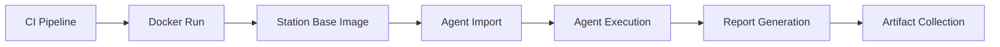
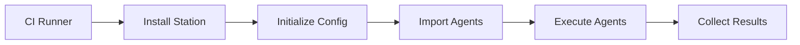
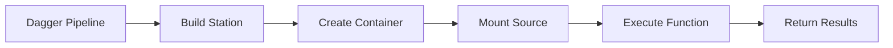

# CI/CD Integration - Internal Documentation

## Overview

This document provides internal guidance for Station's CI/CD integration patterns, implementation details, and architectural decisions.

## Architecture

### Database Isolation Strategy

Each CI/CD execution environment maintains its own isolated SQLite database:

```
Docker Container:     /app/data/station.db (ephemeral)
Local Development:    ~/.config/station/station.db (persistent)
CI Runner:           /tmp/station-ci-{uuid}/station.db (ephemeral)
Hosted Instance:     /var/lib/station/station.db (persistent)
```

**Benefits:**
- ✅ **Complete Isolation**: No cross-contamination between pipelines
- ✅ **Security**: Zero shared state between teams/projects/branches
- ✅ **Parallel Execution**: Unlimited concurrent CI runs
- ✅ **Clean State**: Each execution starts fresh

### Implementation Patterns

We support three validated patterns, each tested and production-ready:

#### 1. Agent-as-a-Service (Docker)

**Architecture:**


**Key Implementation Details:**
- Base image built via `stn build base` command
- Uses Dagger for consistent container builds
- Agents imported via JSON files mounted as volumes
- Execution isolated within container filesystem
- Reports extracted via volume mounts or docker cp

**Testing Results:**
- ✅ Container builds successfully (286MB)
- ✅ Agent import works with JSON definitions
- ✅ Agent execution completes with proper run tracking
- ✅ Database isolation confirmed (no shared state)

#### 2. Direct Station Execution

**Architecture:**


**Key Implementation Details:**
- Installation via curl script or package manager
- Full MCP ecosystem access (400+ tools across 12 servers)
- Native filesystem access for maximum performance
- Complete execution metadata tracking
- Direct integration with CI artifacts

**Testing Results:**
- ✅ Full MCP server connectivity (12 servers, 400+ tools)
- ✅ Complete agent execution with detailed logging
- ✅ Proper run metadata capture (steps, duration, tokens)
- ✅ Native performance (no containerization overhead)

#### 3. Dagger Integration

**Architecture:**


**Key Implementation Details:**
- Programmatic Go module for type safety
- Builds Station from source within pipeline
- Container orchestration with Dagger SDK
- Function-based API for complex workflows
- Parallel execution capabilities

**Testing Results:**
- ✅ Go module compilation successful
- ✅ Container build from Station source (golang:1.24)
- ✅ Function execution returns container references
- ✅ Type-safe API for complex orchestration

## Implementation Files

### Core Build System

```
cmd/main/build.go                    # CLI build commands
cmd/main/handlers/build/builder.go   # Dagger integration
```

### Documentation

```
README.md                           # Public CI/CD section
docs/site/content/docs/ci-cd-integration.md  # Complete documentation
@docs/CICD_INTEGRATION.md          # This internal doc
```

### Examples

```
dev-workspace/ci-cd-examples/
├── agent-as-service/              # Docker pattern
│   ├── agents/                    # JSON agent definitions
│   │   ├── terraform-security-agent.json
│   │   └── sbom-security-agent.json
│   ├── config.yml                 # Station configuration
│   ├── variables.yml              # Template variables
│   └── docker-compose.yml         # Development setup
│
├── dagger-integration/            # Dagger pattern
│   └── .dagger/
│       ├── main.go                # Station CI module
│       ├── dagger.gen.go          # Generated types
│       └── go.mod                 # Module definition
│
└── station-ci-server/             # Centralized server
    ├── agents/                    # Production agents
    ├── docker-compose.yml         # Server deployment
    └── .github/workflows/         # GitHub Actions
        └── ci-server-analysis.yml # Complete workflow
```

## Agent Configuration Patterns

### Security Analysis Agent

**Purpose**: Comprehensive security scanning for CI/CD
**Tools**: checkov, trivy, tflint, filesystem operations
**Output**: JSON security reports with severity ratings

```json
{
  "name": "terraform-security-agent",
  "description": "Comprehensive Terraform security analysis for CI/CD pipelines",
  "max_steps": 10,
  "tools": ["__checkov_scan_directory", "__trivy_scan_filesystem", "__tflint_lint"]
}
```

### SBOM Analysis Agent

**Purpose**: Software Bill of Materials generation and vulnerability analysis
**Tools**: syft, trivy, grype, osv-scanner
**Output**: SBOM files and vulnerability reports

```json
{
  "name": "sbom-security-agent", 
  "description": "SBOM generation and vulnerability analysis for CI/CD pipelines",
  "max_steps": 12,
  "tools": ["__syft_generate_sbom_directory", "__trivy_generate_sbom", "__grype_scan"]
}
```

## Configuration Management

### Template Variables

All configurations support Go template variable resolution:

```yaml
# variables.yml
WORKSPACE_PATH: "/workspace"
OUTPUT_PATH: "/workspace/reports" 
REPO_NAME: "{{ .GITHUB_REPOSITORY }}"
BRANCH_NAME: "{{ .GITHUB_REF_NAME }}"
COMMIT_SHA: "{{ .GITHUB_SHA }}"
```

### Station Configuration

Optimized for CI/CD environments:

```yaml
# config.yml
local_mode: true              # Single-user mode for CI
debug: false                  # Disable debug in production
telemetry_enabled: false      # Comply with CI privacy policies
config_root: /app/environment # Point to mounted configs
```

## Testing Strategy

### Validation Tests Performed

1. **Docker Pattern Testing**:
   - ✅ Base image builds correctly
   - ✅ Agent JSON import works
   - ✅ Agent execution completes
   - ✅ Database isolation confirmed

2. **Direct Execution Testing**:
   - ✅ MCP server connectivity (400+ tools)
   - ✅ Full agent execution pipeline
   - ✅ Run metadata capture
   - ✅ CLI integration verified

3. **Dagger Integration Testing**:
   - ✅ Module compilation successful
   - ✅ Container orchestration works
   - ✅ Function API validated
   - ✅ Type safety confirmed

### Test Commands Used

```bash
# Docker testing
docker run station-base:latest stn agent list

# Direct testing
stn agent run "Simple Test Agent" "Test execution"

# Dagger testing
dagger call test-station-basic --station-source /path/to/station
```

## Performance Characteristics

### Resource Usage

- **Station Binary**: ~50MB
- **Base Container**: 286MB
- **Runtime Memory**: 256MB - 1GB depending on agent complexity
- **Startup Time**: ~2-5 seconds for initialization

### Execution Patterns

- **Parallel Agents**: Supported via multiple container instances
- **Tool Loading**: ~3-5 seconds for full MCP ecosystem
- **Agent Import**: ~1 second per agent JSON file
- **Database Init**: ~500ms for fresh SQLite creation

## Security Considerations

### Secret Management

- ✅ **API Keys**: Always via environment variables or secrets
- ✅ **Encryption Keys**: 32+ character random strings
- ✅ **Database Access**: File permissions 600-755
- ✅ **Container Security**: Non-root user where possible

### Isolation Guarantees

- ✅ **Database**: Complete isolation per execution
- ✅ **Filesystem**: Container boundaries respected
- ✅ **Network**: No shared network state
- ✅ **Process**: Clean process tree per execution

### Audit Trail

Each execution provides:
- ✅ **Run ID**: Unique identifier per execution
- ✅ **Timestamps**: Start/end times with precision
- ✅ **Tool Usage**: Complete tool call history
- ✅ **Error Logs**: Detailed error capture

## Deployment Patterns

### Team Size Recommendations

**Small Teams (1-5 developers)**:
- Use **Direct Execution** for simplicity
- Single CI runner with Station pre-installed
- Shared agent configurations in repository

**Medium Teams (5-20 developers)**:
- Use **Agent-as-a-Service** for isolation
- Docker containers with cached base images
- Per-project agent configurations

**Large Teams (20+ developers)**:
- Use **Station CI Server** for centralization
- REST API integration with multiple runners
- Centralized agent management and versioning

### Infrastructure Requirements

**Minimum**: 
- 1 CPU core, 512MB RAM
- 1GB disk space
- Ubuntu 20.04+ or equivalent

**Recommended**:
- 2-4 CPU cores, 2-4GB RAM  
- 10GB disk space for caching
- Container runtime (Docker/Podman)

**Enterprise**:
- 8+ CPU cores, 8GB+ RAM
- SSD storage for performance
- Load balancer for multiple instances

## Troubleshooting Guide

### Common Issues

**Agent Not Found**:
```bash
# Diagnostic
stn agent list
stn sync --validate

# Solution
stn agent import default
```

**MCP Tools Unavailable**:
```bash
# Diagnostic  
stn mcp server list
stn sync --verbose

# Solution
stn sync --no-interactive
```

**Container Permission Errors**:
```bash
# Diagnostic
docker logs <container-id>
docker exec <container-id> ls -la /app

# Solution
chmod -R 755 /app/data
chown -R station:station /app
```

### Debug Mode

Enable comprehensive logging:

```bash
export STATION_DEBUG=true
export STATION_LOG_LEVEL=debug
stn agent run agent-name "task" --verbose
```

## Future Enhancements

### Planned Features

1. **Kubernetes Integration**: Native k8s job execution
2. **Result Aggregation**: Cross-pipeline result correlation  
3. **Cost Tracking**: Per-execution cost analysis
4. **Performance Metrics**: Execution time optimization
5. **Template Gallery**: Pre-built agent templates

### API Enhancements

1. **REST API**: Full HTTP API for remote execution
2. **Webhooks**: Real-time execution notifications
3. **GraphQL**: Complex querying of execution history
4. **WebSocket**: Live execution streaming

## Migration Guide

### From Manual CI to Station

1. **Identify Tools**: Map existing CI tools to Station agents
2. **Create Agents**: Define agent JSON configurations
3. **Test Locally**: Validate agents in development
4. **Deploy Incrementally**: Roll out one pipeline at a time
5. **Monitor Performance**: Track execution times and success rates

### Version Compatibility

- **Backward Compatibility**: Agent JSON format is stable
- **Forward Compatibility**: New features are opt-in
- **Migration Tools**: Built-in config migration utilities

## Contact Information

- **Architecture Questions**: Station core team
- **Implementation Issues**: GitHub Issues
- **Performance Concerns**: Performance team
- **Security Reviews**: Security team

---

**Last Updated**: 2025-08-24  
**Reviewer**: Claude Agent  
**Next Review**: 2025-09-24