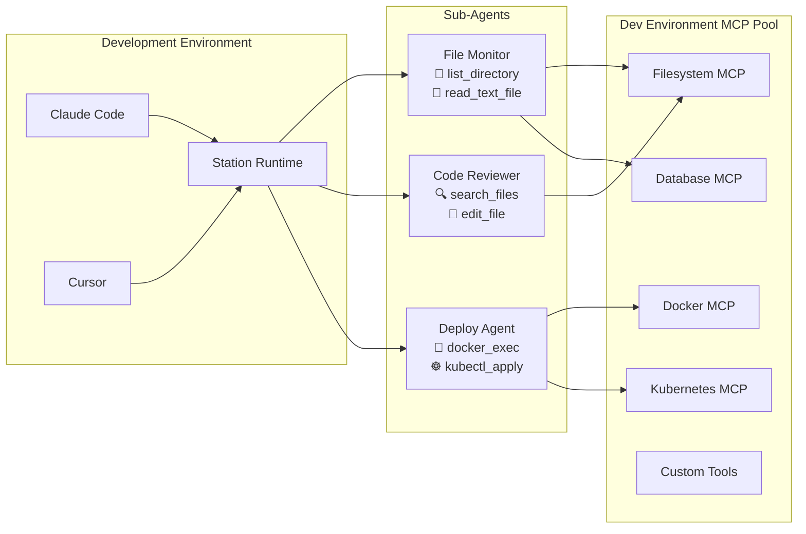

# Station - Lightweight Runtime for Deployable Sub-Agents

> ⚠️ **Beta Release**: Station is currently in beta. Breaking changes may occur between versions. Please pin to specific versions in production environments.

**A secure, self-hosted platform for building and deploying intelligent sub-agents.**



🌐 **[Browse Bundle Registry](https://cloudshipai.github.io/registry)** - Discover ready-to-use MCP bundles for Station

📚 **[Documentation](https://cloudshipai.github.io/station)** - Complete Station documentation and guides

> Station is an MCP runtime that augments your Claude Code and Cursor development experience by providing an agnostic runtime for your sub-agents - with centralized management, environment isolation, and server deployment capabilities.

---

Station is purpose-built for **deployable sub-agents** - the intelligent automation you need for infrastructure monitoring, deployment pipelines, security scanning, and day-to-day tasks that require secure access to internal systems.

## Why Station Exists

When you need agents for internal work, you need more than application-focused agent platforms. You need:

- **Own Your Agents** - Complete control over your agents without vendor lock-in or external dependencies
- **Secure Internal Access** - Agents that can safely handle database credentials, API keys, and system-level access
- **Versionable Deployment** - Deployable agents that integrate with your existing deployment pipelines  
- **Team-Approved Tools** - Easy way to use and share the tools your team builds and approves
- **Low Footprint Runtime** - Lightweight system that blends into your infrastructure without overhead

**Station provides exactly this** - a lightweight, secure runtime specifically designed for deployable sub-agents.

## Core Value: Secure Deployable Sub-Agent Runtime

### 🔧 **Purpose-Built for Internal Tasks**

Unlike application-focused agent platforms, Station is designed for deployable sub-agents that need to:

- Access internal databases with production credentials
- Monitor infrastructure and alert on issues
- Automate deployment pipelines with CI/CD system access
- Perform security scans with elevated permissions
- Handle incident response with system-level tools

### 🔐 **Security by Design**

- **Self-Hosted** - Complete data sovereignty, no external dependencies beyond AI providers
- **Encrypted Secrets** - AES encryption for credentials and sensitive configuration
- **Environment Isolation** - Separate execution contexts for dev/staging/prod
- **Audit Trail** - Complete tracking of agent deployments and executions

### ⚡ **Lightweight & Integrated**

- **Single 45MB Binary** - No complex infrastructure or dependencies
- **SQLite Database** - Zero-setup local development, PostgreSQL for production
- **GitOps Ready** - Version-controlled agent configurations like infrastructure code
- **Existing Toolchain** - Uses your team's approved MCP tools and integrations

## How Station Works

### 1. **Create Agents in Claude Desktop**
Connect Station to Claude Desktop via MCP - then create agents naturally:

**Input:** `"Create a code review agent that can analyze files and provide feedback"`

**Output:**
```json
{
  "agent": {
    "description": "A basic agent that reviews code files and provides feedback",
    "environment_id": 1,
    "id": 53,
    "max_steps": 5,
    "name": "Simple Code Reviewer"
  },
  "message": "Agent 'Simple Code Reviewer' created successfully",
  "tool_assignment": {
    "assigned_count": 2,
    "assigned_tools": ["__read_text_file", "__list_directory"],
    "status": "success"
  }
}
```

*Claude automatically selects the right tools from all your registered MCP servers (filesystem, Slack, AWS, databases, etc.) based on the agent's purpose. No manual tool configuration needed.*

### 2. **Run Agents & Get Full Responses**
Execute agents through Claude and see complete results (no truncation):

**Input:** `"Analyze the current project structure and tell me what you see. Provide a brief summary of what type of project this appears to be."`

**Output:**
```json
{
  "execution": {
    "agent_id": 25,
    "response": "I inspected the repository root and opened the README to understand the project...
    
    What I see (top-level items and purpose)
    - Project identity: README.md — Station: lightweight runtime for deployable sub-agents
    - Language/build: go.mod, go.sum — Go project with cmd/, internal/, pkg/ layout
    - Runtime assets: stn — built CLI binary, station.db — SQLite database
    - Deployment: docker/, Dockerfile, .goreleaser.yml — containerized deployment
    
    Brief summary: This is a Go-based, self-hosted runtime/CLI project called 'Station' 
    that provides a lightweight platform for deploying and running 'sub-agents'. 
    It's designed as a single binary with SQLite for development...",
    "run_id": 70,
    "success": true
  }
}
```

*Full comprehensive analysis with complete tool usage - nothing truncated.*

### 3. **Export Your Environment as a Bundle**
Package your entire setup - agents, tools, configs - for deployment elsewhere:

**Input:**
```bash
stn template create readme-demo-bundle --env default --name "README Demo Bundle" --author "Demo Team" --description "Template bundle for README demonstration"
```

**Output:**
```
╭──────────────────────────────────────────────╮
│                                              │
│  📦 Create Template Bundle from Environment  │
│                                              │
╰──────────────────────────────────────────────╯

🌍 Scanning environment: default
📂 Scanning environment directory: /home/epuerta/.config/station/environments/default
   ✅ MCP Config: aws-cost
   ✅ MCP Config: aws
   ✅ MCP Config: container-use  
   ✅ MCP Config: ntfy
   ✅ MCP Config: slack-test
   ✅ MCP Config: template
   📡 Found 6 MCP configuration(s)
   ✅ Agent Prompt: CodeAnalyzer
   ✅ Agent Prompt: DeploymentHelper
   ✅ Agent Prompt: File Management Agent
   [... 9 more agents]
   🤖 Found 12 agent prompt(s)
   📄 Loaded existing variables from variables.yml
   📝 Found 6 template variable(s)
✅ Bundle created successfully from environment 'default'
```

**Input:**
```bash
stn template bundle readme-demo-bundle
```

**Output:**
```
╭──────────────────────────────╮
│                              │
│  📦 Package Template Bundle  │
│                              │
╰──────────────────────────────╯

✅ Bundle packaging: SUCCESS
📦 Package created: readme-demo-bundle.tar.gz
📊 Package size: 10 B

🚀 Your bundle is ready for distribution!
📤 You can now upload it to a registry or share directly
```

**Input:**
```bash
stn template install readme-demo-bundle.tar.gz test-template-install
```

**Output:**
```
╭──────────────────────────────╮
│                              │
│  📥 Install Template Bundle  │
│                              │
╰──────────────────────────────╯

🎯 Installing 'readme-demo-bundle.tar.gz' into environment 'test-template-install'

📦 Extracting bundle...
⚙️  Installing MCP configuration...
   ✅ Installed MCP config: template.json
🤖 Installing agents...
   ✅ Installed agent: CodeAnalyzer.prompt
   ✅ Installed agent: DeploymentHelper.prompt  
   ✅ Installed agent: File Management Agent.prompt
   [... 9 more agents]
📝 Installing example variables...
   ✅ Created variables.yml from development example
✅ Bundle 'readme-demo-bundle.tar.gz' installed successfully!
📋 Next steps:
   1. Run 'stn sync test-template-install' to load MCP configs and agents
```

## Getting Started

### 1. **Install Station**
```bash
curl -fsSL https://raw.githubusercontent.com/cloudshipai/station/main/install.sh | bash
stn init  # Set up database and encryption
```

### Quick Start: MCP Tools Setup

**Option A: Ship CLI Integration (Recommended)**
```bash
# Bootstrap with ship CLI for instant filesystem access
stn init --ship
```
This automatically installs the [ship CLI](https://github.com/cloudshipai/ship) and configures filesystem MCP tools for secure file operations.

**Option B: Add Your Own MCP Templates**
```bash
# Open editor to paste any MCP configuration
stn mcp add filesystem

# Example: Paste this configuration and save
{
  "name": "Filesystem Tools",
  "description": "Essential filesystem operations",
  "mcpServers": {
    "filesystem": {
      "command": "npx",
      "args": ["-y", "@modelcontextprotocol/server-filesystem@latest", "{{ .ROOT_PATH }}"]
    }
  }
}

# Sync your templates to activate tools
stn sync
```

Both approaches give you MCP tools ready for agent creation!

### 3. **Connect to Claude Desktop (or Claude Code)**
Add Station as an MCP server in your Claude configuration:

```json
{
  "mcpServers": {
    "station": {
      "command": "stn",
      "args": ["stdio"]
    }
  }
}
```

### 4. **Start Creating Agents Through Claude**
Talk to Claude naturally - Station tools are automatically available:

```
You: "Create a security audit agent that can scan files and post alerts to Slack"

Claude: I'll create that agent with the necessary tools.
✅ Agent created with file scanning and Slack integration
✅ Ready to execute: "Run security scan on /etc directory"
```

### 5. **Export & Deploy Your Setup**
When you have agents working, package everything for deployment:

```
You: "Export this entire environment as a bundle for production deployment"

Claude: I'll export your complete environment.
✅ Created bundle with 12 agents and 6 MCP servers  
✅ Package: production-environment.tar.gz ready for deployment
```

## What is a Deployable Sub-Agent?

A sub-agent is simple: **a .prompt file + MCP tools**. Everything you need is in the dotprompt.

### **Example: A Real Sub-Agent**

Here's `TestAgent.prompt` from our environment:

```yaml
---
model: "gemini-2.5-flash"
config:
  temperature: 0.3
  max_tokens: 2000
metadata:
  name: "TestAgent"
  description: "A simple test agent for debugging sync functionality"
  version: "1.0.0"
tools:
  - "__read_file"
  - "__list_directory"
station:
  execution_metadata:
    max_steps: 5
    environment: "default"
---

You are a test agent designed to verify that the agent sync functionality is working correctly.
```

That's it. **Agent defined, tools assigned, ready to deploy.**

## Environment Organization

Station organizes everything by **environment** (dev/staging/production):

```
~/.config/station/environments/
├── default/
│   ├── agents/
│   │   ├── TestAgent.prompt
│   │   ├── SecurityScanner.prompt
│   │   └── DatabaseMonitor.prompt
│   ├── template.json        # MCP server configs
│   └── variables.yml        # Environment-specific variables
├── staging/
│   ├── agents/
│   └── template.json
└── production/
    ├── agents/
    └── template.json
```

## Templated MCP Configurations

MCP servers are configured with templates so you can share and install them:

**Example: `template.json`**
```json
{
  "description": "Essential filesystem operations with MCP server integration",
  "mcpServers": {
    "filesystem": {
      "command": "npx",
      "args": [
        "-y", 
        "@modelcontextprotocol/server-filesystem@latest",
        "{{ .ROOT_PATH }}"
      ]
    }
  },
  "name": "filesystem-updated"
}
```

**Environment Variables: `variables.yml`**
```yaml
ROOT_PATH: "/home/user/projects"
AWS_REGION: "us-east-1"
SLACK_CHANNEL: "#alerts"
```

## The Complete Picture

1. **Define your tools** in `template.json` (MCP servers)
2. **Create agents** in `.prompt` files (combine tools + AI prompt)  
3. **Set environment variables** in `variables.yml`
4. **Deploy as bundle** - everything travels together

Your agents can combine tools from multiple MCP servers:
- `__read_file` + `__list_directory` (from filesystem server)
- `__slack_post_message` (from Slack server)  
- `__get_cost_and_usage` (from AWS server)

**Everything you need is in the dotprompt** - portable, versionable, deployable.

## Advanced Features

### **MCP Server Integration**

Station can serve as an MCP server for other AI applications:

```json
{
  "mcpServers": {
    "station": {
      "command": "stn",
      "args": ["stdio"]
    }
  }
}
```

This provides tools like `call_agent`, `create_agent`, `list_agents` to any MCP-compatible application.

### **Interactive Development Playground**

**NEW**: Station includes a powerful interactive development environment powered by Firebase Genkit:

```bash
genkit start -- stn develop --env dev
```

This launches a complete browser-based development playground where you can:
- **Test agents interactively** with custom task inputs
- **Debug tool calling** with real-time execution traces  
- **Access all MCP tools** from your environment
- **Iterate on prompts** with live reloading
- **Analyze execution flows** with detailed logging

Perfect for developing and testing agents before deployment.

## System Requirements

- **OS:** Linux, macOS, Windows  
- **Memory:** 512MB minimum, 1GB recommended
- **Storage:** 200MB for binary, 1GB+ for agent data
- **Database:** SQLite (development) or PostgreSQL (production)
- **Network:** Outbound HTTPS for AI providers

## Resources

- 📚 **[Documentation](https://cloudshipai.github.io/station)** - Complete guides and tutorials
- 🌐 **[Bundle Registry](https://cloudshipai.github.io/registry)** - Community agent templates
- 🐛 **[Issues](https://github.com/cloudshipai/station/issues)** - Bug reports and feature requests
- 💬 **[Discord](https://discord.gg/station-ai)** - Community support and discussions

## License

**AGPL-3.0** - Free for all use, open source contributions welcome.

---

**Station - Self-Hosted AI Agent Platform**

*Turn your team's tools into AI agents. Deploy securely. Scale reliably.*