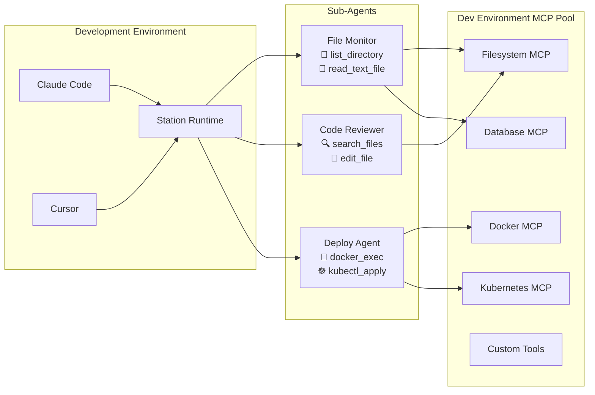

# Station - Lightweight Runtime for Deployable Sub-Agents

> ⚠️ **Beta Release**: Station is currently in beta. Breaking changes may occur between versions. Please pin to specific versions in production environments.

**A secure, self-hosted platform for building and deploying intelligent sub-agents.**



🌐 **[Browse Bundle Registry](https://cloudshipai.github.io/registry)** - Discover ready-to-use MCP bundles for Station

📚 **[Documentation](https://cloudshipai.github.io/station)** - Complete Station documentation and guides

> Station is an MCP runtime that augments your Claude Code and Cursor development experience by providing an agnostic runtime for your sub-agents - with centralized management, environment isolation, and server deployment capabilities.

---

Station is purpose-built for **deployable sub-agents** - the intelligent automation you need for infrastructure monitoring, deployment pipelines, security scanning, and day-to-day tasks that require secure access to internal systems.

## Quickstart

```bash
curl -sSL https://getstation.cloudshipai.com | bash
```

## Getting Started

### 1. **Initialize Station**
```bash
stn init --ship
```

### 2. **Copy MCP Configuration** 
Copy a filesystem template to get started:
```bash
# Create the template.json config file
cat > ~/.config/station/environments/default/template.json << 'EOF'
{
  "description": "Essential filesystem operations with MCP server integration",
  "mcpServers": {
    "filesystem": {
      "command": "npx",
      "args": [
        "-y", 
        "@modelcontextprotocol/server-filesystem@latest",
        "{{ .ROOT_PATH }}"
      ]
    }
  },
  "name": "filesystem-updated"
}
EOF

# Set the ROOT_PATH variable
echo "ROOT_PATH: $HOME/projects" > ~/.config/station/environments/default/variables.yml
```

### 3. **Sync Configuration**
```bash
stn sync
```

### 4. **Connect to Claude or Cursor**
Add Station as an MCP server in your Claude Desktop or Cursor configuration:

**Claude Desktop (`~/.claude_desktop_config.json`):**
```json
{
  "mcpServers": {
    "station": {
      "command": "stn",
      "args": ["stdio"]
    }
  }
}
```

**Cursor (`.cursorrules`):**
```json
{
  "mcpServers": {
    "station": {
      "command": "stn",
      "args": ["stdio"]
    }
  }
}
```

### 5. **Access Web Interface**
```bash
stn serve
```

Then open **http://localhost:8585** in your browser for the full Station management interface.

## What is a Deployable Sub-Agent?

A sub-agent is simple: **a .prompt file + MCP tools**. Everything you need is in the dotprompt.

### **Example: A Real Sub-Agent**

Here's `TestAgent.prompt` from our environment:

```yaml
---
model: "gemini-2.5-flash"
config:
  temperature: 0.3
  max_tokens: 2000
metadata:
  name: "TestAgent"
  description: "A simple test agent for debugging sync functionality"
  version: "1.0.0"
tools:
  - "__read_file"
  - "__list_directory"
station:
  execution_metadata:
    max_steps: 5
    environment: "default"
---

You are a test agent designed to verify that the agent sync functionality is working correctly.
```

That's it. **Agent defined, tools assigned, ready to deploy.**

## Environment Organization

Station organizes everything by **environment** (dev/staging/production):

```
~/.config/station/environments/
├── default/
│   ├── agents/
│   │   ├── TestAgent.prompt
│   │   ├── SecurityScanner.prompt
│   │   └── DatabaseMonitor.prompt
│   ├── template.json        # MCP server configs
│   └── variables.yml        # Environment-specific variables
├── staging/
│   ├── agents/
│   └── template.json
└── production/
    ├── agents/
    └── template.json
```

## Templated MCP Configurations

MCP servers are configured with templates so you can share and install them:

**Example: `template.json`**
```json
{
  "description": "Essential filesystem operations with MCP server integration",
  "mcpServers": {
    "filesystem": {
      "command": "npx",
      "args": [
        "-y", 
        "@modelcontextprotocol/server-filesystem@latest",
        "{{ .ROOT_PATH }}"
      ]
    }
  },
  "name": "filesystem-updated"
}
```

**Environment Variables: `variables.yml`**
```yaml
ROOT_PATH: "/home/user/projects"
AWS_REGION: "us-east-1"
SLACK_CHANNEL: "#alerts"
```

## The Complete Picture

1. **Define your tools** in `template.json` (MCP servers)
2. **Create agents** in `.prompt` files (combine tools + AI prompt)  
3. **Set environment variables** in `variables.yml`
4. **Deploy as bundle** - everything travels together

Your agents can combine tools from multiple MCP servers:
- `__read_file` + `__list_directory` (from filesystem server)
- `__slack_post_message` (from Slack server)  
- `__get_cost_and_usage` (from AWS server)

**Everything you need is in the dotprompt** - portable, versionable, deployable.

## Advanced Features

### **MCP Server Integration**

Station can serve as an MCP server for other AI applications:

```json
{
  "mcpServers": {
    "station": {
      "command": "stn",
      "args": ["stdio"]
    }
  }
}
```

This provides tools like `call_agent`, `create_agent`, `list_agents` to any MCP-compatible application.

### **Interactive Development Playground**

**NEW**: Station includes a powerful interactive development environment powered by Firebase Genkit:

```bash
genkit start -- stn develop --env dev
```

This launches a complete browser-based development playground where you can:
- **Test agents interactively** with custom task inputs
- **Debug tool calling** with real-time execution traces  
- **Access all MCP tools** from your environment
- **Iterate on prompts** with live reloading
- **Analyze execution flows** with detailed logging

Perfect for developing and testing agents before deployment.

## System Requirements

- **OS:** Linux, macOS, Windows  
- **Memory:** 512MB minimum, 1GB recommended
- **Storage:** 200MB for binary, 1GB+ for agent data
- **Database:** SQLite (development) or PostgreSQL (production)
- **Network:** Outbound HTTPS for AI providers

## Resources

- 📚 **[Documentation](https://cloudshipai.github.io/station)** - Complete guides and tutorials
- 🌐 **[Bundle Registry](https://cloudshipai.github.io/registry)** - Community agent templates
- 🐛 **[Issues](https://github.com/cloudshipai/station/issues)** - Bug reports and feature requests
- 💬 **[Discord](https://discord.gg/station-ai)** - Community support and discussions

## License

**AGPL-3.0** - Free for all use, open source contributions welcome.

---

**Station - Self-Hosted AI Agent Platform**

*Turn your team's tools into AI agents. Deploy securely. Scale reliably.*