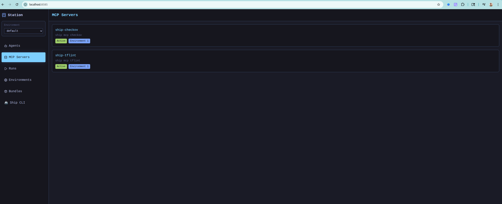

# Station - Lightweight Runtime for Deployable Sub-Agents

> ⚠️ **Beta Release**: Station is currently in beta. Breaking changes may occur between versions. Please pin to specific versions in production environments.

**A secure, self-hosted platform for building and deploying intelligent sub-agents.**


📚 **[Documentation](https://cloudshipai.github.io/station)** - Complete Station documentation and guides

> Station is an MCP runtime that augments your Claude Code and Cursor development experience by providing an agnostic runtime for your sub-agents - with centralized management, environment isolation, and server deployment capabilities.

---

Station is purpose-built for **deployable sub-agents** - to bring intelligence in tough to reach places. Made for engineering teams that want to own and control AI agents across their environments. Station provides a framework and lifecycle to go from local to server deployments. Versioned user agents and tools opens the possibility for more intelligent infrastructure, deployments, security, background processes, and day-to-day tasks that require secure access to internal systems.

---


## Quickstart

> **⚡ Quick Start**: Requires `OPENAI_API_KEY` in your environment

```bash
curl -fsSL https://raw.githubusercontent.com/cloudshipai/station/main/install.sh | bash
stn bootstrap --openai 
```

This single command sets up Station with:
- **OpenAI integration** (gpt-5)
- **Hello World agent** (default env - basic tasks)
- **Playwright agent** (default env - web automation, 21 browser tools)
- **DevOps Security Bundle** (security env - comprehensive security tools, 12 tools)
- **Ship CLI filesystem tools**

## Platform Overview

### **Environment Management**
Station provides a clean web interface for managing your AI agents across different environments:


### **Specialized Agent Examples** 
Pre-built agents for common DevOps workflows, like this Terraform quality analysis agent:


## Manual Setup (Advanced)

> **Note**: Requires `OPENAI_API_KEY` in your environment

### 1. **Install and Initialize**
```bash
curl -fsSL https://raw.githubusercontent.com/cloudshipai/station/main/install.sh | bash
stn init --ship --provider openai --model gpt-5
```

### 2. **Install Security Bundle**
```bash
stn bundle install https://github.com/cloudshipai/registry/releases/latest/download/devops-security-bundle.tar.gz security
```

### 3. **Sync and Connect**
```bash
stn sync && stn sync security
echo '{"mcpServers":{"station":{"command":"stn","args":["stdio"]}}}' > ~/.claude_desktop_config.json
```

### 4. **Test Your Agents**
```bash
# Test security scanning agent
stn agent run "Security Scanner" "Scan the current directory for security vulnerabilities"

# Open Station UI
open http://localhost:8585
```

**✅ You're Ready!** View your agents, MCP servers, and execution results in the Station UI:



Station MCP tools are now available in Claude Code for creating agents, running security scans, and managing environments through natural conversation.

## Station Bundles - Portable AI Environments

Station bundles are pre-configured environment packages that contain specialized AI agents, MCP tools, and complete workflows ready for immediate deployment.

### 🚀 **Quick Install from Registry**

Install production-ready bundles from the [Station Registry](https://cloudshipai.github.io/registry):

```bash
# Install DevOps Security Bundle via UI
# 1. Navigate to http://localhost:8585/bundles
# 2. Paste URL: https://github.com/cloudshipai/registry/releases/latest/download/devops-security-bundle.tar.gz
# 3. Select environment name and click "Install"

# Or install via CLI
stn bundle install https://github.com/cloudshipai/registry/releases/latest/download/devops-security-bundle.tar.gz security-env
```

The DevOps Security Bundle includes:
- **Security Scanner Agent** - Comprehensive vulnerability scanning with Checkov tools
- **Terraform Auditor Agent** - Infrastructure as Code validation with TFLint
- **16 Security Tools** - Ready-to-use tools for CI/CD security automation

### 📦 **Creating Your Own Bundles**

Turn any environment into a shareable bundle:

```bash
# Method 1: CLI Command (Recommended)
stn bundle my-environment --output my-custom-bundle.tar.gz

# Method 2: MCP Tools (For Claude Code/AI)
create_bundle_from_environment(environmentName="my-environment", outputPath="./bundle.tar.gz")

# Method 3: CLI Integration  
stn bundle create my-environment
```

### 🔄 **Bundle Structure**

Station bundles use a simple, API-compatible format:
```
bundle.tar.gz
├── agents/                    # Agent definition files
│   ├── Security Scanner.prompt
│   └── Terraform Auditor.prompt  
├── ship-security.json         # MCP server configurations
└── other-tools.json          # Additional MCP configs
```

### 🛠 **CI/CD Integration**

Use bundles in your CI/CD pipelines with Docker:

```yaml
# GitHub Actions with Station Bundle
- name: Security Analysis
  run: |
    docker run \
      -v $(pwd):/workspace:ro \
      -v /var/run/docker.sock:/var/run/docker.sock \
      -e OPENAI_API_KEY=${{ secrets.OPENAI_API_KEY }} \
      -e ENCRYPTION_KEY=${{ secrets.STATION_ENCRYPTION_KEY }} \
      epuerta18/station-default:latest \
      bash -c "
        stn agent run 'Security Scanner' 'Analyze /workspace for vulnerabilities'
        stn agent run 'Terraform Auditor' 'Validate Terraform in /workspace'
      "
```

**📚 Learn More:** [Creating Bundles Guide](https://cloudshipai.github.io/station/en/creating-bundles) | [Bundle Registry](https://cloudshipai.github.io/registry)

## What is a Deployable Sub-Agent?

A sub-agent is simple: **a .prompt file + MCP tools**. Everything you need is in the dotprompt.

dotprompts have the ability to define both system prompt and user prompt in the same file, making this perfect to share and easy to test. 

It also supports rich variable schema with Picoschema style 


### **Example: A Real Sub-Agent**

Here's `TestAgent.prompt` from our environment:

```yaml
---
model: "gemini-2.5-flash"
config:
  temperature: 0.3
  max_tokens: 2000
input:
  schema:
    userInput: string
output:
  schema:
    response: string
metadata:
  name: "helper"
  description: "A general-purpose helper agent for common tasks and assistance"
  version: "1.0.0"
station:
  execution_metadata:
    max_steps: 5
    environment: "default"
    agent_id: 1
    created_at: "2025-08-18T17:19:22Z"
    updated_at: "2025-08-18T17:19:22Z"
---

{{role "system"}}
You are a helpful assistant designed to assist users with various tasks. You can help with:

- Answering questions and providing explanations
- Analyzing data and information
- Helping with problem-solving
- Providing guidance on best practices
- Assisting with documentation and writing
- Supporting development and technical tasks

Always be concise, accurate, and helpful in your responses. If you're unsure about something, acknowledge it and suggest ways to find the correct information.

{{role "user"}}
{{userInput}}

```

### Example with more dynamic input schema 

A planning agent that defines variables in the system prompt. These are fed at runtime via MCP, API, CLI

```yaml

  ---
  model: "gemini-2.5-flash"
  config:
    temperature: 0.3
    max_tokens: 2000
  input:
    schema:
      userInput: string
      project_type: string
      scope: string
      timeline: string
      priority: string
      budget: string
  output:
    schema:
      response: string
  metadata:
    name: "planner"
    description: "A versatile planning agent that can create structured plans for various
  types of projects and tasks"
    version: "1.0.0"
  station:
    execution_metadata:
      max_steps: 5
      environment: "default"
      agent_id: 3
      created_at: "2025-08-18T17:30:17Z"
      updated_at: "2025-08-18T17:30:17Z"
  ---

  {{role "system"}}
  You are an expert planning agent specialized in creating detailed, actionable plans for
  various types of projects and tasks.

  **Planning Context:**
  - Project Type: {{project_type}}
  - Scope: {{scope}}
  - Timeline: {{timeline}}
  - Priority: {{priority}}
  - Budget: {{budget}}

  **Your Planning Approach:**
  1. **Analysis Phase**: Break down the requirements and constraints
  2. **Structure Phase**: Create a logical sequence of phases/milestones
  3. **Resource Phase**: Identify required resources, skills, and dependencies
  4. **Risk Phase**: Anticipate potential obstacles and mitigation strategies
  5. **Timeline Phase**: Provide realistic time estimates and scheduling
  6. **Review Phase**: Include checkpoints and success criteria

  **Output Format:**
  - Executive Summary (2-3 sentences)
  - Key Phases with deliverables
  - Resource Requirements
  - Timeline with milestones
  - Risk Assessment and Mitigation
  - Success Metrics

  Always tailor your planning style to the project type and provide actionable, specific
  recommendations. Include contingency planning and be realistic about constraints.

  {{role "user"}}
  {{userInput}}
```

That's it. **Agent defined, tools assigned, ready to deploy.**

## Environment Organization

Station organizes everything by **environment** (dev/staging/production):

```
~/.config/station/environments/
├── default/
│   ├── agents/
│   │   ├── TestAgent.prompt
│   │   ├── SecurityScanner.prompt
│   │   └── DatabaseMonitor.prompt
│   ├── template.json        # MCP server configs
│   └── variables.yml        # Environment-specific variables
├── staging/
│   ├── agents/
│   └── template.json
└── production/
    ├── agents/
    └── template.json
```

## Templated MCP Configurations

MCP servers are configured with templates so you can share and install them:

**Example: `template.json`**
```json
{
  "description": "Essential filesystem operations with MCP server integration",
  "mcpServers": {
    "filesystem": {
      "command": "npx",
      "args": [
        "-y", 
        "@modelcontextprotocol/server-filesystem@latest",
        "{{ .ROOT_PATH }}"
      ]
    }
  },
  "name": "filesystem-updated"
}
```

**Environment Variables: `variables.yml`**
```yaml
ROOT_PATH: "/home/user/projects"
AWS_REGION: "us-east-1"
SLACK_CHANNEL: "#alerts"
```

## The Complete Picture

1. **Define your tools** in `template.json` (MCP servers)
2. **Create agents** in `.prompt` files (combine tools + AI prompt)  
3. **Set environment variables** in `variables.yml`
4. **Deploy as bundle** - everything travels together

Your agents can combine tools from multiple MCP servers:
- `__read_file` + `__list_directory` (from filesystem server)
- `__slack_post_message` (from Slack server)  
- `__get_cost_and_usage` (from AWS server)

**Everything you need is in the dotprompt** - portable, versionable, deployable.

## Advanced Features

### **MCP Server Integration**

Station can serve as an MCP server for other AI applications:

```json
{
  "mcpServers": {
    "station": {
      "command": "stn",
      "args": ["stdio"]
    }
  }
}
```

This provides tools like `call_agent`, `create_agent`, `list_agents` to any MCP-compatible application.

### **Interactive Development Playground**

**NEW**: Station includes a powerful interactive development environment powered by Firebase Genkit:

```bash
genkit start -- stn develop --env dev
```

This launches a complete browser-based development playground where you can:
- **Test agents interactively** with custom task inputs
- **Debug tool calling** with real-time execution traces  
- **Access all MCP tools** from your environment
- **Iterate on prompts** with live reloading
- **Analyze execution flows** with detailed logging

Perfect for developing and testing agents before deployment.

## Building Docker Containers from Environments

Station provides a powerful Docker build system that packages any environment into production-ready containers with automatic configuration and CloudShip integration.

### 🎯 **Quick Container Build via UI**

The easiest way to build containers is through Station's web interface:


1. **Navigate to Environments** → `http://localhost:8585/environments`
2. **Click "Build Docker Image"** on your environment
3. **Configure the build**:
   - **Image Name**: `station-env-default`
   - **Tag**: `latest`
   - **Provider/Model**: Auto-detected from your Station config
4. **Click "Build Image"** - Station will build and configure everything automatically

### 🚀 **API-Based Container Building**

For programmatic builds, use Station's REST API:

```bash
# Build Docker container from environment
curl -X POST http://localhost:8585/api/v1/environments/build-image \
  -H "Content-Type: application/json" \
  -d '{
    "environment": "default",
    "image_name": "my-station-agents",
    "tag": "latest"
  }'
```

**Response includes complete runtime configuration:**
```json
{
  "success": true,
  "message": "Docker image built successfully",
  "image_id": "station-default:latest",
  "environment_variables": {
    "OPENAI_API_KEY": "<your-openai-api-key>",
    "STATION_AI_PROVIDER": "openai",
    "STATION_AI_MODEL": "gpt-4o-mini",
    "STATION_API_PORT": "8585",
    "STATION_MCP_PORT": "3000",
    "STATION_SSH_PORT": "2222",
    "STATION_ENCRYPTION_KEY": "<encryption-key>",
    "STN_CLOUDSHIP_ENABLED": "false",
    "STN_CLOUDSHIP_KEY": "<your-cloudship-registration-key>",
    "STN_CLOUDSHIP_ENDPOINT": "lighthouse.cloudship.ai:443"
  }
}
```

### 🐳 **What's Included in Station Containers**

Station containers are **production-ready** and include:

- ✅ **Station Binary** + all dependencies (Node.js, npx, ship CLI)
- ✅ **Environment Agents** imported and synced into database
- ✅ **MCP Server Configurations** with template variable resolution
- ✅ **Automatic Sync** on startup for consistent state
- ✅ **CloudShip Integration** ready for remote management
- ✅ **Runtime Configuration** via environment variables

### 🌐 **Running Containers with CloudShip**

Deploy containers with CloudShip remote management capabilities:

```bash
# Run with CloudShip integration
docker run -d \
  --name station-production \
  --network host \
  -e OPENAI_API_KEY="sk-your-actual-key" \
  -e STN_CLOUDSHIP_ENABLED="true" \
  -e STN_CLOUDSHIP_KEY="your-registration-key" \
  -e STN_CLOUDSHIP_ENDPOINT="lighthouse.cloudship.ai:443" \
  -e STATION_API_PORT="8586" \
  -e STATION_MCP_PORT="3001" \
  -e STATION_SSH_PORT="2223" \
  -e STATION_ENCRYPTION_KEY="$(openssl rand -hex 32)" \
  my-station-agents:latest \
  stn serve --debug
```

**Key Features:**
- **🔐 Secure**: Each container gets unique encryption key
- **📡 Connected**: CloudShip can remotely manage and monitor
- **⚡ Fast**: Automatic environment sync on startup
- **🔧 Configurable**: Runtime environment variable configuration
- **📊 Observable**: Full execution logging and agent tracking

### 🏗️ **Container Build Process**

Station's build process is comprehensive and automated:

1. **Base Container**: Ubuntu with Station binary and dependencies
2. **Environment Copy**: Complete environment copied to `/root/.config/station/environments/default/`
3. **Dependency Installation**: Ship CLI and Node.js MCP tools pre-installed
4. **Database Sync**: Agents imported with timeout and retry logic
5. **Configuration Injection**: Runtime environment variables configured
6. **Health Validation**: MCP connections tested and validated

### 🚀 **Production Deployment Patterns**

**Kubernetes Deployment:**
```yaml
apiVersion: apps/v1
kind: Deployment
metadata:
  name: station-agents
spec:
  replicas: 2
  selector:
    matchLabels:
      app: station-agents
  template:
    spec:
      containers:
      - name: station
        image: my-station-agents:latest
        env:
        - name: OPENAI_API_KEY
          valueFrom:
            secretKeyRef:
              name: station-secrets
              key: openai-api-key
        - name: STN_CLOUDSHIP_ENABLED
          value: "true"
        - name: STN_CLOUDSHIP_KEY
          valueFrom:
            secretKeyRef:
              name: cloudship-secrets
              key: registration-key
        ports:
        - containerPort: 8585
        - containerPort: 3000
        - containerPort: 2222
```

**Docker Compose:**
```yaml
version: '3.8'
services:
  station:
    image: my-station-agents:latest
    environment:
      OPENAI_API_KEY: ${OPENAI_API_KEY}
      STN_CLOUDSHIP_ENABLED: "true"
      STN_CLOUDSHIP_KEY: ${CLOUDSHIP_REGISTRATION_KEY}
      STATION_ENCRYPTION_KEY: ${STATION_ENCRYPTION_KEY}
    ports:
      - "8585:8585"
      - "3000:3000"
      - "2222:2222"
    command: stn serve --debug
```

**Benefits of Station Container Deployment:**
- ✅ **Consistent Environments** - Same agents and tools everywhere
- ✅ **Zero Configuration** - Containers start ready with all dependencies
- ✅ **Horizontal Scaling** - Multiple container instances for load balancing
- ✅ **Remote Management** - CloudShip integration for centralized control
- ✅ **CI/CD Ready** - Perfect for automated deployment pipelines

### 🌍 **Deploying as a Server**

Deploy Station containers as production servers with multi-user access and authentication:

```bash
# Deploy as production server (non-local mode)
docker run -d \
  --name station-server \
  --restart unless-stopped \
  -p 8585:8585 \
  -p 3000:3000 \
  -p 2222:2222 \
  -e OPENAI_API_KEY="sk-your-actual-key" \
  -e STN_CLOUDSHIP_ENABLED="true" \
  -e STN_CLOUDSHIP_KEY="your-registration-key" \
  -e STN_CLOUDSHIP_ENDPOINT="lighthouse.cloudship.ai:443" \
  -e STATION_ENCRYPTION_KEY="$(openssl rand -hex 32)" \
  -v station-data:/root/.config/station \
  my-station-agents:latest \
  stn serve --debug
```

**Key Differences from Local Mode:**
- **🔐 Authentication Required**: Users must authenticate via SSH keys or API tokens
- **👥 Multi-User**: Supports multiple concurrent users and sessions
- **🌐 Remote Access**: Accessible from any network location
- **📊 Centralized Management**: Single server manages multiple environments and users
- **🔒 Enhanced Security**: All operations require proper authentication

**Server Configuration:**
```bash
# Initialize server with admin user
docker exec station-server stn user create admin --admin
docker exec station-server stn ssh-key add admin ~/.ssh/id_rsa.pub

# Access via SSH (authenticated)
ssh admin@your-server.com -p 2222

# Access via web UI (requires authentication)
# Navigate to: https://your-server.com:8585
```

**Environment Variables for Server Mode:**
```bash
# Required
OPENAI_API_KEY=sk-your-key
STATION_ENCRYPTION_KEY=your-32-char-hex-key

# CloudShip Integration (Recommended)
STN_CLOUDSHIP_ENABLED=true
STN_CLOUDSHIP_KEY=your-registration-key
STN_CLOUDSHIP_ENDPOINT=lighthouse.cloudship.ai:443

# Optional Server Configuration
STATION_ADMIN_USERNAME=admin
STATION_DEBUG=false
STATION_TELEMETRY_ENABLED=true
```

**Production Server Setup with SSL:**
```yaml
# docker-compose.yml for production server
version: '3.8'
services:
  station:
    image: my-station-agents:latest
    container_name: station-server
    restart: unless-stopped
    environment:
      OPENAI_API_KEY: ${OPENAI_API_KEY}
      STN_CLOUDSHIP_ENABLED: "true"
      STN_CLOUDSHIP_KEY: ${CLOUDSHIP_REGISTRATION_KEY}
      STATION_ENCRYPTION_KEY: ${STATION_ENCRYPTION_KEY}
      STATION_ADMIN_USERNAME: admin
    ports:
      - "8585:8585"  # Web UI
      - "3000:3000"  # MCP Server
      - "2222:2222"  # SSH Access
    volumes:
      - station-data:/root/.config/station
    command: stn serve --debug

  nginx:
    image: nginx:alpine
    ports:
      - "443:443"
      - "80:80"
    volumes:
      - ./nginx.conf:/etc/nginx/nginx.conf
      - ./ssl:/etc/ssl/certs
    depends_on:
      - station

volumes:
  station-data:
```

**Use Cases for Server Deployment:**
- **🏢 Team Environments**: Central station for development teams
- **🤖 Production AI Services**: Hosted agents for customer-facing applications
- **🔧 CI/CD Infrastructure**: Centralized build and deployment automation
- **🌐 Multi-Tenant Platforms**: SaaS platforms with per-customer agent environments
- **📈 Scalable Agent Orchestration**: Load-balanced agent execution across containers

## CI/CD Integration

Station provides **three production-ready patterns** for integrating AI agents into your CI/CD pipelines:

### 🐳 **Agent-as-a-Service (Docker)**
Deploy agents in containerized environments for maximum isolation and scalability.

**Build Production-Ready Containers:**
```bash
# Build containerized environment with agents pre-configured
stn build env security-bundle \
  --provider openai \
  --model gpt-4o-mini \
  --cloudshipai-registration-key $CLOUDSHIP_KEY

# Container includes:
# ✅ Station binary + all dependencies (Node.js, npx)
# ✅ Agents imported and ready to execute
# ✅ Runtime variable resolution (PROJECT_ROOT, etc.)
# ✅ All MCP tools connected and validated
```

**Use in CI/CD Pipelines:**
```yaml
# GitHub Actions Example with Ship Security Tools
- name: Run Security Analysis
  run: |
    docker run --rm \
      -v ${{ github.workspace }}:/workspace \
      -v /var/run/docker.sock:/var/run/docker.sock \
      -e PROJECT_ROOT=/workspace \
      -e OPENAI_API_KEY=${{ secrets.OPENAI_API_KEY }} \
      your-registry/station-security:latest \
      stn agent run "Security Scanner" "Analyze project for vulnerabilities"

# Docker socket access required for Ship security tools (trivy, grype, etc.)
```

### 🔧 **Direct Station Execution**
Execute agents directly in CI runners with full MCP tool access.

```bash
# Install Station in CI
curl -fsSL https://raw.githubusercontent.com/cloudshipai/station/main/install.sh | bash

# Configure and run agents
stn init --provider openai --model gpt-4o
stn agent import production
stn agent run sbom-security-agent "Generate SBOM and vulnerability analysis"
```

### ⚡ **Dagger Integration**
Programmatic orchestration with type-safe Go modules for complex CI workflows.

```go
// Dagger module for Station CI
func (m *StationCI) SecurityScan(
    ctx context.Context,
    stationSource *dagger.Directory,
    source *dagger.Directory,
    openaiKey *dagger.Secret,
) *dagger.Container {
    return m.BuildStationBase(ctx, stationSource).
        WithDirectory("/workspace", source).
        WithSecretVariable("OPENAI_API_KEY", openaiKey).
        WithExec([]string{"stn", "agent", "run", "security-scanner"})
}
```

### **Complete Examples Available**
- **Docker Compose** deployments with persistent volumes
- **GitHub Actions** workflows with artifact collection
- **Kubernetes** deployments with multi-environment support
- **Dagger modules** for complex multi-stage pipelines

📚 **[View Complete CI/CD Examples →](dev-workspace/ci-cd-examples/)**

**Benefits:**
- ✅ **Database Isolation** - Each CI run gets its own execution context
- ✅ **Security** - No shared state between pipelines or teams  
- ✅ **Scalability** - Parallel execution across multiple environments
- ✅ **Auditability** - Complete run history and execution tracking

## System Requirements

- **OS:** Linux, macOS, Windows  
- **Memory:** 512MB minimum, 1GB recommended
- **Storage:** 200MB for binary, 1GB+ for agent data
- **Database:** SQLite (development) or PostgreSQL (production)
- **Network:** Outbound HTTPS for AI providers

## Resources

- 📚 **[Documentation](https://cloudshipai.github.io/station)** - Complete guides and tutorials
- 🌐 **[Bundle Registry](https://cloudshipai.github.io/registry)** - Community agent templates
- 🐛 **[Issues](https://github.com/cloudshipai/station/issues)** - Bug reports and feature requests
- 💬 **[Discord](https://discord.gg/station-ai)** - Community support and discussions

## License

**AGPL-3.0** - Free for all use, open source contributions welcome.

---

**Station - Self-Hosted AI Agent Platform**

*Turn your team's tools into AI agents. Deploy securely. Scale reliably.*
