# Station - Self-Hosted AI Agent Runtime

**A secure, self-hosted platform for building and deploying intelligent AI agents with MCP tool integration.**

```mermaid
graph LR
    subgraph "Development Environment"
        Claude[Claude Code]
        Cursor[Cursor]
        Station[Station Runtime]
    end

    subgraph "AI Agents"
        Agent1["Security Scanner<br/>🔍 checkov<br/>📦 trivy"]
        Agent2["Cost Analyzer<br/>💰 aws-cost-explorer<br/>📊 grafana"]
        Agent3["Code Reviewer<br/>📝 filesystem<br/>🔧 github"]
    end

    subgraph "MCP Tool Pool"
        Security[Security Tools]
        Cloud[Cloud APIs]
        Dev[Dev Tools]
        Custom[Custom MCPs]
    end

    Claude --> Station
    Cursor --> Station
    Station --> Agent1
    Station --> Agent2
    Station --> Agent3

    Agent1 --> Security
    Agent2 --> Cloud
    Agent3 --> Dev
    Agent1 --> Custom
```



📚 **[Documentation](https://cloudshipai.github.io/station)** | 🚀 **[Getting Started Guide](./docs/GETTING_STARTED.md)** | 🌐 **[Bundle Registry](https://cloudshipai.github.io/registry)**

---

## Quick Start

### 1. Install Station

```bash
curl -fsSL https://raw.githubusercontent.com/cloudshipai/station/main/install.sh | bash
```

### 2. Start Station

```bash
# Set your OpenAI API key
export OPENAI_API_KEY=sk-your-key-here

# Start Station (automatically configures .mcp.json for Claude Code/Cursor)
stn up --provider openai
```

**That's it!** Station is now running with:
- ✅ Web UI at `http://localhost:8585`
- ✅ MCP server configured for Claude Code/Cursor
- ✅ Ready to create and run AI agents

### 3. Testing Agents Interactively

Use Genkit Developer UI for interactive agent testing:

```bash
# Start with Genkit Developer UI (default environment)
stn up --develop

# Start with specific environment
stn up --develop --environment security
```

**Genkit Developer UI provides:**
- 🎯 Interactive agent testing at `http://localhost:4000`
- 🔍 Real-time tool call inspection
- 📊 Token usage tracking
- 🐛 Step-by-step execution debugging

### 4. Managing Station

```bash
# Stop Station (preserves all data)
stn down

# Stop and clear all data
stn down --remove-volume

# View logs
stn logs

# Check status
stn status
```

---

## What is Station?

Station makes it easy to **create custom AI agents** that combine MCP tools for your specific needs.

**Key Features:**
- 🔐 **Secure Template Variables** - Render sensitive values at runtime, never stored in configs
- 🔧 **Mix and Match Tools** - Combine any MCP servers with custom agents
- 📦 **Portable Bundles** - Package agents + MCPs for easy sharing and deployment
- 🐳 **Deploy Anywhere** - Build Docker containers from your agent environments
- 🌐 **Multi-Environment** - Separate dev/staging/production configurations

---

## Creating Your First Agent

Use your preferred LLM via MCP to create agents. Station provides an MCP server that lets you create, manage, and execute agents directly from Claude Code, Cursor, or any MCP-compatible client.

After creating agents through MCP or editing `.prompt` files directly, sync your environment via the web UI at `http://localhost:8585` in the Environments section.

---

## Installing Pre-Built Bundles

Install production-ready agent bundles from the [Station Registry](https://cloudshipai.github.io/registry) via the web UI at `http://localhost:8585`.

After installing a bundle, **sync the environment** in the Environments section to activate the agents.

---

## Building Docker Containers

Deploy your agents as Docker containers:

```bash
# Build container from any environment
stn build env default --output station-default:latest

# Run the container
docker run -d \
  -e OPENAI_API_KEY=sk-your-key \
  -e STATION_ENCRYPTION_KEY=$(openssl rand -hex 32) \
  -p 8585:8585 \
  station-default:latest
```

**What's included in containers:**
- ✅ Station binary + all dependencies
- ✅ Your agents pre-configured and synced
- ✅ MCP servers with variables resolved
- ✅ Production-ready for deployment

---

## Security: Template Variables

Station uses **template variables** to keep sensitive data secure:

**Why this matters:**
- ❌ **Without templates**: API keys, paths, and credentials stored in plain text configs
- ✅ **With templates**: Values rendered at runtime from environment variables

**Example:**
```json
{
  "mcpServers": {
    "ship-semgrep": {
      "command": "ship",
      "args": ["mcp", "semgrep", "--stdio"]
    }
  }
}
```

**Benefits:**
- 🔐 Share configs safely (no secrets exposed)
- 📦 Distribute bundles securely
- 🌍 Deploy across environments with different credentials
- 🔄 Change secrets without updating configs

---

## Use Cases

**Development:**
- Local AI agents with full MCP tool access
- Mix filesystem, cloud, security, and custom tools
- Test agents before production deployment

**CI/CD:**
```yaml
# GitHub Actions example
- name: Security Scan
  run: |
    docker run --rm \
      -v ${{ github.workspace }}:/workspace \
      -e OPENAI_API_KEY=${{ secrets.OPENAI_API_KEY }} \
      ghcr.io/cloudshipai/station:latest \
      stn agent run "Security Scanner" "Analyze /workspace"
```

**Production:**
- Deploy containerized agents to Kubernetes
- Horizontal scaling with multiple instances
- Remote management via CloudShip integration

---

## System Requirements

- **OS:** Linux, macOS, Windows
- **Memory:** 512MB minimum, 1GB recommended
- **Storage:** 200MB for binary, 1GB+ for agent data
- **Network:** Outbound HTTPS for AI providers

---

## Resources

- 📚 **[Documentation](https://cloudshipai.github.io/station)** - Complete guides and tutorials
- 🌐 **[Bundle Registry](https://cloudshipai.github.io/registry)** - Community agent bundles
- 🐛 **[Issues](https://github.com/cloudshipai/station/issues)** - Bug reports and feature requests
- 💬 **[Discord](https://discord.gg/station-ai)** - Community support

---

## License

**Apache 2.0** - Free for all use, open source contributions welcome.

---

**Station - Self-Hosted AI Agent Runtime**

*Secure AI agents. Custom MCP tools. Deploy anywhere.*
