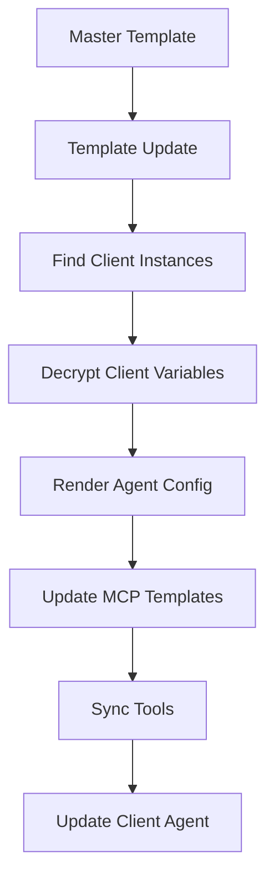

# Agent Multi-Tenant Template System - Sub-PRD

## 🎯 **Vision Statement**

Enable service providers to manage identical agents across multiple clients with centralized template updates and client-specific encrypted variables. This system extends the Agent Template System to support one-to-many agent deployment patterns where a single template serves multiple isolated client instances.

## 📋 **Executive Summary**

This sub-system addresses the multi-tenant use case where service providers (MSPs, consultants, SaaS providers) need to deploy the same agent logic across multiple clients with client-specific configuration while maintaining centralized control and updates.

### **Key Problems Solved:**
- **Multi-Client Management**: Deploy same agent to dozens/hundreds of clients
- **Centralized Updates**: Update template → all client instances updated immediately
- **Client Isolation**: Secure, encrypted client-specific variables and configurations
- **Easy Onboarding**: Add new clients with minimal configuration
- **Service Provider Efficiency**: Manage entire client base from single interface

## 🏗️ **System Architecture**

### **Conceptual Model**
```
Master Template Agent (ID: 100)
├── Client A Instance (ID: 101) + Encrypted Variables
├── Client B Instance (ID: 102) + Encrypted Variables
├── Client C Instance (ID: 103) + Encrypted Variables
└── ... (scales to N clients)
```

### **Data Flow**


## 📊 **Data Models**

### **Extended Agent Model**
```go
type Agent struct {
    // ... existing fields
    AgentType       string  `json:"agent_type"`        // "standard", "template", "client_instance"
    IsTemplate      bool    `json:"is_template"`       // true for master templates
    TemplateAgentID *int64  `json:"template_agent_id"` // references master template
    ClientID        *string `json:"client_id"`         // unique client identifier
    TemplateVersion string  `json:"template_version"`  // track template version for updates
    LastSyncedAt    *time.Time `json:"last_synced_at"` // last template sync time
}
```

### **Agent Client Variables (Database-Stored)**
```go
type AgentClientVariable struct {
    ID               int64     `json:"id" db:"id"`
    TemplateAgentID  int64     `json:"template_agent_id" db:"template_agent_id"`
    ClientID         string    `json:"client_id" db:"client_id"`
    VariableName     string    `json:"variable_name" db:"variable_name"`
    EncryptedValue   string    `json:"encrypted_value" db:"encrypted_value"`  // AES-256 encrypted
    VariableType     string    `json:"variable_type" db:"variable_type"`      // "agent", "mcp", "system"
    Description      string    `json:"description" db:"description"`
    IsRequired       bool      `json:"is_required" db:"is_required"`
    CreatedAt        time.Time `json:"created_at" db:"created_at"`
    UpdatedAt        time.Time `json:"updated_at" db:"updated_at"`
}
```

**Database Schema:**
```sql
-- Extend existing agents table
ALTER TABLE agents ADD COLUMN agent_type TEXT DEFAULT 'standard';
ALTER TABLE agents ADD COLUMN is_template BOOLEAN DEFAULT FALSE; 
ALTER TABLE agents ADD COLUMN template_agent_id INTEGER REFERENCES agents(id);
ALTER TABLE agents ADD COLUMN client_id TEXT;
ALTER TABLE agents ADD COLUMN template_version TEXT;
ALTER TABLE agents ADD COLUMN last_synced_at TIMESTAMP;

-- New table for encrypted client-specific variables
CREATE TABLE agent_client_variables (
    id INTEGER PRIMARY KEY AUTOINCREMENT,
    template_agent_id INTEGER NOT NULL,
    client_id TEXT NOT NULL,
    variable_name TEXT NOT NULL,
    encrypted_value TEXT NOT NULL,           -- AES-256 encrypted with station key
    variable_type TEXT DEFAULT 'agent',     -- 'agent', 'mcp', 'system'
    description TEXT,
    is_required BOOLEAN DEFAULT true,
    created_at TIMESTAMP DEFAULT CURRENT_TIMESTAMP,
    updated_at TIMESTAMP DEFAULT CURRENT_TIMESTAMP,
    FOREIGN KEY (template_agent_id) REFERENCES agents(id) ON DELETE CASCADE,
    UNIQUE(template_agent_id, client_id, variable_name)
);

-- Index for performance
CREATE INDEX idx_client_vars_template_client ON agent_client_variables(template_agent_id, client_id);
```

## 🔐 **Encryption & Security**

### **Variable Encryption Strategy**

**Use Station's Existing Encryption Key:**
```go
type ClientVariableEncryption struct {
    encryptionKey []byte  // From Station's existing init process
}

func (e *ClientVariableEncryption) EncryptVariable(value string) (string, error) {
    // Use Station's existing AES-256-GCM encryption
    // Same pattern as other encrypted data in Station
    return encryption.Encrypt(value, e.encryptionKey)
}

func (e *ClientVariableEncryption) DecryptVariable(encryptedValue string) (string, error) {
    // Decrypt using Station's key
    return encryption.Decrypt(encryptedValue, e.encryptionKey)
}
```

**Security Benefits:**
- **✅ Reuses Station's proven encryption**: No new crypto implementation
- **✅ Key management handled**: Station init already generates and manages keys
- **✅ Client isolation**: Each client's variables encrypted separately
- **✅ Access control**: Only Station with correct key can decrypt variables

### **Variable Access Control**
```go
type ClientVariableService struct {
    repo          repositories.AgentClientVariableRepo
    encryption    *ClientVariableEncryption
    accessControl *AccessControl
}

func (s *ClientVariableService) GetClientVariables(templateID int64, clientID string, userID int64) (map[string]string, error) {
    // Check user has access to template and client
    if err := s.accessControl.CheckTemplateAccess(userID, templateID, clientID); err != nil {
        return nil, err
    }
    
    // Get encrypted variables
    encryptedVars := s.repo.GetByTemplateAndClient(templateID, clientID)
    
    // Decrypt and return
    vars := make(map[string]string)
    for _, encVar := range encryptedVars {
        decrypted, err := s.encryption.DecryptVariable(encVar.EncryptedValue)
        if err != nil {
            return nil, fmt.Errorf("failed to decrypt variable %s: %w", encVar.VariableName, err)
        }
        vars[encVar.VariableName] = decrypted
    }
    
    return vars, nil
}
```

## 🔄 **Variable Resolution Hierarchy**

### **Clear Separation of Concerns**

**Agent-Specific Variables (Database-Stored, Encrypted):**
- Client AWS keys, API tokens, client names
- Service-specific configuration (timeouts, regions)
- Billing/account identifiers
- **Storage**: `agent_client_variables` table (encrypted)
- **Usage**: Agent prompt templates, agent configuration

**MCP Configuration Variables (File-Based):**
- Environment-specific settings (dev/staging/prod URLs)
- Tool configuration (filesystem paths, database connections)  
- Environment secrets (database passwords, service URLs)
- **Storage**: File-based in `environments/{env}/variables.yml`
- **Usage**: MCP server configuration templates

### **Variable Resolution Strategy**

**For Agent Configuration:**
```go
func (s *TemplateProcessor) ResolveAgentVariables(templateID int64, clientID string, environment string) (map[string]interface{}, error) {
    variables := make(map[string]interface{})
    
    // 1. Client-specific variables (database, encrypted)
    clientVars, err := s.clientVarService.GetClientVariables(templateID, clientID)
    if err != nil {
        return nil, err
    }
    for k, v := range clientVars {
        if strings.HasPrefix(k, "AGENT_") || strings.HasPrefix(k, "CLIENT_") {
            variables[k] = v
        }
    }
    
    // 2. Template defaults (from template agent config)
    templateVars := s.getTemplateDefaultVariables(templateID)
    for k, v := range templateVars {
        if _, exists := variables[k]; !exists {
            variables[k] = v
        }
    }
    
    // 3. Environment variables (for agent-level settings)
    envVars := os.Environ()
    for _, env := range envVars {
        if strings.HasPrefix(env, "STATION_AGENT_") {
            parts := strings.SplitN(env, "=", 2)
            if len(parts) == 2 {
                variables[strings.TrimPrefix(parts[0], "STATION_AGENT_")] = parts[1]
            }
        }
    }
    
    return variables, nil
}
```

**For MCP Configuration Templates:**
```go
func (s *TemplateProcessor) ResolveMCPVariables(templateID int64, clientID string, environment string) (map[string]interface{}, error) {
    variables := make(map[string]interface{})
    
    // 1. Client-specific MCP variables (database, encrypted)
    clientVars, err := s.clientVarService.GetClientVariables(templateID, clientID)
    if err != nil {
        return nil, err
    }
    for k, v := range clientVars {
        if strings.HasPrefix(k, "MCP_") || strings.HasPrefix(k, "AWS_") || strings.HasPrefix(k, "API_") {
            variables[k] = v
        }
    }
    
    // 2. Environment-based variables (file-based)
    envVars, err := s.mcpService.LoadEnvironmentVariables(environment)
    if err != nil {
        return nil, err
    }
    for k, v := range envVars {
        if _, exists := variables[k]; !exists {
            variables[k] = v
        }
    }
    
    // 3. System variables
    variables["ENVIRONMENT"] = environment
    variables["CLIENT_ID"] = clientID
    
    return variables, nil
}
```

### **Variable Type Classification**

**Variable Naming Convention:**
```bash
# Agent-specific variables (database-stored, encrypted)
CLIENT_NAME="Acme Corp"
CLIENT_AWS_ACCESS_KEY="AKIA..."
CLIENT_AWS_SECRET_KEY="..."
AGENT_MAX_RETRIES="3"
AGENT_TIMEOUT="30"

# MCP-specific variables (can be database or file-based)
AWS_REGION="us-east-1"
API_ENDPOINT="https://api.client.com"
S3_BUCKET_PREFIX="client-data"

# Environment variables (file-based)
DATABASE_URL="postgresql://localhost/staging"
LOG_LEVEL="debug"
STATION_API_URL="http://localhost:8080"
```

**Resolution Logic:**
```go
func (s *TemplateProcessor) DetermineVariableSource(variableName string) string {
    // Agent-specific: always from encrypted database
    if strings.HasPrefix(variableName, "CLIENT_") || 
       strings.HasPrefix(variableName, "AGENT_") {
        return "database_encrypted"
    }
    
    // MCP/Service variables: check database first, fallback to files
    if strings.HasPrefix(variableName, "AWS_") ||
       strings.HasPrefix(variableName, "API_") ||
       strings.HasPrefix(variableName, "MCP_") {
        return "database_or_file"
    }
    
    // Environment variables: always from files
    return "file_based"
}
```

## 🎨 **User Experience Workflows**

### **1. Create Multi-Tenant Template**
```bash
# Create template agent with variable placeholders
stn agent create-template --name "AWS Client Manager" --environment shared

✅ Created template agent: AWS Client Manager (ID: 100)
📝 Configure your template:
   - Agent prompt: "You are managing AWS resources for {{ .CLIENT_NAME }}"  
   - Required variables: CLIENT_NAME, CLIENT_AWS_ACCESS_KEY, CLIENT_AWS_SECRET_KEY
   - MCP bundles: aws-tools, monitoring-tools

# Define required client variables
stn agent template-vars 100 --define \
    CLIENT_NAME:string:required:"Client company name" \
    CLIENT_AWS_ACCESS_KEY:string:required:"AWS Access Key ID" \
    CLIENT_AWS_SECRET_KEY:secret:required:"AWS Secret Access Key" \
    AWS_REGION:string:optional:"AWS Region (default: us-east-1)"
```

### **2. Add Client Instances**
```bash
# Add client with encrypted variables
stn agent add-client 100 acme-corp \
    --var CLIENT_NAME="Acme Corporation" \
    --var CLIENT_AWS_ACCESS_KEY="AKIA..." \
    --var CLIENT_AWS_SECRET_KEY="..." \
    --var AWS_REGION="us-east-1"

🔐 Encrypting client variables...
🤖 Creating client instance...
🔧 Configuring MCP servers with client variables...
✅ Created: Acme Corporation AWS Manager (Agent ID: 101)

# Add another client
stn agent add-client 100 widgets-inc \
    --var CLIENT_NAME="Widgets Inc" \
    --var CLIENT_AWS_ACCESS_KEY="AKIA..." \
    --var CLIENT_AWS_SECRET_KEY="..." \
    --var AWS_REGION="us-west-2"

✅ Created: Widgets Inc AWS Manager (Agent ID: 102)
```

### **3. Centralized Template Updates**
```bash
# Update affects all client instances
stn agent update-template 100 \
    --add-mcp-bundle "cost-optimization-tools" \
    --update-prompt "You are an AWS expert managing {{ .CLIENT_NAME }}'s infrastructure. Focus on cost optimization and security."

🔄 Updating template: AWS Client Manager
🔍 Found 15 client instances
🔐 Decrypting client variables for MCP config updates...
🔧 Adding cost-optimization-tools to all client MCP configurations...
📝 Updating agent prompts with client names...
⚡ Running mcp sync for all client environments...
✅ Updated 15/15 client instances successfully

Affected clients:
- Agent 101: Acme Corporation AWS Manager  
- Agent 102: Widgets Inc AWS Manager
- Agent 103: TechCorp AWS Manager
- ... (12 more)
```

### **4. Client Management Operations**
```bash
# Run agent for specific client
stn agent run 101 "Analyze S3 costs for this month"
# Variables automatically resolved: {{ .CLIENT_NAME }} → "Acme Corporation"

# Update client-specific variables
stn agent update-client-vars 101 --var AWS_REGION="eu-west-1"
🔐 Encrypting updated variables...
🔧 Updating MCP configurations with new region...
✅ Updated Acme Corp configuration

# List all clients for a template
stn agent list-clients 100
Template: AWS Client Manager (ID: 100)
Client Instances:
- acme-corp     → Agent 101 (Acme Corporation AWS Manager)
- widgets-inc   → Agent 102 (Widgets Inc AWS Manager)  
- techcorp      → Agent 103 (TechCorp AWS Manager)
Total: 15 active clients
```

## 🔧 **Core Services**

### **1. Template Synchronization Service**
```go
type TemplateSyncService struct {
    agentRepo       repositories.AgentRepo
    clientVarRepo   repositories.AgentClientVariableRepo
    mcpService      mcp.FileConfigService
    encryption      *ClientVariableEncryption
    templateProcessor *TemplateProcessor
}

func (s *TemplateSyncService) UpdateTemplate(templateID int64, updates AgentTemplateUpdate) error {
    // 1. Update master template
    // 2. Find all client instances
    // 3. For each client:
    //    - Decrypt client variables
    //    - Apply template updates
    //    - Re-render agent configuration
    //    - Update MCP configurations if needed
    //    - Trigger tool sync
    //    - Update client instance
    // 4. Track update propagation and errors
}

func (s *TemplateSyncService) AddClient(templateID int64, clientID string, variables map[string]string) (*Agent, error) {
    // 1. Validate template exists and user has access
    // 2. Encrypt and store client variables
    // 3. Create agent instance from template
    // 4. Render agent configuration with client variables
    // 5. Set up MCP configurations with mixed variable resolution
    // 6. Assign tools to client agent
    // 7. Return new agent instance
}
```

### **2. Client Variable Service**
```go
type ClientVariableService struct {
    repo       repositories.AgentClientVariableRepo
    encryption *ClientVariableEncryption
    audit      *AuditLogger
}

func (s *ClientVariableService) SetClientVariable(templateID int64, clientID string, name, value string, varType VariableType) error {
    // Encrypt the value
    encrypted, err := s.encryption.EncryptVariable(value)
    if err != nil {
        return err
    }
    
    // Store encrypted variable
    variable := &AgentClientVariable{
        TemplateAgentID: templateID,
        ClientID:        clientID,
        VariableName:    name,
        EncryptedValue:  encrypted,
        VariableType:    string(varType),
    }
    
    err = s.repo.Upsert(variable)
    
    // Audit log the variable change (not the value!)
    s.audit.LogVariableChange(templateID, clientID, name, varType)
    
    return err
}

func (s *ClientVariableService) GetClientVariables(templateID int64, clientID string) (map[string]string, error) {
    // Get encrypted variables
    encryptedVars, err := s.repo.GetByTemplateAndClient(templateID, clientID)
    if err != nil {
        return nil, err
    }
    
    // Decrypt all variables
    variables := make(map[string]string)
    for _, encVar := range encryptedVars {
        decrypted, err := s.encryption.DecryptVariable(encVar.EncryptedValue)
        if err != nil {
            return nil, fmt.Errorf("failed to decrypt %s: %w", encVar.VariableName, err)
        }
        variables[encVar.VariableName] = decrypted
    }
    
    return variables, nil
}
```

### **3. Multi-Variable Resolution Engine**
```go
type MultiVariableResolver struct {
    clientVarService  *ClientVariableService
    fileVarService    *FileVariableService
    envVarResolver    *EnvironmentVariableResolver
}

func (r *MultiVariableResolver) ResolveForAgent(templateID int64, clientID string, environment string) (map[string]interface{}, error) {
    variables := make(map[string]interface{})
    
    // Agent variables (database, encrypted)
    clientVars, err := r.clientVarService.GetClientVariables(templateID, clientID)
    if err != nil {
        return nil, err
    }
    for k, v := range clientVars {
        variables[k] = v
    }
    
    // Environment variables (file-based, not encrypted)  
    envVars, err := r.fileVarService.LoadEnvironmentVariables(environment)
    if err != nil {
        return nil, err
    }
    
    // Apply precedence: client vars override environment vars
    for k, v := range envVars {
        if _, exists := variables[k]; !exists {
            variables[k] = v
        }
    }
    
    // System variables
    variables["ENVIRONMENT"] = environment
    variables["CLIENT_ID"] = clientID
    variables["TIMESTAMP"] = time.Now().Unix()
    
    return variables, nil
}

func (r *MultiVariableResolver) ResolveForMCP(templateID int64, clientID string, environment string) (map[string]interface{}, error) {
    // Similar to agent resolution but prioritizes MCP-prefixed variables
    // Handles both encrypted client vars and file-based environment vars
}
```

## 🧪 **Testing Strategy**

### **Unit Testing (Target: 85%+ Coverage)**

**Template Synchronization Tests:**
```go
func TestTemplateSyncService_UpdateTemplate(t *testing.T) {
    tests := []struct {
        name           string
        templateID     int64
        updates        AgentTemplateUpdate
        clientCount    int
        expectSuccess  bool
        expectErrors   []string
    }{
        {
            name: "successful_bulk_update",
            templateID: 100,
            updates: AgentTemplateUpdate{
                Prompt: "Updated prompt with {{ .CLIENT_NAME }}",
                AddMCPBundles: []string{"new-tools"},
            },
            clientCount: 5,
            expectSuccess: true,
        },
        {
            name: "partial_failure_with_rollback",
            templateID: 100,
            updates: AgentTemplateUpdate{
                AddMCPBundles: []string{"non-existent-bundle"},
            },
            clientCount: 3,
            expectSuccess: false,
            expectErrors: []string{"bundle not found"},
        },
    }
}
```

**Encryption Tests:**
```go
func TestClientVariableEncryption(t *testing.T) {
    encryption := NewClientVariableEncryption(testKey)
    
    sensitive := "AKIA1234567890EXAMPLE"
    encrypted, err := encryption.EncryptVariable(sensitive)
    assert.NoError(t, err)
    assert.NotEqual(t, sensitive, encrypted)
    
    decrypted, err := encryption.DecryptVariable(encrypted)
    assert.NoError(t, err)
    assert.Equal(t, sensitive, decrypted)
}
```

### **Integration Testing**

**End-to-End Multi-Client Workflow:**
```go
func TestE2E_MultiClientTemplate(t *testing.T) {
    // 1. Create template agent
    templateID := createTestTemplate(t)
    
    // 2. Add multiple clients with different variables
    clients := []struct{id string; vars map[string]string}{
        {"client-a", map[string]string{"CLIENT_NAME": "Client A", "AWS_REGION": "us-east-1"}},
        {"client-b", map[string]string{"CLIENT_NAME": "Client B", "AWS_REGION": "eu-west-1"}},
    }
    
    var agentIDs []int64
    for _, client := range clients {
        agentID := addTestClient(t, templateID, client.id, client.vars)
        agentIDs = append(agentIDs, agentID)
    }
    
    // 3. Update template
    updateTemplate(t, templateID, AgentTemplateUpdate{
        Prompt: "Updated prompt for {{ .CLIENT_NAME }}",
    })
    
    // 4. Verify all clients updated correctly
    for i, agentID := range agentIDs {
        agent := getAgent(t, agentID)
        expected := fmt.Sprintf("Updated prompt for %s", clients[i].vars["CLIENT_NAME"])
        assert.Equal(t, expected, agent.Prompt)
    }
    
    // 5. Run agents and verify client-specific behavior
    for i, agentID := range agentIDs {
        result := runAgent(t, agentID, "test task")
        assert.Contains(t, result.Response, clients[i].vars["CLIENT_NAME"])
    }
}
```

## 🚀 **Implementation Plan**

### **Phase 1: Core Infrastructure (2 weeks)**
- [ ] Database schema extensions for template relationships
- [ ] Client variable encryption service using Station's key
- [ ] Template synchronization service foundation
- [ ] Basic CLI commands: `create-template`, `add-client`

### **Phase 2: Variable Resolution (1 week)**  
- [ ] Multi-variable resolution engine
- [ ] Integration with MCP template processing
- [ ] Variable type classification and routing
- [ ] Testing with encrypted variables in MCP configs

### **Phase 3: Template Operations (1 week)**
- [ ] Template update propagation
- [ ] Bulk client management operations
- [ ] Error handling and rollback mechanisms
- [ ] Advanced CLI commands: `update-template`, `list-clients`

### **Phase 4: Integration & Polish (1 week)**
- [ ] Integration with existing agent export/import
- [ ] Bundle system integration for template sharing
- [ ] Comprehensive testing and documentation
- [ ] Performance optimization for large client bases

## ✅ **Success Metrics**

### **Functional Requirements**
- [ ] Create template and add 10 clients in < 5 minutes
- [ ] Template update propagates to 50 clients in < 30 seconds  
- [ ] Client variables encrypted with Station's key
- [ ] Variable resolution works correctly for both agent and MCP configs
- [ ] Zero cross-client variable leakage

### **Performance Requirements**
- [ ] Support 100+ clients per template
- [ ] Template updates complete in O(n) time where n = client count
- [ ] Variable decryption adds < 100ms per client operation
- [ ] Database queries optimized with proper indexing

### **Security Requirements**
- [ ] All client-specific variables encrypted at rest
- [ ] Audit logging for all variable access and changes
- [ ] Access control prevents unauthorized client access
- [ ] No sensitive data in logs or error messages

This sub-PRD provides a comprehensive design for multi-tenant agent templates that addresses the service provider use case while maintaining security and performance at scale!