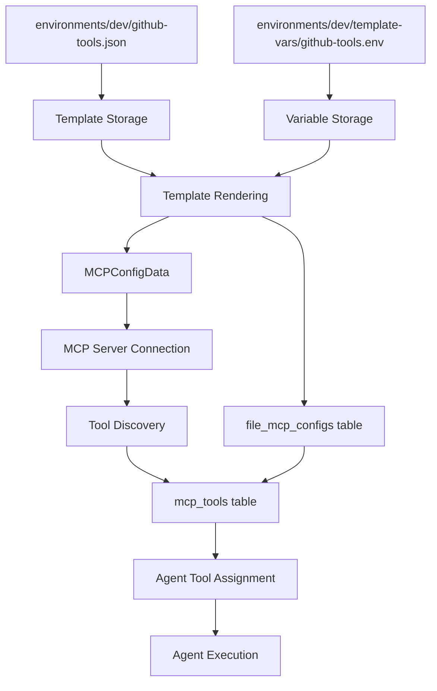

# Final File-Based MCP Config Integration Architecture

## Key Integration Points Identified ✅

### 1. **MCP Config Creation & Storage**
**FROM**: `MCPConfigService.UploadConfig()` → Encrypted SQLite storage  
**TO**: `FileConfigService.CreateOrUpdateTemplate()` → File templates + variables

```go
// OLD: Upload encrypted JSON to database
mcpConfig := MCPConfigService.UploadConfig(envID, configData)

// NEW: Save template + variables, trigger tool discovery
fileConfigService.CreateOrUpdateTemplate(ctx, envID, "github-tools", template, variables)
```

### 2. **Tool Discovery & Loading** 
**FROM**: `ToolDiscoveryService.ReplaceToolsWithTransaction()` → Decrypt config → Connect to MCP servers  
**TO**: Load template → Render with variables → Connect to MCP servers → Link tools to file config

```go
// OLD: Decrypt database config
configData := decryptConfig(latestConfig)

// NEW: Render file template  
configData := fileConfigService.LoadAndRenderConfig(ctx, envID, "github-tools")
// Then: Same tool discovery process, but tools linked to file_mcp_configs.id
```

### 3. **Agent Tool Assignment (UNCHANGED)**
Agents still get tools via `agent_tools` table → `mcp_tools` table (environment-filtered)

```go
// This remains exactly the same
agentTools := repos.AgentTools.ListAgentTools(agentID)
// Tools are still environment-specific, just sourced from file configs
```

### 4. **Agent Execution (UNCHANGED)**
`GenkitService` loads agent tools for execution - no changes needed

## Complete Workflow Integration

### Template → Variables → Tools → Agent Assignment



## Database Schema Changes

### New Tables (Migration 016)
```sql
-- Links file configs to discovered tools
CREATE TABLE file_mcp_configs (
    id INTEGER PRIMARY KEY,
    environment_id INTEGER NOT NULL,
    config_name TEXT NOT NULL,           -- github-tools, aws-tools, etc.
    template_path TEXT NOT NULL,         -- environments/dev/github-tools.json
    variables_path TEXT,                 -- environments/dev/variables.env
    template_specific_vars_path TEXT,    -- environments/dev/template-vars/github-tools.env
    template_hash TEXT,                  -- SHA256 of template content
    variables_hash TEXT,                 -- SHA256 of variables
    template_vars_hash TEXT,             -- SHA256 of template-specific vars
    last_loaded_at TIMESTAMP,
    FOREIGN KEY (environment_id) REFERENCES environments(id)
);

-- Track template variables metadata
CREATE TABLE template_variables (
    id INTEGER PRIMARY KEY,
    file_config_id INTEGER NOT NULL,
    variable_name TEXT NOT NULL,
    variable_type TEXT DEFAULT 'string',
    required BOOLEAN DEFAULT TRUE,
    secret BOOLEAN DEFAULT FALSE,
    description TEXT,
    validation_rules TEXT,             -- JSON validation rules
    FOREIGN KEY (file_config_id) REFERENCES file_mcp_configs(id)
);

-- mcp_tools gets optional reference to file config
ALTER TABLE mcp_tools ADD COLUMN file_config_id INTEGER REFERENCES file_mcp_configs(id);
```

### Remove Old Tables
```sql
-- Remove encrypted config storage (no backward compatibility needed)
DROP TABLE mcp_configs;
```

## Variable Resolution Architecture

### Problem: Multiple Templates, Same Variable Names
Both `github-tools.json` and `aws-tools.json` use `{{.ApiKey}}` but need different values.

### Solution: Template-Specific Variable Files
```bash
environments/dev/
├── variables.env                    # Global: Environment=dev, LogLevel=debug
├── template-vars/
│   ├── github-tools.env            # ApiKey=ghp_github_token_xxx
│   └── aws-tools.env               # ApiKey=AKIA_aws_key_xxx
├── github-tools.json               # Template: "TOKEN": "{{.ApiKey}}"
└── aws-tools.json                  # Template: "ACCESS_KEY": "{{.ApiKey}}"
```

### Variable Resolution Strategy
```go
func (s *FileConfigService) RenderTemplate(envID int64, configName string) (*MCPConfigData, error) {
    // 1. Load global variables
    globalVars := s.loadGlobalVariables(envID)
    
    // 2. Load template-specific variables (higher precedence)
    templateVars := s.loadTemplateVariables(envID, configName)
    
    // 3. Merge: template-specific overrides global
    finalVars := mergeVariables(globalVars, templateVars)
    
    // 4. Render template
    return s.templateEngine.Render(template, finalVars)
}
```

## GitOps Integration

### Repository Structure
```bash
station-configs/                      # Git repository ✅ COMMITTED
├── environments/
│   ├── dev/
│   │   ├── github-tools.json        # ✅ Template committed
│   │   ├── aws-tools.json           # ✅ Template committed
│   │   └── datadog-tools.json       # ✅ Template committed
│   ├── staging/
│   └── prod/
├── placeholders/                     # ✅ COMMITTED
│   ├── github-tools.env.example     # Generated placeholders
│   └── aws-tools.env.example
└── .gitignore                       # ✅ COMMITTED

~/.config/station/secrets/            # ❌ NOT COMMITTED
├── environments/
│   ├── dev/template-vars/
│   │   ├── github-tools.env         # Real secrets
│   │   └── aws-tools.env            # Real secrets
│   ├── staging/template-vars/
│   └── prod/template-vars/
```

### Placeholder Generation
```go
stn mcp config create github-tools --env dev
  -> Creates template
  -> Extracts variables 
  -> Generates placeholders/github-tools.env.example
  -> Team commits template + placeholder
  -> Developers fill in real values in secrets directory
```

## CLI Integration

### Template Management
```bash
# Create template with interactive variable collection
stn mcp config create github-tools --env dev --interactive

# Edit template
stn mcp config edit github-tools --env dev

# Validate template syntax and variables
stn mcp config validate github-tools --env dev

# Preview rendered config
stn mcp config render github-tools --env dev
```

### Variable Management  
```bash
# Set template-specific variables
stn mcp vars set ApiKey=ghp_xxx --template github-tools --env dev

# Edit variables interactively
stn mcp vars edit --template github-tools --env dev

# List variables (secrets masked)
stn mcp vars list --template github-tools --env dev --secrets
```

### GitOps Commands
```bash
# Generate placeholders for sharing
stn mcp placeholders generate --env dev --all

# Initialize config structure
stn mcp config init --env dev

# Validate all templates in environment
stn mcp config validate --env dev --all
```

## Integration with Existing Agent Flow

### Agent Creation (ENHANCED)
```go
// Agents now get tools from file-config-sourced mcp_tools
agentTools := repos.AgentTools.ListAgentTools(agentID)
// Tools are linked to file_mcp_configs instead of encrypted mcp_configs
```

### Agent Execution (UNCHANGED)
```go
// GenkitService execution flow stays the same
assignedTools := s.agentToolRepo.ListAgentTools(agentID)
// Tools work exactly the same way, just sourced from file configs
```

### Tool Assignment (UNCHANGED)
```go
// Agent tool assignment UI and logic unchanged
repos.AgentTools.AddAgentTool(agentID, toolID)
// Still uses mcp_tools.id for assignment
```

## Change Detection & Auto-Reload

### File Watching
```go
func (s *FileConfigService) WatchForChanges(envID int64) {
    // 1. Calculate current hashes
    currentHashes := s.calculateFileHashes(envID)
    
    // 2. Compare with database hashes
    storedHashes := s.repos.FileMCPConfigs.GetConfigsForChangeDetection(envID)
    
    // 3. Detect changes
    changes := s.detectChanges(currentHashes, storedHashes)
    
    // 4. Auto-reload changed configs
    for _, change := range changes {
        s.DiscoverToolsForConfig(ctx, envID, change.ConfigName)
    }
}
```

## Implementation Benefits

### ✅ Solves Key Problems
1. **Multiple templates, same variables**: Template-specific variable files
2. **GitOps workflow**: Templates committed, secrets separate
3. **Team collaboration**: Share templates, manage secrets individually
4. **Environment promotion**: Copy templates, configure environment-specific secrets

### ✅ Maintains Existing Flow
1. **Agent tool assignment**: Unchanged - uses same `mcp_tools` table
2. **Agent execution**: Unchanged - tools work exactly the same
3. **Environment isolation**: Enhanced - still environment-specific
4. **Tool discovery**: Enhanced - works with rendered templates

### ✅ Adds New Capabilities
1. **Declarative configuration**: Infrastructure as Code
2. **Variable validation**: Type checking and constraints
3. **Template sharing**: Team collaboration on agent configs
4. **Change detection**: Auto-reload on file changes
5. **Placeholder generation**: Secure secret management

## Migration Strategy (No Backward Compatibility)

### Phase 1: Replace Config Storage
1. Remove `MCPConfigService` encrypted storage
2. Implement `FileConfigService` with template rendering
3. Update tool discovery to use rendered configs

### Phase 2: Update Integrations
1. Update CLI to use file-based commands
2. Update TUI to show file config status
3. Update API endpoints for file config management

### Phase 3: Enhanced Features
1. Add change detection and auto-reload
2. Implement placeholder generation
3. Add template validation and CI/CD integration

## Complete Integration Success ✅

This architecture successfully:
- **Eliminates encrypted SQLite configs** → File-based templates + variables
- **Solves variable naming conflicts** → Template-specific variable files  
- **Enables GitOps workflows** → Templates in git, secrets separate
- **Maintains agent execution flow** → Same tool assignment and execution
- **Supports team collaboration** → Shared templates, individual secrets
- **Provides environment promotion** → Copy templates, configure secrets per environment

The key insight is that **agents don't need to change at all** - they still get tools from the `mcp_tools` table, which are now populated from rendered file configs instead of decrypted database configs. This makes the migration seamless while adding powerful GitOps capabilities.