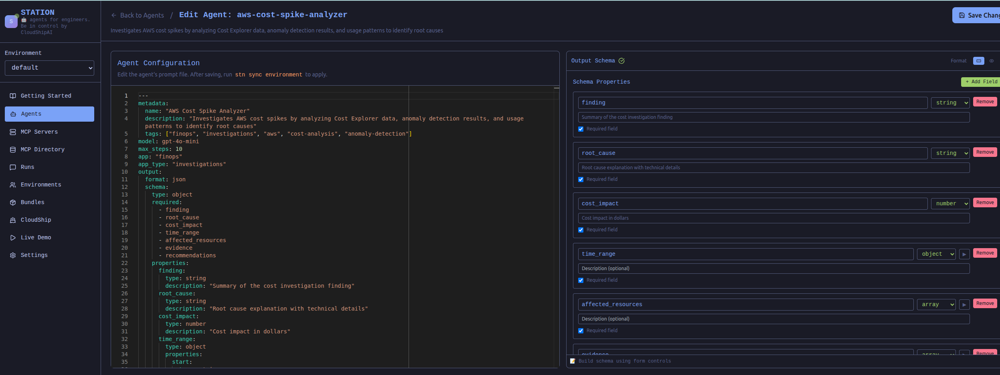
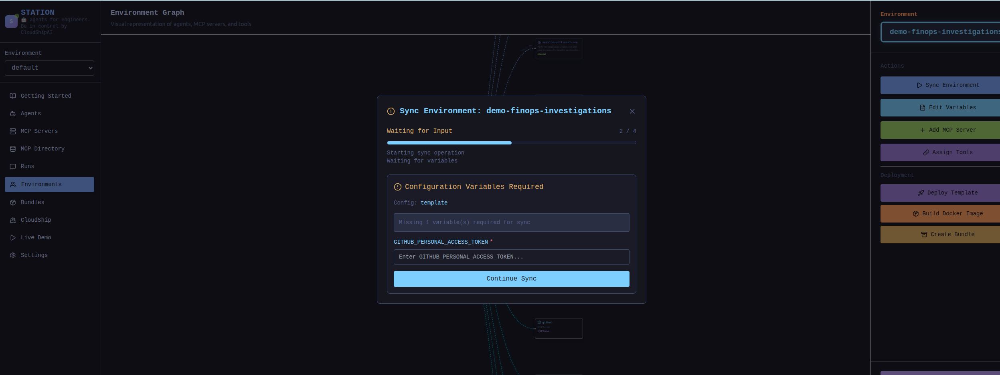
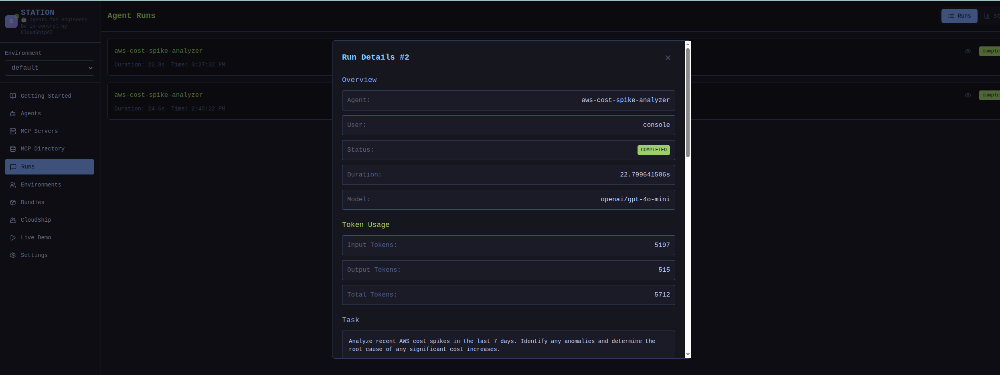

# Getting Started with Station

Learn how to build powerful AI agents with the most flexible MCP agent platform.

## Welcome to Station

Great! You have Station running, the most powerful MCP agent builder out there. Here's what you can do next:

- Build intelligent agents that interact with your LLM through MCP
- Organize agents and tools across multiple environments
- Create reusable bundles and deploy with Docker
- Integrate with CloudShip for structured data ingestion

---

## Table of Contents

1. [MCP Integration](#mcp-integration)
   - [Connecting to Station via MCP](#connecting-to-station-via-mcp)
   - [Available MCP Tools](#available-mcp-tools)
2. [AI Providers & Models](#ai-providers--models)
   - [OpenAI Provider](#openai-provider)
   - [Google Gemini Provider](#google-gemini-provider)
   - [Custom OpenAI-Compatible Endpoints](#custom-openai-compatible-endpoints)
3. [Understanding Agents](#understanding-agents)
   - [What are Agents?](#what-are-agents)
   - [GenKit DotPrompt Format](#genkit-dotprompt-format)
   - [Creating Agents via MCP](#creating-agents-via-mcp)
   - [Editing Agents in the UI](#editing-agents-in-the-ui)
4. [MCP Servers & Tools](#mcp-servers--tools)
   - [What are MCP Servers?](#what-are-mcp-servers)
   - [Adding MCP Servers](#adding-mcp-servers)
   - [Tool Discovery](#tool-discovery)
5. [Templates & Variables](#templates--variables)
   - [Template System](#template-system)
   - [Why Variables?](#why-variables)
6. [Sync Process](#sync-process)
   - [What is Sync?](#what-is-sync)
   - [Interactive Variable Prompts](#interactive-variable-prompts)
   - [When to Sync](#when-to-sync)
7. [Environments](#environments)
   - [What are Environments?](#what-are-environments)
   - [Multi-Environment Organization](#multi-environment-organization)
   - [Creating Environments via MCP](#creating-environments-via-mcp)
8. [Bundles & Deployment](#bundles--deployment)
   - [What are Bundles?](#what-are-bundles)
   - [Docker Deployment](#docker-deployment)
9. [Agent Runs](#agent-runs)
   - [Executing Agents via MCP](#executing-agents-via-mcp)
   - [Viewing Run Details](#viewing-run-details)
   - [Structured Output with JSON Schemas](#structured-output-with-json-schemas)
10. [CloudShip Integration](#cloudship-integration)
    - [Data Ingestion Platform](#data-ingestion-platform)
    - [Supported App Types](#supported-app-types)
    - [Configuring CloudShip Integration](#configuring-cloudship-integration)

---

## MCP Integration

### Connecting to Station via MCP

Station runs as an HTTP MCP server. After running `stn up`, a `.mcp.json` file is automatically created in your current directory.

**Auto-generated `.mcp.json`:**

```json
{
  "mcpServers": {
    "station": {
      "type": "http",
      "url": "http://localhost:8586/mcp"
    }
  }
}
```

💡 **Point your MCP host to this config:** Claude Code, Cursor, or any MCP-compatible client can use this config to interact with Station.

### Available MCP Tools

Station provides 28 MCP tools for managing agents, environments, and execution:

**Agent Management:**
- `create_agent`
- `list_agents`
- `get_agent_details`
- `update_agent`
- `delete_agent`

**Execution & Runs:**
- `call_agent`
- `list_runs`
- `inspect_run`

**Environment Management:**
- `list_environments`
- `create_environment`
- `delete_environment`

**MCP Server Management:**
- `list_mcp_servers_for_environment`
- `add_mcp_server_to_environment`
- `update_mcp_server_in_environment`

**Tool Management:**
- `discover_tools`
- `list_tools`
- `add_tool`
- `remove_tool`

**Export & Bundles:**
- `export_agent`
- `export_agents`
- `list_demo_bundles`
- `install_demo_bundle`

---

## AI Providers & Models

Station supports multiple AI providers. Configure your provider during `stn up --provider [openai|gemini|custom]` or set environment variables.

### OpenAI Provider

**Environment Variable:**
```bash
OPENAI_API_KEY=sk-...
```

**Supported Models (15 total):**

**Latest Models:**
- `gpt-4.1`
- `gpt-4.1-mini`
- `gpt-4.1-nano`
- `gpt-4.5-preview`

**Production Models:**
- `gpt-4o`
- `gpt-4o-mini`
- `gpt-4-turbo`
- `gpt-4`
- `gpt-3.5-turbo`

**Reasoning Models:**
- `o3-mini`
- `o1`
- `o1-preview`
- `o1-mini`

💡 **Recommended:** `gpt-4o-mini` (cost-effective) or `gpt-4o` (balanced)

### Google Gemini Provider

**Environment Variables:**
```bash
GEMINI_API_KEY=...
# or
GOOGLE_API_KEY=...
```

**Supported Models:**
- `gemini-2.5-flash`
- `gemini-2.5-pro`

### Custom OpenAI-Compatible Endpoints

Station supports any OpenAI-compatible API endpoint (Ollama, LM Studio, vLLM, etc.)

**Configuration:** `stn up --provider custom`

---

## Understanding Agents

### What are Agents?

Agents are autonomous AI assistants that can use tools to accomplish tasks. Each agent has:

- **System Prompt:** Instructions that define the agent's behavior and expertise
- **Tools:** MCP tools the agent can call to interact with external systems
- **Model:** The LLM model used for reasoning (gpt-4o, gemini-2.5-flash, etc.)
- **Max Steps:** Maximum number of tool calls allowed per execution

### GenKit DotPrompt Format

Agents are stored as `.prompt` files using GenKit's DotPrompt format with YAML frontmatter:

**Example `~/.config/station/environments/default/agents/example-agent.prompt`:**

```yaml
---
metadata:
  name: "AWS Cost Analyzer"
  description: "Analyzes AWS cost spikes and anomalies"
  tags: ["finops", "aws", "cost-analysis"]
model: gpt-4o-mini
max_steps: 10
tools:
  - "__get_cost_and_usage"
  - "__get_cost_forecast"
  - "__get_cost_anomalies"
---

{{role "system"}}
You are an AWS Cost Analyzer expert. You investigate cost spikes,
identify root causes, and provide actionable recommendations.

{{role "user"}}
{{userInput}}
```

### Creating Agents via MCP

Agents are created through MCP using the `create_agent` tool. There is no UI form for agent creation - you interact with Station through your LLM.

**Example:** Ask your LLM to create an agent:

> "Create a new agent called 'Security Scanner' in the 'production' environment that scans code for vulnerabilities using gitleaks and semgrep tools"

### Editing Agents in the UI

While agents are created via MCP, you can edit them in the Station UI:



---

## MCP Servers & Tools

### What are MCP Servers?

MCP Servers are external services that provide tools to your agents. Examples:

- **Filesystem MCP:** Read, write, and search files
- **Ship Security MCP:** 307+ security scanning tools (trivy, gitleaks, semgrep, etc.)
- **AWS MCP:** AWS cost, CloudWatch, EC2, and other AWS services
- **Custom MCP:** Build your own MCP servers for any API or service

### Adding MCP Servers

MCP servers are configured in each environment's `template.json` file:

**Example `template.json`:**

```json
{
  "name": "production",
  "description": "Production environment",
  "mcpServers": {
    "filesystem": {
      "command": "npx",
      "args": [
        "-y",
        "@modelcontextprotocol/server-filesystem@latest",
        "{{ .PROJECT_ROOT }}"
      ]
    },
    "ship-security": {
      "command": "ship",
      "args": ["mcp", "security", "--stdio"]
    }
  }
}
```

### Tool Discovery

After adding MCP servers, run `stn sync [environment]` to discover all available tools. Tools are automatically namespaced with `__` prefix.

**Example Tool Names:**
- `__read_text_file` (from filesystem MCP)
- `__list_directory` (from filesystem MCP)
- `__checkov_scan_directory` (from ship security MCP)
- `__trivy_scan_filesystem` (from ship security MCP)

---

## Templates & Variables

### Template System

Station uses Go template syntax in `template.json` for dynamic configuration. Variables are defined in `variables.yml` and rendered at runtime.

**Example `variables.yml`:**

```yaml
PROJECT_ROOT: "/home/user/projects/my-app"
AWS_REGION: "us-east-1"
ENVIRONMENT: "production"
```

**Example `template.json` (using variables):**

```json
{
  "mcpServers": {
    "filesystem": {
      "command": "npx",
      "args": [
        "-y",
        "@modelcontextprotocol/server-filesystem@latest",
        "{{ .PROJECT_ROOT }}"
      ]
    }
  }
}
```

### Why Variables?

Variables keep secrets and environment-specific configuration separate from your MCP server definitions:

- 🔒 **Security:** Secrets stay in `variables.yml` (gitignored)
- ♻️ **Reusability:** Share `template.json` as bundles without exposing paths
- 🌍 **Portability:** Same template works across dev, staging, and production

---

## Sync Process

### What is Sync?

Sync connects to your MCP servers, discovers available tools, and prompts for missing template variables. It's required after:

- Adding or updating MCP servers in `template.json`
- Creating a new environment
- Installing a bundle with new variables

### Interactive Variable Prompts

When sync detects missing variables in `template.json`, the UI automatically prompts you to fill them in:



### When to Sync

Always sync before running agents to ensure they have access to the latest tools.

💡 **Tip:** You can run `stn sync [environment]` from CLI or use the Sync button in the UI's environment view

---

## Environments

### What are Environments?

Environments are isolated workspaces that organize your agents, MCP servers, and tools. Each environment has:

- **Agents:** Agent .prompt files in `agents/` directory
- **MCP Servers:** Server configuration in `template.json`
- **Variables:** Environment-specific config in `variables.yml`

### Multi-Environment Organization

Common environment patterns:

**Development:**
Local testing with dev API keys and filesystem access to your projects

**Staging:**
Pre-production testing with staging credentials and limited tool access

**Production:**
Production agents with production API keys and strict tool restrictions

### Creating Environments via MCP

Use the `create_environment` MCP tool to create new environments. Environment directories are created at `~/.config/station/environments/[name]/`

---

## Bundles & Deployment

### What are Bundles?

Bundles are shareable `.tar.gz` exports of environments containing agents, MCP server configs, and templates (but NOT secrets/variables).

✅ **Safe to Share:**
- Agent .prompt files
- template.json (with variable placeholders)
- MCP server configurations

⛔ **NOT Included (Security):**
- variables.yml (contains secrets and paths)
- API keys or credentials
- Environment-specific file paths

### Docker Deployment

Station environments can be containerized and deployed with Docker for production use:

```bash
# Build Docker image with your environment
docker build -t my-station-agents .

# Run Station server with mounted config
docker run -d \
  -p 8585:8585 \
  -p 8586:8586 \
  -v ~/.config/station:/root/.config/station \
  -e OPENAI_API_KEY=${OPENAI_API_KEY} \
  my-station-agents
```

💡 **Production Tip:** Use Docker secrets or environment variables for API keys, never hardcode them in your images

---

## Agent Runs

### Executing Agents via MCP

Use the `call_agent` MCP tool to execute agents. Each execution creates a run record with complete metadata:

- **Tool Calls:** Every tool invocation with parameters and results
- **Execution Steps:** Step-by-step reasoning and actions
- **Token Usage:** Input/output/total tokens consumed
- **Duration:** Execution time in seconds
- **Final Response:** The agent's output (plain text or structured JSON)

### Viewing Run Details

Use `inspect_run` to get detailed execution metadata, or view runs in the Station UI:



### Structured Output with JSON Schemas

Agents can return structured JSON output by defining an output schema. Example from FinOps use case:

```json
{
  "finding": "Significant cost spike in EC2 us-east-1",
  "root_cause": "Auto-scaling triggered by load spike",
  "cost_impact": 14343.30,
  "time_range": {
    "start": "2023-10-23",
    "end": "2023-10-30"
  },
  "affected_resources": [
    {
      "service": "EC2",
      "resource_id": "i-0abc123",
      "cost_increase": 8200.50
    }
  ],
  "recommendations": [
    {
      "action": "Implement reserved instances",
      "estimated_savings": 5000.00
    }
  ]
}
```

💡 **Tip:** Define output schemas in agent .prompt files using JSON Schema format. Station validates and enforces the schema during execution.

---

## CloudShip Integration

### Data Ingestion Platform

CloudShip is a data ingestion platform that collects structured agent outputs for analytics and reporting. Station integrates with CloudShip using `app` and `app_type` fields.

### Supported App Types

Currently, Station supports the **finops** app with 5 subtypes:

**investigations:** Cost spike analysis, anomaly detection, and root cause investigations

**opportunities:** Cost optimization recommendations and savings opportunities

**projections:** Cost forecasting and budget projections

**inventory:** Resource inventory and tagging analysis

**governance:** Policy compliance and governance reporting

### Configuring CloudShip Integration

Add `app` and `app_type` to your agent's .prompt file:

```yaml
---
metadata:
  name: "AWS Cost Spike Analyzer"
  description: "Investigates AWS cost anomalies"
  tags: ["finops", "aws", "investigations"]
  # CloudShip integration
  app: "finops"
  app_type: "investigations"
model: gpt-4o-mini
output:
  schema: |
    {
      "type": "object",
      "required": ["finding", "root_cause", "cost_impact"],
      "properties": {
        "finding": { "type": "string" },
        "root_cause": { "type": "string" },
        "cost_impact": { "type": "number" }
      }
    }
---
```

**Important:** CloudShip integration requires structured output. You MUST define either `output.schema` or use an `output_schema_preset`.

---

## Need Help?

- Check out the [Station Documentation](https://station.dev/docs)
- Join our [Discord Community](https://discord.gg/station)

---

*Last updated: October 2025*
