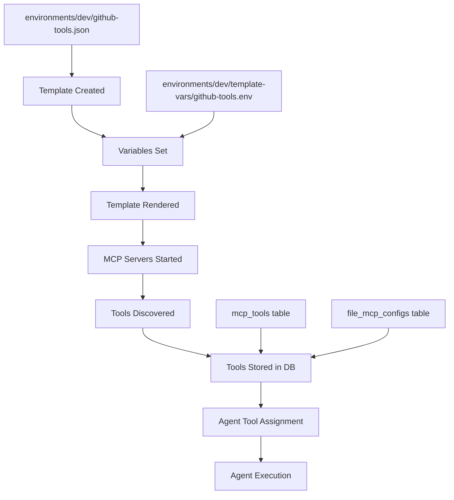

# MCP Config Integration Points Analysis (Historical)

> **⚠️ HISTORICAL DOCUMENT**: This analysis was used during the migration from database-based to file-based MCP configuration system. The migration has been completed successfully. This document is preserved for reference.

> **✅ Current Status**: Station now uses a fully file-based configuration system with GitOps support, template variables, and modular CLI architecture.

## Current Architecture - Key Integration Points

### 1. **MCP Config Upload & Storage** 
**Current Flow**: `MCPConfigService.UploadConfig()` → Database (encrypted)
```go
// internal/services/mcp_config_service.go:28
UploadConfig(environmentID, configData) -> stores encrypted JSON in mcp_configs table
```

**File-Based Integration**: 
- Replace with template storage + variable extraction
- Store template in `environments/{env}/mcpconfig.json` 
- Extract variables to `environments/{env}/variables.env`

### 2. **Tool Discovery & Loading**
**Current Flow**: `ToolDiscoveryService.ReplaceToolsWithTransaction()` → MCP Server Connection → `mcp_tools` table
```go
// internal/services/tool_discovery_transactions.go:15
ReplaceToolsWithTransaction(environmentID, configName) -> 
  decrypt config -> connect to MCP servers -> discover tools -> store in mcp_tools
```

**File-Based Integration**:
- Load template + render with variables → MCPConfigData
- Connect to MCP servers using rendered config
- Store discovered tools linked back to file config

### 3. **Agent Tool Assignment**
**Current Flow**: Agents get tools via `agent_tools` table (environment-specific)
```go
// internal/db/repositories/agent_tools.go:91
ListAgentTools(agentID) -> returns tools filtered by agent's environment
```

**File-Based Integration**:
- Tools still stored in `mcp_tools` table
- Link tools back to `file_mcp_configs` instead of encrypted `mcp_configs`
- Agent assignment unchanged (uses `mcp_tools.id`)

### 4. **Agent Execution with Tools**
**Current Flow**: `GenkitService` loads agent tools for execution
```go
// internal/services/genkit_service.go:189
assignedTools := agentToolRepo.ListAgentTools(agentID)
// Tools filtered by environment, used in agent execution
```

**File-Based Integration**:
- No change needed - agents still get tools from `mcp_tools` table
- Tools are linked to rendered MCPConfig (same data structure)

## Updated Architecture Design

### File-Based MCP Config Lifecycle



### Database Schema Integration

**New Tables**:
```sql
-- Links file-based configs to discovered tools
CREATE TABLE file_mcp_configs (
    id INTEGER PRIMARY KEY,
    environment_id INTEGER NOT NULL,
    config_name TEXT NOT NULL, -- github-tools, aws-tools, etc.
    template_path TEXT NOT NULL,
    variables_path TEXT,
    template_hash TEXT, -- For change detection
    variables_hash TEXT,
    last_rendered_at TIMESTAMP,
    FOREIGN KEY (environment_id) REFERENCES environments(id)
);

-- mcp_tools table updated to reference file configs
ALTER TABLE mcp_tools ADD COLUMN file_config_id INTEGER REFERENCES file_mcp_configs(id);
```

**Migration Path**:
- No backward compatibility needed (as requested)
- Replace encrypted `mcp_configs` with file-based system
- Keep `mcp_tools` and `agent_tools` tables (just update references)

## Updated Integration Points

### 1. **Template Management Service**
```go
type FileConfigService struct {
    configManager config.ConfigManager
    toolDiscovery *ToolDiscoveryService
    repos         *repositories.Repositories
}

// CreateOrUpdateTemplate handles template + variable management
func (s *FileConfigService) CreateOrUpdateTemplate(envID int64, configName string, template *MCPTemplate, variables map[string]interface{}) error {
    // 1. Save template file
    // 2. Save variables file  
    // 3. Render template
    // 4. Trigger tool discovery
    // 5. Update file_mcp_configs table
}
```

### 2. **Tool Discovery Integration**
```go
// Updated tool discovery to work with file-based configs
func (s *ToolDiscoveryService) DiscoverToolsFromFileConfig(envID int64, configName string) (*ToolDiscoveryResult, error) {
    // 1. Load file config via FileConfigManager
    fileConfig, err := s.fileConfigManager.LoadAndRender(envID, configName)
    
    // 2. Connect to MCP servers using rendered config
    tools := s.discoverFromServers(fileConfig.Servers)
    
    // 3. Store tools with file_config_id reference
    s.storeToolsWithFileReference(fileConfigID, tools)
}
```

### 3. **Agent Tool Assignment (Unchanged)**
```go
// This remains the same - agents get tools from mcp_tools table
agentTools := s.agentToolRepo.ListAgentTools(agentID)
// Tools are environment-filtered as before
```

### 4. **CLI Integration Points**
```go
// New CLI commands integrate with existing workflow
stn mcp config create github-tools --env dev
  -> FileConfigService.CreateTemplate()
  -> ToolDiscoveryService.DiscoverToolsFromFileConfig()
  -> Tools available for agent assignment

stn mcp vars set ApiKey=ghp_xxx --template github-tools --env dev  
  -> FileConfigService.UpdateVariables()
  -> ToolDiscoveryService.DiscoverToolsFromFileConfig() // Re-render & discover
```

## Environment-Specific Variable Resolution

### Problem: Multiple Templates, Same Variables
**Example**: Both `github-tools.json` and `aws-tools.json` use `{{.ApiKey}}`

**Solution**: Template-specific variable files
```bash
environments/dev/
├── template-vars/
│   ├── github-tools.env    # ApiKey=ghp_github_token_xxx
│   └── aws-tools.env       # ApiKey=AKIA_aws_key_xxx
├── github-tools.json       # Uses {{.ApiKey}}
└── aws-tools.json          # Uses {{.ApiKey}} (different value)
```

### Variable Resolution Strategy
```go
func (s *FileConfigService) RenderTemplate(envID int64, configName string) (*models.MCPConfigData, error) {
    // 1. Load global variables
    globalVars := s.loadGlobalVariables(envID)
    
    // 2. Load template-specific variables (override global)
    templateVars := s.loadTemplateVariables(envID, configName)
    
    // 3. Merge with template-specific taking precedence
    finalVars := mergeVariables(globalVars, templateVars)
    
    // 4. Render template
    return s.templateEngine.Render(template, finalVars)
}
```

## Declarative Git Workflow

### Repository Structure
```bash
station-configs/              # Git repository
├── environments/
│   ├── dev/
│   │   ├── github-tools.json      # ✅ Committed
│   │   ├── aws-tools.json         # ✅ Committed
│   │   └── datadog-tools.json     # ✅ Committed
│   ├── staging/
│   │   ├── github-tools.json      # ✅ Committed (same templates)
│   │   ├── aws-tools.json         # ✅ Committed
│   │   └── newrelic-tools.json    # ✅ Committed (staging-specific)
│   └── prod/
│       ├── github-tools.json      # ✅ Committed
│       ├── aws-tools.json         # ✅ Committed
│       └── newrelic-tools.json    # ✅ Committed
├── placeholders/
│   ├── github-tools.env.example   # ✅ Committed (placeholder)
│   ├── aws-tools.env.example      # ✅ Committed (placeholder)
│   └── datadog-tools.env.example  # ✅ Committed (placeholder)
└── .gitignore                     # ✅ Excludes secrets

# Secrets (NOT in git)
~/.config/station/secrets/
├── environments/
│   ├── dev/template-vars/
│   │   ├── github-tools.env       # ❌ NOT committed
│   │   ├── aws-tools.env          # ❌ NOT committed
│   │   └── datadog-tools.env      # ❌ NOT committed
│   ├── staging/template-vars/
│   └── prod/template-vars/
```

### Placeholder Generation
```go
func (s *FileConfigService) GeneratePlaceholders(templatePath string) error {
    // 1. Extract variables from template
    variables := s.templateEngine.ExtractVariables(template)
    
    // 2. Generate .env.example file
    placeholderContent := ""
    for _, variable := range variables {
        if variable.Secret {
            placeholderContent += fmt.Sprintf("%s=# %s (required, secret)\n", variable.Name, variable.Description)
        } else {
            placeholderContent += fmt.Sprintf("%s=%s # %s\n", variable.Name, variable.Default, variable.Description)
        }
    }
    
    // 3. Save placeholder file
    s.savePlaceholder(placeholderContent)
}
```

## Implementation Plan - File-Based Integration

### Phase 1: Core File-Based Config Service
1. **FileConfigService** - Manage templates and variables
2. **Template rendering** integration with existing tool discovery
3. **Database migration** - Remove encrypted configs, add file config tracking

### Phase 2: Tool Discovery Integration  
1. **Update ToolDiscoveryService** to work with rendered file configs
2. **Maintain mcp_tools table** structure (just update references)
3. **Agent tool assignment** unchanged (uses existing mcp_tools)

### Phase 3: CLI Integration
1. **Template management** commands (`stn mcp config create/edit/validate`)
2. **Variable management** commands (`stn mcp vars set/edit/list`)
3. **Placeholder generation** for GitOps workflow

### Phase 4: GitOps Features
1. **Template validation** and CI/CD integration
2. **Environment promotion** workflows
3. **Secret management** best practices

## Key Benefits

### ✅ Declarative Configuration
- Templates version controlled
- Environment-specific variable management  
- No secrets in git (placeholders instead)

### ✅ GitOps Ready
- Infrastructure as Code approach
- Team collaboration on agent configurations
- Environment promotion workflows

### ✅ Maintains Existing Agent Flow
- Agents still get tools from `mcp_tools` table
- Tool assignment and execution unchanged
- Environment isolation preserved

### ✅ Flexible Variable Management
- Template-specific variables solve naming conflicts
- Global + template-specific variable resolution
- Support for different services (GitHub, AWS, etc.)

This architecture preserves the existing agent execution flow while enabling GitOps workflows and solving the multiple templates with same variables problem through template-specific variable files.