# Station Runtime Internals

This document covers the internal architecture of Station's runtime systems for developers contributing to Station or debugging complex issues.

## Table of Contents

- [Container Architecture (`stn up`)](#container-architecture-stn-up)
- [Workflow Engine & NATS Messaging](#workflow-engine--nats-messaging)
- [Sandbox Execution](#sandbox-execution)

---

## Container Architecture (`stn up`)

### Overview

The `stn up` command orchestrates a complete Station environment in Docker. It handles image building, volume management, bundle installation, and service startup.

### Architecture Diagram

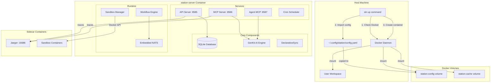

### Startup Sequence

Detailed initialization flow when `stn serve` runs inside the container:

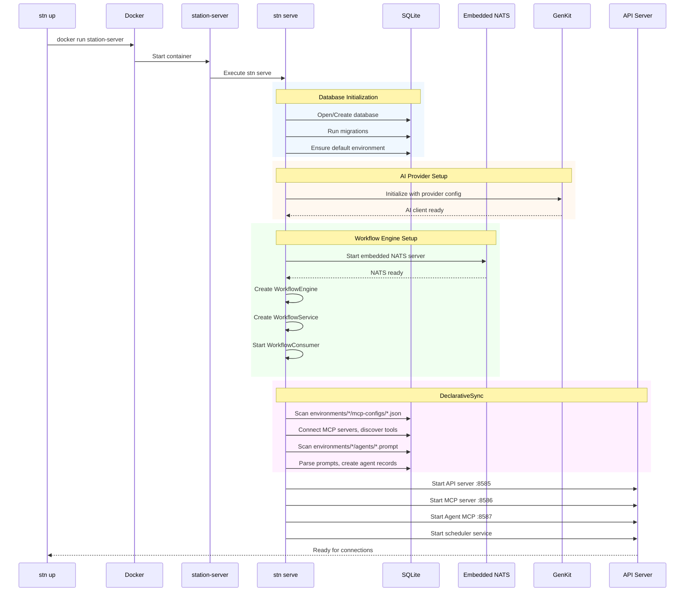

### Shared Workflow Engine Pattern

A critical architectural detail: the container uses a **single shared workflow engine** for both HTTP API and internal operations. This ensures messages published via HTTP API are processed by the same consumer:

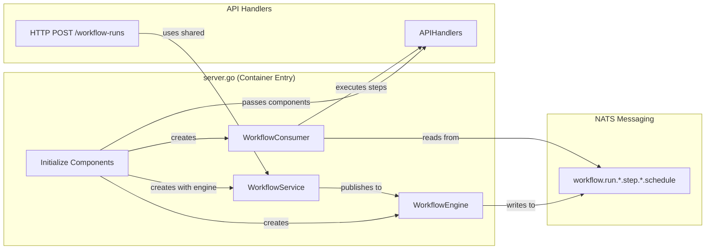

> **Note:** Prior to commit `a6878261`, HTTP API handlers created their own separate engine, causing workflows started via API to be stuck in "pending" status.

### Volume Data Layout

Understanding what's stored in the `station-config` volume:

```
/home/station/.config/station/
├── config.yaml                    # Main configuration
├── station.db                     # SQLite database
├── environments/
│   ├── default/
│   │   ├── agents/                # .prompt files
│   │   │   ├── my-agent.prompt
│   │   │   └── coordinator.prompt
│   │   ├── mcp-configs/           # MCP server configs
│   │   │   ├── github.json
│   │   │   └── slack.json
│   │   ├── workflows/             # Workflow definitions
│   │   │   └── incident-rca.workflow.yaml
│   │   └── variables.yml          # Environment variables
│   └── production/
│       └── ...
└── bundles/                       # Installed bundles
    └── finops-v1.0.0/
```

---

## Workflow Engine & NATS Messaging

### NATS Architecture Overview

Station uses an embedded NATS JetStream server for durable, reliable workflow execution. All workflow steps are published as messages and processed by a consumer pool.

```mermaid
graph TB
    subgraph "Workflow Execution Entry Points"
        HTTP[HTTP POST /workflow-runs]
        CLI[stn workflow run]
        MCP[MCP start_workflow_run]
    end
    
    subgraph "Workflow Service"
        WS[WorkflowService]
        WE[WorkflowEngine]
    end
    
    subgraph "Embedded NATS JetStream"
        Stream[(WORKFLOWS Stream)]
        Subject1[workflow.run.{run_id}.step.{step_id}.schedule]
    end
    
    subgraph "Consumer Pool"
        Consumer[WorkflowConsumer]
        W1[Worker 1]
        W2[Worker 2]
        W3[Worker 3]
        WN[Worker N...]
    end
    
    subgraph "Step Executors"
        Agent[AgentExecutor]
        Switch[SwitchExecutor]
        Transform[TransformExecutor]
        Parallel[ParallelExecutor]
        Foreach[ForeachExecutor]
        Approval[HumanApprovalExecutor]
    end
    
    HTTP --> WS
    CLI --> WS
    MCP --> WS
    
    WS --> WE
    WE -->|publish| Stream
    Stream -->|subscribe| Consumer
    
    Consumer --> W1
    Consumer --> W2
    Consumer --> W3
    Consumer --> WN
    
    W1 --> Agent
    W2 --> Switch
    W3 --> Transform
    W1 --> Parallel
    W2 --> Foreach
    W3 --> Approval
```

### Message Flow: Step-by-Step

When a workflow runs, each step follows this message pattern:

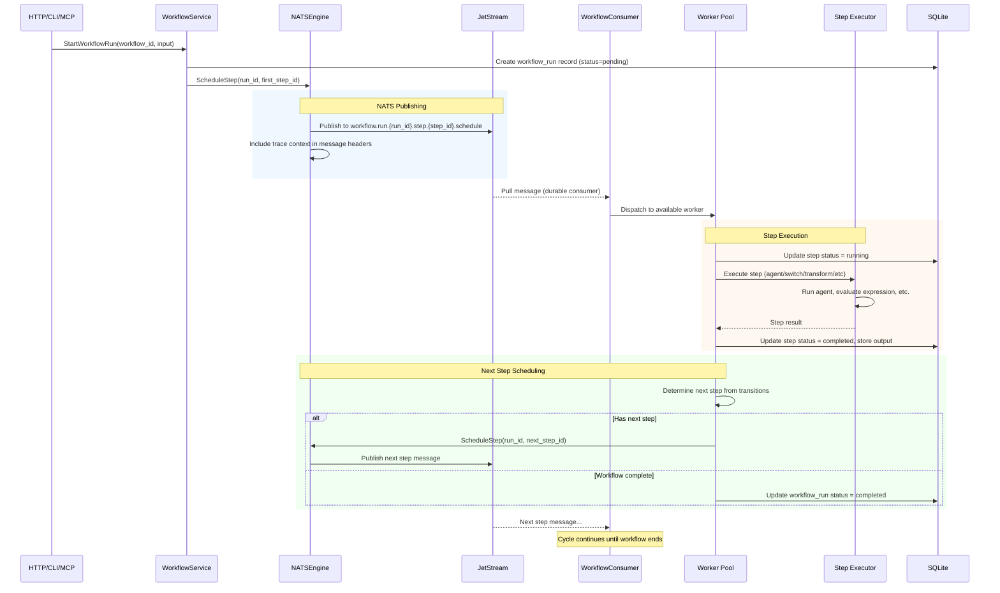

### Subject Naming Convention

NATS subjects follow a hierarchical pattern for routing and filtering:

| Subject Pattern | Description | Example |
|-----------------|-------------|---------|
| `workflow.run.{run_id}.step.{step_id}.schedule` | Schedule a step for execution | `workflow.run.abc123.step.analyze.schedule` |
| `workflow.run.{run_id}.cancel` | Cancel a running workflow | `workflow.run.abc123.cancel` |
| `workflow.approval.{approval_id}` | Approval-related messages | `workflow.approval.xyz789` |

### Consumer Configuration

The workflow consumer uses JetStream's durable consumer for reliability:

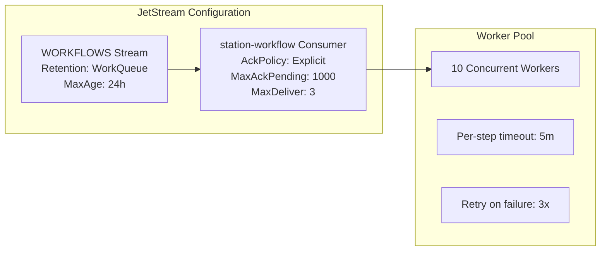

**Key Configuration:**
- **AckPolicy: Explicit** - Messages must be explicitly acknowledged after processing
- **MaxAckPending: 1000** - Up to 1000 messages can be in-flight
- **MaxDeliver: 3** - Failed messages retry up to 3 times before dead-lettering
- **WorkQueue Retention** - Messages removed after acknowledgment

### Parallel and Foreach Execution

Parallel and foreach states spawn multiple sub-messages:

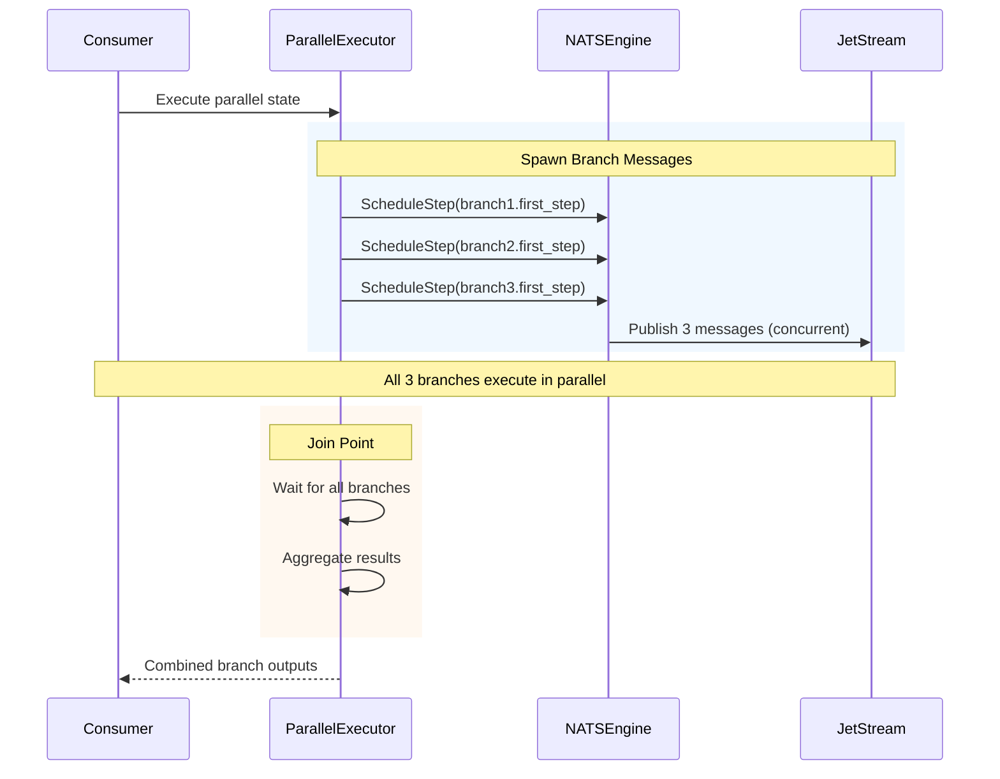

### Trace Context Propagation

OpenTelemetry trace context is preserved across NATS messages:

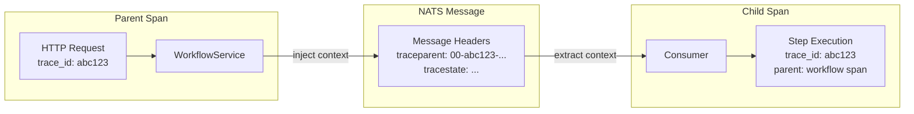

This enables end-to-end distributed tracing in Jaeger, showing the complete workflow execution path including all step transitions.

### Error Handling and Recovery

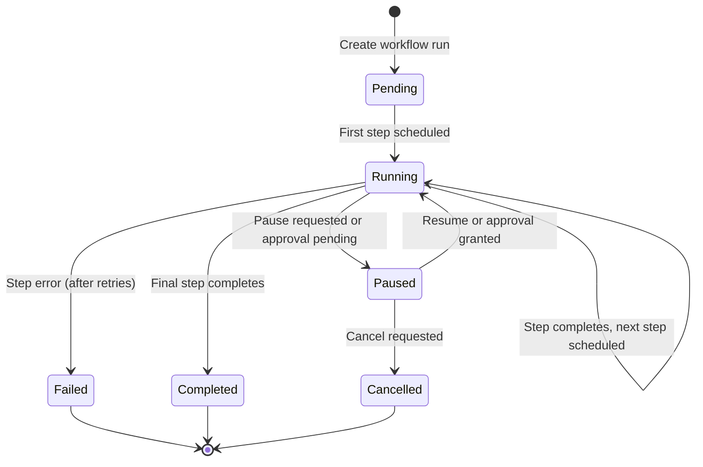

### Stale Run Recovery

On startup, the workflow consumer recovers pending runs that were interrupted:

```go
// Pseudo-code for recovery logic
runs := db.GetWorkflowRuns(status: "running", olderThan: 4h)
for _, run := range runs {
    if run.Age > staleThreshold {
        log.Warn("Skipping stale run", run.ID)
        continue
    }
    // Resume from last completed step
    lastStep := db.GetLastCompletedStep(run.ID)
    engine.ScheduleStep(run.ID, lastStep.NextStep)
}
```

> **Note:** Runs older than 4 hours are considered stale and skipped during recovery. This prevents infinite retries of broken workflows.

---

## Sandbox Execution

### Architecture Overview

Station supports two sandbox backends that manage isolated execution environments:

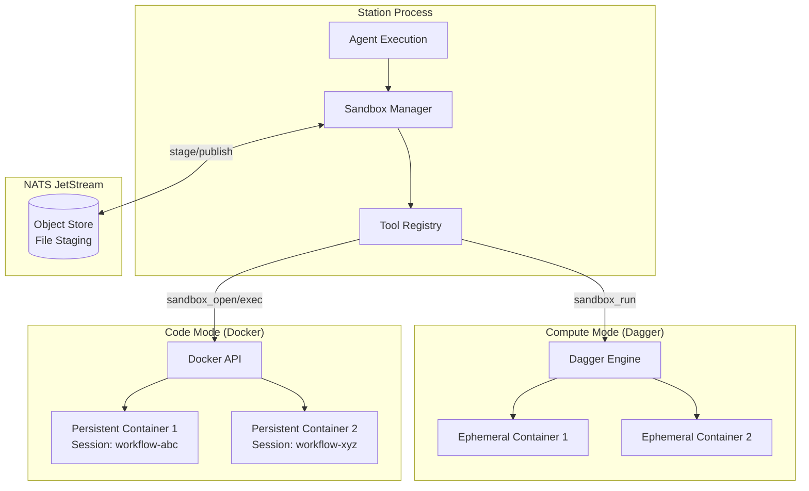

### Compute Mode: Ephemeral Execution

Compute mode uses Dagger for ephemeral, single-call code execution:

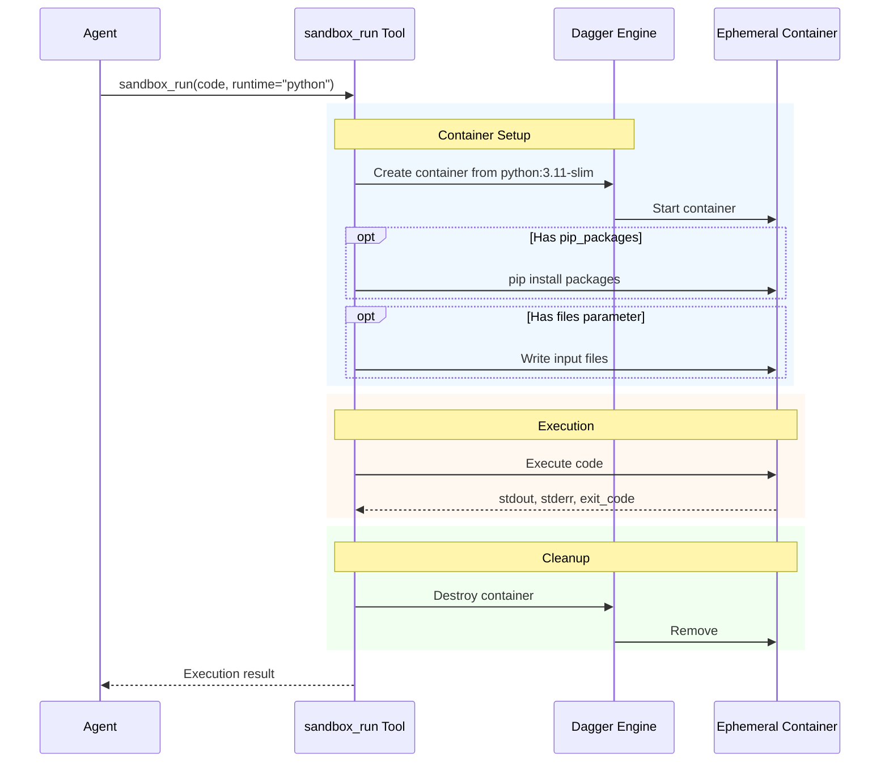

**Key Characteristics:**
- Container created fresh for each `sandbox_run` call
- No state persists between calls
- Fast for simple computations
- Automatic cleanup

### Code Mode: Persistent Sessions

Code mode uses Docker directly for persistent, session-based sandboxes:

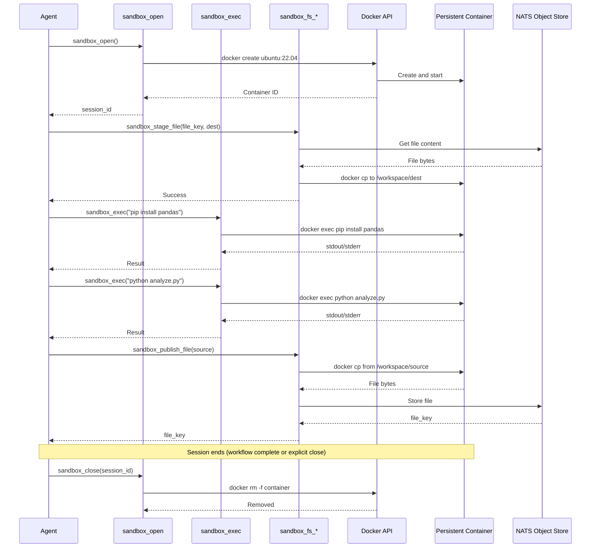

### Session Scoping: Workflow vs Agent

The `session` configuration determines container lifecycle:

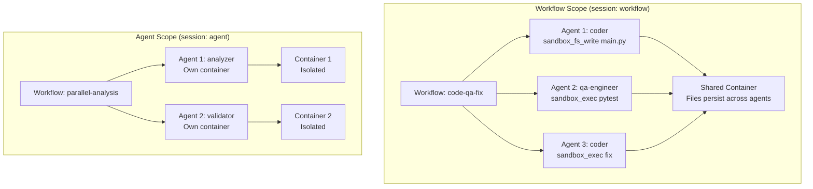

**Workflow Scope:**
- Single container shared across all agents in workflow
- Files written by Agent 1 are visible to Agent 2
- Container destroyed when workflow completes
- Ideal for: Build → Test → Fix pipelines

**Agent Scope:**
- Fresh container for each agent execution
- Complete isolation between agents
- Container destroyed when agent completes
- Ideal for: Parallel independent tasks

### File Staging Architecture

Large files are staged through NATS Object Store to avoid passing binary data through LLM context:

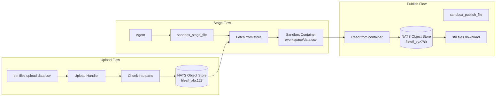

### Resource Limits and Security

```mermaid
graph TB
    subgraph "Security Boundaries"
        subgraph "Station Container"
            SandboxMgr[Sandbox Manager]
            DockerSock[/var/run/docker.sock]
        end
        
        subgraph "Sandbox Container (Isolated)"
            NoPriv[No --privileged]
            NoSock[No Docker socket]
            NetOff[Network disabled by default]
            User[Non-root user]
            Limits[Resource limits enforced]
        end
    end
    
    SandboxMgr -->|creates| NoPriv
    DockerSock -.->|NOT mounted| NoSock
    
    subgraph "Default Limits"
        CPU[CPU: 2 cores]
        Mem[Memory: 2GB]
        Disk[Disk: 10GB]
        Time[Timeout: 5 minutes]
        Files[Max files: 100]
        FileSize[Max file size: 10MB]
    end
    
    Limits --> CPU
    Limits --> Mem
    Limits --> Disk
    Limits --> Time
    Limits --> Files
    Limits --> FileSize
```

**Security Features:**
- Unprivileged containers (no `--privileged` flag)
- No Docker socket access from within sandbox
- Network disabled by default (`allow_network: false`)
- Non-root user execution
- Resource limits (CPU, memory, disk, time)
- File count and size limits

> **Warning:** When `allow_network: true` is set, the sandbox can reach external services. Only enable this when necessary and ensure your agents handle untrusted network data safely.

### Container Image Selection

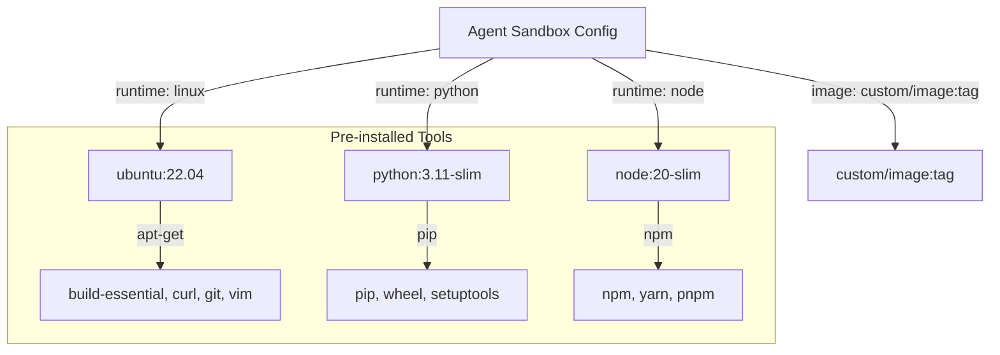

---

## Related Documentation

- [Architecture Index](./ARCHITECTURE_INDEX.md) - Quick navigation and key concepts
- [Architecture Diagrams](./ARCHITECTURE_DIAGRAMS.md) - Complete ASCII diagrams
- [Component Interactions](./COMPONENT_INTERACTIONS.md) - Detailed sequence diagrams
