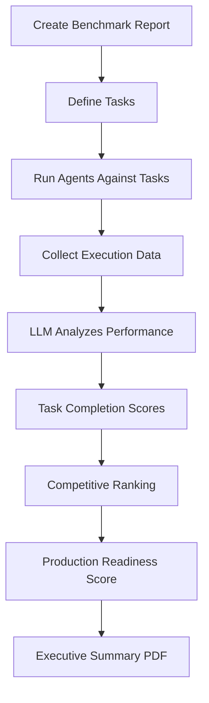

# Task-Based Benchmark System - Product Requirements Document

## 🎯 Vision

Transform Station's Reports system from abstract metric evaluation into a **production readiness confidence score** that answers:
- ✅ **Can this agent team handle real production workloads?**
- 🏆 **Which agents excel at specific tasks?**
- ❌ **Why do certain agents fail and how can we fix them?**
- 📊 **What's the overall confidence score for deploying this team?**

## 🔥 The Problem

**Current State:**
- Reports evaluate abstract metrics like "effectiveness" and "efficiency"
- No connection to actual task completion
- Unclear what agents can/cannot do in production
- No competitive ranking between agents
- Missing actionable insights on failures

**User Pain Points:**
- "I don't know if my security agents can actually detect vulnerabilities"
- "Which cost optimization agent should I trust in production?"
- "Why did my deployment agent fail and which one works better?"
- "Can I confidently deploy this agent team to production?"

## 💡 The Solution

**Task-Based Benchmark Reports** that evaluate agents on **real-world scenarios**:

### Core Concept: Benchmark Tasks

Instead of abstract criteria, users define **concrete tasks** agents must complete:

```yaml
benchmark_tasks:
  - name: "Detect OWASP Top 10 Vulnerabilities"
    category: "security"
    scenario: "Scan a codebase with 50 planted vulnerabilities (SQL injection, XSS, etc.)"
    success_criteria:
      - detect_rate: ">= 95%"
      - false_positive_rate: "<= 5%"
      - time_to_complete: "<= 5 minutes"
    weight: 0.40
    
  - name: "Identify Cost Savings Opportunities"
    category: "finops"
    scenario: "Analyze AWS bill with $50k+ in waste (idle resources, unattached volumes)"
    success_criteria:
      - savings_identified: ">= $45k"
      - recommendation_quality: ">= 8/10"
      - false_positives: "<= 3"
    weight: 0.35
```

### Evaluation Flow



## 📋 Detailed Requirements

### 1. Benchmark Task Model

```typescript
interface BenchmarkTask {
  id: string;
  name: string;
  category: 'security' | 'finops' | 'devops' | 'data' | 'custom';
  
  // The real-world scenario
  scenario: string;
  description: string;
  
  // What constitutes success
  success_criteria: {
    [metric: string]: {
      operator: '>=' | '<=' | '==' | 'contains' | 'excludes';
      value: number | string;
      description: string;
    }
  };
  
  // Importance weight
  weight: number; // 0.0-1.0, sum to 1.0
  
  // Test data/environment
  test_environment?: string; // faker environment
  test_data?: string; // path to test dataset
  expected_outputs?: string[]; // what we expect to see
}
```

### 2. Agent Task Performance

```typescript
interface AgentTaskPerformance {
  agent_id: number;
  agent_name: string;
  task_id: string;
  
  // Execution data
  runs_executed: number;
  successful_runs: number;
  failed_runs: number;
  
  // Performance metrics (from Jaeger + run data)
  avg_execution_time: number;
  avg_tokens_used: number;
  avg_cost: number;
  
  // Task completion analysis
  task_completed: boolean;
  completion_score: number; // 0-10
  
  // Detailed results
  success_criteria_met: {
    [criterion: string]: {
      met: boolean;
      actual_value: any;
      expected_value: any;
      reasoning: string;
    }
  };
  
  // LLM analysis
  strengths: string[];
  weaknesses: string[];
  failure_reasons: string[];
  recommendations: string[];
  
  // Evidence (from actual runs)
  evidence_run_ids: number[];
  jaeger_trace_ids: string[];
  key_outputs: string[];
}
```

### 3. Competitive Ranking

```typescript
interface TaskRanking {
  task_id: string;
  task_name: string;
  
  rankings: {
    rank: number;
    agent_id: number;
    agent_name: string;
    score: number;
    completion_rate: number;
    avg_time: number;
    badge: 'champion' | 'runner_up' | 'needs_improvement' | 'failed';
  }[];
  
  insights: {
    best_performer: string;
    fastest_performer: string;
    most_cost_effective: string;
    common_failure_pattern: string;
  };
}
```

### 4. Production Readiness Score

```typescript
interface ProductionReadinessReport {
  overall_score: number; // 0-100
  confidence_level: 'production_ready' | 'needs_improvement' | 'not_ready';
  
  // Task category breakdown
  category_scores: {
    [category: string]: {
      score: number;
      tasks_passed: number;
      tasks_total: number;
      champion_agents: string[];
    }
  };
  
  // Team assessment
  team_strengths: string[];
  team_weaknesses: string[];
  coverage_gaps: string[]; // tasks no agent can complete
  
  // Deployment recommendation
  deployment_recommendation: {
    status: 'go' | 'no_go' | 'conditional';
    reasoning: string;
    required_improvements: string[];
    risk_assessment: 'low' | 'medium' | 'high';
  };
  
  // Evidence
  total_runs_analyzed: number;
  total_agents_tested: number;
  test_environment: string;
}
```

## 🏗️ Implementation Plan

### Phase 1: Data Collection & Analysis (Week 1)

**Goal:** Leverage existing run data, Jaeger traces, and LLM analysis

**Tasks:**
1. Extend report generation to analyze Jaeger spans
2. Parse agent inputs/outputs from run data
3. Extract tool call patterns from execution steps
4. Build evidence collection from actual execution data

**New Backend Services:**
```go
// pkg/benchmark/analyzer.go
type BenchmarkAnalyzer struct {
    // Analyzes agent performance on specific tasks
}

// Methods:
- AnalyzeTaskCompletion(task, agentRuns) -> TaskPerformance
- ExtractEvidenceFromRuns(runIDs) -> Evidence
- ParseJaegerTraces(traceIDs) -> ExecutionMetrics
- CompareAgentPerformance(agents, task) -> Ranking
```

### Phase 2: Task-Based Criteria (Week 1-2)

**Goal:** Replace abstract criteria with concrete tasks

**Tasks:**
1. Update report creation UI with task builder
2. Create benchmark task templates (Security, FinOps, DevOps)
3. Modify LLM prompt to evaluate task completion
4. Implement success criteria validation

**Updated CreateReportModal:**
```typescript
// Task Builder Interface
<TaskBuilder>
  <TaskTemplate selected="security">
    <Task name="SQL Injection Detection">
      <Scenario>
        Scan codebase with 20 SQL injection vulnerabilities
      </Scenario>
      <SuccessCriteria>
        - Detection rate: >= 90%
        - Time to scan: <= 3 minutes
        - False positives: <= 2
      </SuccessCriteria>
      <Weight>40%</Weight>
    </Task>
  </TaskTemplate>
</TaskBuilder>
```

### Phase 3: Competitive Ranking (Week 2)

**Goal:** Show which agents excel at each task

**Tasks:**
1. Implement ranking algorithm
2. Create ranking visualization UI
3. Add champion badges
4. Show head-to-head comparisons

**UI Component:**
```typescript
<TaskRankingTable task="Detect Vulnerabilities">
  <Ranking>
    🥇 iac-security-scanner: 9.5/10 (47/50 found, 2 FP)
    🥈 terraform-checker: 8.2/10 (41/50 found, 1 FP)
    🥉 legacy-scanner: 6.1/10 (31/50 found, 8 FP)
    ❌ security-scanner: 4.2/10 (21/50 found, 15 FP)
  </Ranking>
</TaskRankingTable>
```

### Phase 4: Faker Integration (Week 2-3)

**Goal:** Enable benchmark testing with faker environments

**Tasks:**
1. Create benchmark faker environments
2. Populate with test scenarios
3. Run agents against faker data
4. Collect deterministic results

**Test Environments:**
```bash
/test-environments/benchmarks/
├── security-benchmark/
│   ├── vulnerable-codebase/
│   ├── terraform-misconfigs/
│   └── container-issues/
├── finops-benchmark/
│   ├── aws-waste-scenario/
│   ├── cost-spike-data/
│   └── optimization-opportunities/
└── devops-benchmark/
    ├── deployment-scenarios/
    ├── incident-response/
    └── scaling-tests/
```

### Phase 5: Enhanced UI & PDF Export (Week 3)

**Goal:** Professional benchmark report presentation

**Tasks:**
1. Redesign report detail page with task focus
2. Add competitive comparison views
3. Implement PDF export with branding
4. Add executive summary generation

**Executive PDF Structure:**
```
📄 Production Readiness Benchmark Report
━━━━━━━━━━━━━━━━━━━━━━━━━━━━━━━━━━━

Executive Summary
├── Overall Score: 82/100 (PRODUCTION READY)
├── Confidence Level: High
└── Deployment Status: GO

Task Performance Breakdown
├── Security (85/100)
│   └── Champion: iac-security-scanner
├── Cost Optimization (79/100)
│   └── Champion: cost-spike-investigator
└── Deployment (81/100)
    └── Champion: aws-monitor-orchestrator

Team Assessment
├── Strengths: High accuracy, fast execution
├── Gaps: No Lambda monitoring coverage
└── Recommendations: Add lambda-cost-analyzer

Agent Rankings
├── 🏆 Top Performers (5 agents)
├── 📊 Average Performers (6 agents)
└── ⚠️  Needs Improvement (3 agents)
```

## 📊 Success Metrics

### User Success
- **Time to Confidence:** <10 minutes to get production readiness score
- **Task Completion Rate:** >90% of reports show clear pass/fail
- **Actionability:** 100% of reports include specific improvement recommendations
- **Adoption:** 70% of users create benchmark reports before production deployment

### System Performance
- **Generation Time:** <45 seconds for 15 agents, 5 tasks
- **Accuracy:** LLM analysis matches manual review >95% of time
- **Cost:** <$0.03 per comprehensive benchmark report

## 🎨 UI Mockups

### Report Detail Page - New Design

```
┌─────────────────────────────────────────────────────────────────┐
│ 🎯 Security Posture Benchmark                     [Export PDF] │
├─────────────────────────────────────────────────────────────────┤
│                                                                   │
│  PRODUCTION READINESS SCORE                                      │
│  ╔═══════════════════════════╗                                  │
│  ║          85/100           ║                                  │
│  ║    PRODUCTION READY       ║                                  │
│  ║      ⚠️  2 gaps found      ║                                  │
│  ╚═══════════════════════════╝                                  │
│                                                                   │
│  ━━━━━━━━━━━━━━━━━━━━━━━━━━━━━━━━━━━━━━━━━━━━━━━━━━━━━━━━━━  │
│                                                                   │
│  TASK PERFORMANCE BREAKDOWN                                      │
│                                                                   │
│  ✅ Detect OWASP Top 10 Vulnerabilities (40% weight)            │
│     🏆 Champion: iac-security-scanner (9.5/10)                  │
│     ├─ Found: 47/50 vulnerabilities (94%)                       │
│     ├─ False Positives: 2 (4%)                                  │
│     ├─ Time: 2.3 min (✓ under 5 min target)                    │
│     └─ Evidence: Runs #4521, #4523, #4529                       │
│                                                                   │
│     📊 All Agents Performance:                                   │
│     ├─ 🥇 iac-security-scanner: 9.5/10 (47/50 found)           │
│     ├─ 🥈 terraform-checker: 8.2/10 (41/50 found)              │
│     ├─ 🥉 legacy-scanner: 6.1/10 (31/50 found)                 │
│     └─ ❌ security-scanner: 4.2/10 (21/50, high FP)            │
│                                                                   │
│  ✅ Terraform Misconfiguration Detection (30% weight)           │
│     🏆 Champion: terraform-security-checker (8.8/10)            │
│     ├─ Found: 28/30 misconfigs (93%)                            │
│     ├─ Time: 1.8 min                                            │
│     └─ Evidence: Runs #4534, #4536                              │
│                                                                   │
│  ⚠️  Container Vulnerability Scanning (30% weight)              │
│     ⚠️  No agent passed threshold (best: 6.9/10)                │
│     └─ Gap: Need dedicated container scanner                    │
│                                                                   │
│  ━━━━━━━━━━━━━━━━━━━━━━━━━━━━━━━━━━━━━━━━━━━━━━━━━━━━━━━━━━  │
│                                                                   │
│  DEPLOYMENT RECOMMENDATION                                       │
│                                                                   │
│  Status: ✅ CONDITIONAL GO                                       │
│  Risk Level: 🟡 MEDIUM                                          │
│                                                                   │
│  Required Before Production:                                     │
│  1. Add container vulnerability scanner (trivy/grype)           │
│  2. Retire security-scanner agent (poor performance)            │
│  3. Configure iac-security-scanner as primary security agent    │
│                                                                   │
│  Optional Improvements:                                          │
│  - Train terraform-checker on more AWS-specific misconfigs      │
│  - Add coverage for Kubernetes manifests                        │
│                                                                   │
└─────────────────────────────────────────────────────────────────┘
```

## 🔑 Key Differentiators

1. **Evidence-Based:** Every score backed by actual run data and Jaeger traces
2. **Competitive:** Clear winners/losers for each task
3. **Actionable:** Specific recommendations for production readiness
4. **Comprehensive:** Uses all available data (runs, traces, inputs, outputs, prompts)
5. **Faker-Compatible:** Works with test environments for safe benchmarking

## 🚀 Rollout Plan

### Week 1: Foundation
- [ ] Update data models
- [ ] Implement Jaeger trace analysis
- [ ] Create benchmark analyzer service
- [ ] Update LLM prompts for task evaluation

### Week 2: Task System
- [ ] Build task builder UI
- [ ] Create task templates
- [ ] Implement competitive ranking
- [ ] Add champion badges

### Week 3: Polish & Export
- [ ] Redesign report detail page
- [ ] Implement PDF export
- [ ] Create faker benchmark environments
- [ ] Documentation and examples

## 📚 Future Enhancements

- **Trend Tracking:** Compare benchmark scores over time
- **Automated Benchmarking:** Schedule regular benchmark runs
- **Custom Test Suites:** Upload your own test scenarios
- **Multi-Environment Comparison:** Dev vs Staging vs Prod
- **Cost/Performance Optimization:** Recommend agent improvements based on benchmarks

---

**Status:** Ready for Implementation  
**Target Release:** v0.3.0  
**Owner:** Station Core Team  
