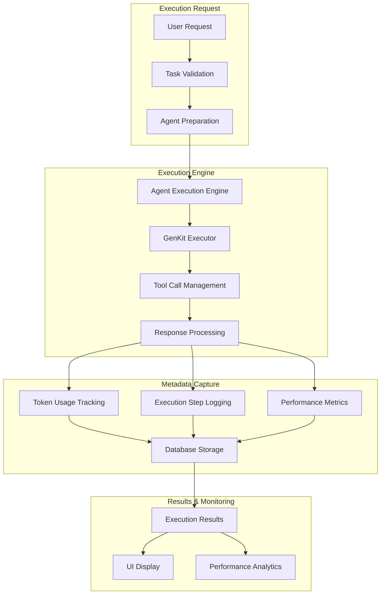

# Agent Execution Engine

## Overview

Station's Agent Execution Engine has undergone a major overhaul to provide comprehensive execution metadata tracking, including complete token usage monitoring, detailed execution steps, and enhanced performance metrics. This system ensures that every aspect of agent execution is captured, analyzed, and made available for monitoring and optimization.

## Architecture

### Execution Flow



## Implementation Details

### Core Execution Engine

```go
// internal/services/agent_execution_engine.go
type AgentExecutionEngine struct {
    db                    db.Interface
    mcpConnectionManager  *mcp.ConnectionManager
    executionQueue       *ExecutionQueueService
    telemetryManager     *telemetry.TelemetryManager
}

type AgentExecutionResult struct {
    AgentRunID      int64                  `json:"agent_run_id"`
    FinalResponse   string                 `json:"final_response"`
    TokenUsage      map[string]interface{} `json:"token_usage"`
    ToolCalls       []ToolCall             `json:"tool_calls"`
    ExecutionSteps  []ExecutionStep        `json:"execution_steps"`
    Duration        time.Duration          `json:"duration"`
    Status          string                 `json:"status"`
    ModelName       string                 `json:"model_name"`
    StepsUsed       int                    `json:"steps_used"`
    ToolsUsed       int                    `json:"tools_used"`
}

func (aee *AgentExecutionEngine) ExecuteAgent(
    agentID int64, 
    task string, 
    userID int64,
) (*AgentExecutionResult, error) {
    startTime := time.Now()
    
    // Create initial agent run record
    runID, err := aee.createAgentRun(agentID, userID, task, startTime)
    if err != nil {
        return nil, fmt.Errorf("failed to create agent run: %w", err)
    }
    
    // Execute using GenKit with comprehensive tracking
    response, err := aee.executeWithGenKit(agentID, task, userID)
    if err != nil {
        aee.updateRunWithError(runID, err, startTime)
        return nil, err
    }
    
    // Process and capture all execution metadata
    result := &AgentExecutionResult{
        AgentRunID:     runID,
        FinalResponse:  response.FinalResponse,
        TokenUsage:     response.TokenUsage,
        ToolCalls:      response.ToolCalls,
        ExecutionSteps: response.ExecutionSteps,
        Duration:       time.Since(startTime),
        Status:         "completed",
        ModelName:      response.ModelName,
        StepsUsed:      len(response.ExecutionSteps),
        ToolsUsed:      len(response.ToolCalls),
    }
    
    // Update database with complete execution metadata
    err = aee.updateRunCompletion(runID, result, startTime)
    if err != nil {
        logging.Error("Failed to update run completion: %v", err)
    }
    
    return result, nil
}
```

### GenKit Integration with Token Tracking

```go
// pkg/dotprompt/genkit_executor.go
type GenKitExecutor struct {
    modelProvider string
    modelName     string
    temperature   float32
    maxTokens     int
}

type ExecutionResponse struct {
    FinalResponse  string                 `json:"final_response"`
    TokenUsage     map[string]interface{} `json:"token_usage"`
    ToolCalls      []ToolCall             `json:"tool_calls"`
    ExecutionSteps []ExecutionStep        `json:"execution_steps"`
    ModelName      string                 `json:"model_name"`
    Duration       time.Duration          `json:"duration"`
}

func (ge *GenKitExecutor) Execute(
    ctx context.Context, 
    prompt string, 
    task string, 
    availableTools []Tool,
) (*ExecutionResponse, error) {
    startTime := time.Now()
    
    // Execute with GenKit
    response, err := ge.executeGenKitFlow(ctx, prompt, task, availableTools)
    if err != nil {
        return nil, fmt.Errorf("genkit execution failed: %w", err)
    }
    
    // Extract comprehensive token usage from GenKit response
    tokenUsage := make(map[string]interface{})
    if response != nil && response.Usage != nil {
        logging.Debug("Extracting token usage from GenKit response")
        tokenUsage["input_tokens"] = response.Usage.InputTokens
        tokenUsage["output_tokens"] = response.Usage.OutputTokens
        tokenUsage["total_tokens"] = response.Usage.InputTokens + response.Usage.OutputTokens
        
        // Extract detailed usage breakdown if available
        if response.Usage.Details != nil {
            tokenUsage["prompt_tokens"] = response.Usage.Details.PromptTokens
            tokenUsage["completion_tokens"] = response.Usage.Details.CompletionTokens
            tokenUsage["cached_tokens"] = response.Usage.Details.CachedTokens
        }
    }
    
    // Process tool calls and execution steps
    allToolCalls := extractToolCalls(response)
    executionSteps := buildExecutionSteps(response, allToolCalls)
    
    return &ExecutionResponse{
        FinalResponse:  response.Text,
        TokenUsage:     tokenUsage,
        ToolCalls:      allToolCalls,
        ExecutionSteps: executionSteps,
        ModelName:      ge.modelName,
        Duration:       time.Since(startTime),
    }, nil
}
```

### Tool Call and Execution Step Processing

```go
// Tool call extraction with comprehensive metadata
type ToolCall struct {
    ID          string                 `json:"id"`
    Name        string                 `json:"name"`
    Parameters  map[string]interface{} `json:"parameters"`
    Result      string                 `json:"result,omitempty"`
    Duration    time.Duration          `json:"duration"`
    Status      string                 `json:"status"`
    Timestamp   time.Time              `json:"timestamp"`
}

type ExecutionStep struct {
    StepNumber int                    `json:"step_number"`
    Type       string                 `json:"type"` // "tool_call", "reasoning", "response"
    Content    string                 `json:"content"`
    ToolName   string                 `json:"tool_name,omitempty"`
    Input      map[string]interface{} `json:"input,omitempty"`
    Output     string                 `json:"output,omitempty"`
    Duration   time.Duration          `json:"duration"`
    Timestamp  time.Time              `json:"timestamp"`
}

func extractToolCalls(response *genkit.GenerateResponse) []ToolCall {
    var toolCalls []ToolCall
    
    if response.Candidates == nil {
        return toolCalls
    }
    
    for _, candidate := range response.Candidates {
        if candidate.Message == nil || candidate.Message.Content == nil {
            continue
        }
        
        for _, part := range candidate.Message.Content {
            if part.ToolRequest != nil {
                toolCall := ToolCall{
                    ID:         part.ToolRequest.Ref,
                    Name:       part.ToolRequest.Name,
                    Parameters: part.ToolRequest.Input,
                    Status:     "executed",
                    Timestamp:  time.Now(),
                }
                
                // Find corresponding tool response
                if toolResponse := findToolResponse(response, part.ToolRequest.Ref); toolResponse != nil {
                    toolCall.Result = fmt.Sprintf("%v", toolResponse.Output)
                }
                
                toolCalls = append(toolCalls, toolCall)
            }
        }
    }
    
    return toolCalls
}

func buildExecutionSteps(response *genkit.GenerateResponse, toolCalls []ToolCall) []ExecutionStep {
    var steps []ExecutionStep
    stepNumber := 1
    
    // Add reasoning steps
    if response.Text != "" {
        steps = append(steps, ExecutionStep{
            StepNumber: stepNumber,
            Type:       "reasoning",
            Content:    response.Text,
            Timestamp:  time.Now(),
        })
        stepNumber++
    }
    
    // Add tool call steps
    for _, toolCall := range toolCalls {
        steps = append(steps, ExecutionStep{
            StepNumber: stepNumber,
            Type:       "tool_call",
            Content:    fmt.Sprintf("Called %s with parameters", toolCall.Name),
            ToolName:   toolCall.Name,
            Input:      toolCall.Parameters,
            Output:     toolCall.Result,
            Duration:   toolCall.Duration,
            Timestamp:  toolCall.Timestamp,
        })
        stepNumber++
    }
    
    return steps
}
```

## Database Integration

### Enhanced Schema

```sql
-- internal/db/migrations/020_add_response_metadata_to_agent_runs.sql
ALTER TABLE agent_runs ADD COLUMN input_tokens INTEGER DEFAULT 0;
ALTER TABLE agent_runs ADD COLUMN output_tokens INTEGER DEFAULT 0;
ALTER TABLE agent_runs ADD COLUMN total_tokens INTEGER DEFAULT 0;
ALTER TABLE agent_runs ADD COLUMN duration_seconds REAL DEFAULT 0;
ALTER TABLE agent_runs ADD COLUMN model_name TEXT DEFAULT '';
ALTER TABLE agent_runs ADD COLUMN tools_used INTEGER DEFAULT 0;
ALTER TABLE agent_runs ADD COLUMN tool_calls TEXT DEFAULT '[]'; -- JSON array
ALTER TABLE agent_runs ADD COLUMN execution_steps TEXT DEFAULT '[]'; -- JSON array
```

### Repository Implementation

```go
// internal/db/repositories/agent_runs.go
type AgentRunWithDetails struct {
    ID             int64     `json:"id"`
    AgentID        int64     `json:"agent_id"`
    UserID         int64     `json:"user_id"`
    Task           string    `json:"task"`
    FinalResponse  string    `json:"final_response"`
    StepsTaken     int       `json:"steps_taken"`
    ToolCalls      string    `json:"tool_calls"`      // JSON string
    ExecutionSteps string    `json:"execution_steps"` // JSON string
    Status         string    `json:"status"`
    StartedAt      time.Time `json:"started_at"`
    CompletedAt    *time.Time `json:"completed_at"`
    InputTokens    int       `json:"input_tokens"`
    OutputTokens   int       `json:"output_tokens"`
    TotalTokens    int       `json:"total_tokens"`
    DurationSeconds float64  `json:"duration_seconds"`
    ModelName      string    `json:"model_name"`
    ToolsUsed      int       `json:"tools_used"`
    AgentName      string    `json:"agent_name"`
    Username       string    `json:"username"`
}

func (r *AgentRunsRepository) UpdateCompletionWithMetadata(
    runID int64, 
    result *AgentExecutionResult,
) error {
    toolCallsJSON, _ := json.Marshal(result.ToolCalls)
    executionStepsJSON, _ := json.Marshal(result.ExecutionSteps)
    
    inputTokens := extractIntFromTokenUsage(result.TokenUsage, "input_tokens")
    outputTokens := extractIntFromTokenUsage(result.TokenUsage, "output_tokens")
    totalTokens := extractIntFromTokenUsage(result.TokenUsage, "total_tokens")
    
    return r.queries.UpdateAgentRunCompletion(context.Background(), 
        db.UpdateAgentRunCompletionParams{
            ID:              runID,
            FinalResponse:   result.FinalResponse,
            Status:          result.Status,
            CompletedAt:     sql.NullTime{Time: time.Now(), Valid: true},
            StepsTaken:      int32(result.StepsUsed),
            ToolCalls:       string(toolCallsJSON),
            ExecutionSteps:  string(executionStepsJSON),
            InputTokens:     int32(inputTokens),
            OutputTokens:    int32(outputTokens),
            TotalTokens:     int32(totalTokens),
            DurationSeconds: result.Duration.Seconds(),
            ModelName:       result.ModelName,
            ToolsUsed:       int32(result.ToolsUsed),
        })
}
```

## API Integration

### Enhanced Run Details Endpoint

```go
// internal/api/v1/agent_runs.go
type AgentRunResponse struct {
    ID             int64            `json:"id"`
    AgentID        int64            `json:"agent_id"`
    Task           string           `json:"task"`
    FinalResponse  string           `json:"final_response"`
    StepsTaken     int              `json:"steps_taken"`
    ToolCalls      []ToolCall       `json:"tool_calls"`
    ExecutionSteps []ExecutionStep  `json:"execution_steps"`
    Status         string           `json:"status"`
    StartedAt      time.Time        `json:"started_at"`
    CompletedAt    *time.Time       `json:"completed_at"`
    TokenUsage     TokenUsage       `json:"token_usage"`
    Duration       float64          `json:"duration_seconds"`
    ModelName      string           `json:"model_name"`
    ToolsUsed      int              `json:"tools_used"`
    AgentName      string           `json:"agent_name"`
    Username       string           `json:"username"`
}

type TokenUsage struct {
    InputTokens  int `json:"input_tokens"`
    OutputTokens int `json:"output_tokens"`
    TotalTokens  int `json:"total_tokens"`
}

func (h *AgentRunsHandler) GetAgentRunDetails(c *gin.Context) {
    runID := c.Param("id")
    id, err := strconv.ParseInt(runID, 10, 64)
    if err != nil {
        c.JSON(400, gin.H{"error": "Invalid run ID"})
        return
    }
    
    run, err := h.agentRunsRepo.GetAgentRunWithDetails(id)
    if err != nil {
        c.JSON(404, gin.H{"error": "Run not found"})
        return
    }
    
    // Parse JSON fields
    var toolCalls []ToolCall
    json.Unmarshal([]byte(run.ToolCalls), &toolCalls)
    
    var executionSteps []ExecutionStep
    json.Unmarshal([]byte(run.ExecutionSteps), &executionSteps)
    
    response := AgentRunResponse{
        ID:             run.ID,
        AgentID:        run.AgentID,
        Task:           run.Task,
        FinalResponse:  run.FinalResponse,
        StepsTaken:     run.StepsTaken,
        ToolCalls:      toolCalls,
        ExecutionSteps: executionSteps,
        Status:         run.Status,
        StartedAt:      run.StartedAt,
        CompletedAt:    run.CompletedAt,
        TokenUsage: TokenUsage{
            InputTokens:  run.InputTokens,
            OutputTokens: run.OutputTokens,
            TotalTokens:  run.TotalTokens,
        },
        Duration:   run.DurationSeconds,
        ModelName:  run.ModelName,
        ToolsUsed:  run.ToolsUsed,
        AgentName:  run.AgentName,
        Username:   run.Username,
    }
    
    c.JSON(200, response)
}
```

## UI Integration

### Agent Run Details Modal

```typescript
// ui/src/components/AgentRunDetails.tsx
interface AgentRunDetailsProps {
    runId: number;
    isOpen: boolean;
    onClose: () => void;
}

export function AgentRunDetailsModal({ runId, isOpen, onClose }: AgentRunDetailsProps) {
    const [runDetails, setRunDetails] = useState<AgentRunResponse | null>(null);
    
    useEffect(() => {
        if (isOpen && runId) {
            fetchRunDetails(runId);
        }
    }, [isOpen, runId]);
    
    const fetchRunDetails = async (id: number) => {
        try {
            const response = await fetch(`/api/v1/agent-runs/${id}`);
            const data = await response.json();
            setRunDetails(data);
        } catch (error) {
            console.error('Failed to fetch run details:', error);
        }
    };
    
    if (!runDetails) return <LoadingSpinner />;
    
    return (
        <div className="fixed inset-0 bg-black bg-opacity-50 flex items-center justify-center z-50">
            <div className="bg-tokyo-bg border border-tokyo-comment rounded-lg max-w-4xl w-full mx-4 max-h-[90vh] overflow-hidden">
                <div className="p-6">
                    <h2 className="text-xl font-bold text-tokyo-fg mb-4">
                        Agent Run Details - #{runDetails.id}
                    </h2>
                    
                    {/* Token Usage Section */}
                    <div className="mb-6">
                        <h3 className="text-lg font-semibold text-tokyo-blue mb-2">Token Usage</h3>
                        <div className="grid grid-cols-3 gap-4">
                            <div className="bg-tokyo-bg-dark p-3 rounded border border-tokyo-comment">
                                <div className="text-tokyo-comment text-sm">Input Tokens</div>
                                <div className="text-tokyo-fg text-xl font-mono">
                                    {runDetails.token_usage.input_tokens.toLocaleString()}
                                </div>
                            </div>
                            <div className="bg-tokyo-bg-dark p-3 rounded border border-tokyo-comment">
                                <div className="text-tokyo-comment text-sm">Output Tokens</div>
                                <div className="text-tokyo-fg text-xl font-mono">
                                    {runDetails.token_usage.output_tokens.toLocaleString()}
                                </div>
                            </div>
                            <div className="bg-tokyo-bg-dark p-3 rounded border border-tokyo-comment">
                                <div className="text-tokyo-comment text-sm">Total Tokens</div>
                                <div className="text-tokyo-fg text-xl font-mono">
                                    {runDetails.token_usage.total_tokens.toLocaleString()}
                                </div>
                            </div>
                        </div>
                    </div>
                    
                    {/* Execution Steps Section */}
                    <div className="mb-6">
                        <h3 className="text-lg font-semibold text-tokyo-purple mb-2">
                            Execution Steps ({runDetails.execution_steps.length})
                        </h3>
                        <div className="space-y-3 max-h-60 overflow-y-auto">
                            {runDetails.execution_steps.map((step, index) => (
                                <div key={index} 
                                     className="bg-tokyo-bg-dark p-3 rounded border border-tokyo-comment">
                                    <div className="flex items-center justify-between mb-2">
                                        <span className="text-tokyo-comment text-sm">
                                            Step {step.step_number}
                                        </span>
                                        <span className={`px-2 py-1 text-xs rounded ${
                                            step.type === 'tool_call' 
                                                ? 'bg-tokyo-blue bg-opacity-20 text-tokyo-blue'
                                                : 'bg-tokyo-purple bg-opacity-20 text-tokyo-purple'
                                        }`}>
                                            {step.type}
                                        </span>
                                    </div>
                                    
                                    {step.type === 'tool_call' && (
                                        <div>
                                            <div className="text-tokyo-cyan mb-2">🔧 {step.tool_name}</div>
                                            <div className="text-tokyo-comment text-sm">
                                                Input: {JSON.stringify(step.input, null, 2)}
                                            </div>
                                            {step.output && (
                                                <div className="text-tokyo-comment text-sm mt-2">
                                                    Output: {step.output}
                                                </div>
                                            )}
                                        </div>
                                    )}
                                    
                                    {step.type === 'reasoning' && (
                                        <div className="text-tokyo-fg text-sm">
                                            {step.content}
                                        </div>
                                    )}
                                </div>
                            ))}
                        </div>
                    </div>
                    
                    {/* Tool Calls Section */}
                    <div className="mb-6">
                        <h3 className="text-lg font-semibold text-tokyo-cyan mb-2">
                            Tool Calls ({runDetails.tool_calls.length})
                        </h3>
                        <div className="space-y-2">
                            {runDetails.tool_calls.map((call, index) => (
                                <div key={index} 
                                     className="bg-tokyo-bg-dark p-3 rounded border border-tokyo-comment">
                                    <div className="flex items-center justify-between">
                                        <span className="text-tokyo-cyan font-mono">{call.name}</span>
                                        <span className="text-tokyo-comment text-xs">
                                            {call.duration}ms
                                        </span>
                                    </div>
                                    <div className="text-tokyo-comment text-sm mt-1">
                                        {Object.keys(call.parameters).length} parameters
                                    </div>
                                </div>
                            ))}
                        </div>
                    </div>
                </div>
                
                <div className="border-t border-tokyo-comment p-4 flex justify-end">
                    <button 
                        onClick={onClose}
                        className="px-4 py-2 bg-tokyo-blue text-tokyo-bg rounded hover:bg-opacity-80"
                    >
                        Close
                    </button>
                </div>
            </div>
        </div>
    );
}
```

## Performance Monitoring

### Telemetry Integration

```go
// internal/services/telemetry_manager.go
type ExecutionMetrics struct {
    AgentID         int64         `json:"agent_id"`
    ExecutionTime   time.Duration `json:"execution_time"`
    TokensUsed      int           `json:"tokens_used"`
    ToolCallCount   int           `json:"tool_call_count"`
    Success         bool          `json:"success"`
    ModelName       string        `json:"model_name"`
    EnvironmentID   int64         `json:"environment_id"`
}

func (tm *TelemetryManager) RecordAgentExecution(metrics ExecutionMetrics) {
    // OpenTelemetry metrics
    tm.executionCounter.Add(context.Background(), 1, 
        metric.WithAttributes(
            attribute.Int64("agent_id", metrics.AgentID),
            attribute.String("model_name", metrics.ModelName),
            attribute.Bool("success", metrics.Success),
        ))
    
    tm.executionDuration.Record(context.Background(), 
        metrics.ExecutionTime.Milliseconds(),
        metric.WithAttributes(
            attribute.Int64("agent_id", metrics.AgentID),
            attribute.String("model_name", metrics.ModelName),
        ))
    
    tm.tokenUsage.Record(context.Background(), 
        int64(metrics.TokensUsed),
        metric.WithAttributes(
            attribute.Int64("agent_id", metrics.AgentID),
            attribute.String("model_name", metrics.ModelName),
        ))
}
```

## Performance Optimizations

### Database Query Optimization

```sql
-- Optimized queries for execution metadata
CREATE INDEX idx_agent_runs_agent_id_started_at ON agent_runs(agent_id, started_at DESC);
CREATE INDEX idx_agent_runs_status ON agent_runs(status);
CREATE INDEX idx_agent_runs_duration ON agent_runs(duration_seconds DESC);
CREATE INDEX idx_agent_runs_tokens ON agent_runs(total_tokens DESC);
```

### Caching Strategy

```go
// Execution result caching for performance
type ExecutionCache struct {
    cache map[string]*AgentExecutionResult
    mutex sync.RWMutex
    ttl   time.Duration
}

func (ec *ExecutionCache) Get(key string) (*AgentExecutionResult, bool) {
    ec.mutex.RLock()
    defer ec.mutex.RUnlock()
    
    result, exists := ec.cache[key]
    return result, exists
}

func (ec *ExecutionCache) Set(key string, result *AgentExecutionResult) {
    ec.mutex.Lock()
    defer ec.mutex.Unlock()
    
    ec.cache[key] = result
    
    // Set expiration
    go func() {
        time.Sleep(ec.ttl)
        ec.mutex.Lock()
        delete(ec.cache, key)
        ec.mutex.Unlock()
    }()
}
```

## Testing Strategy

### Unit Testing

```go
// internal/services/agent_execution_engine_test.go
func TestAgentExecutionEngine_ExecuteAgent(t *testing.T) {
    tests := []struct {
        name           string
        agentID        int64
        task           string
        expectedTokens int
        expectedSteps  int
        expectedTools  int
    }{
        {
            name:           "successful_execution_with_file_operations",
            agentID:        1,
            task:           "List files in current directory",
            expectedTokens: 150,
            expectedSteps:  3,
            expectedTools:  1,
        },
        {
            name:           "complex_execution_with_multiple_tools",
            agentID:        2,
            task:           "Analyze code quality and create report",
            expectedTokens: 500,
            expectedSteps:  8,
            expectedTools:  4,
        },
    }
    
    for _, tt := range tests {
        t.Run(tt.name, func(t *testing.T) {
            result, err := executionEngine.ExecuteAgent(tt.agentID, tt.task, 1)
            
            assert.NoError(t, err)
            assert.NotNil(t, result)
            assert.Greater(t, result.TokenUsage["total_tokens"], tt.expectedTokens)
            assert.Equal(t, tt.expectedSteps, result.StepsUsed)
            assert.Equal(t, tt.expectedTools, result.ToolsUsed)
        })
    }
}
```

### Integration Testing

```go
func TestExecutionEngine_Integration(t *testing.T) {
    // Test complete execution flow with real agent
    agent := createTestAgent(t, "test-filesystem-agent")
    
    result, err := executionEngine.ExecuteAgent(
        agent.ID, 
        "Check disk usage and create summary", 
        1,
    )
    
    // Verify comprehensive execution tracking
    assert.NoError(t, err)
    assert.NotEmpty(t, result.FinalResponse)
    assert.Greater(t, result.TokenUsage["total_tokens"], 0)
    assert.Greater(t, len(result.ExecutionSteps), 0)
    assert.Greater(t, len(result.ToolCalls), 0)
    
    // Verify database persistence
    stored, err := agentRunsRepo.GetAgentRunWithDetails(result.AgentRunID)
    assert.NoError(t, err)
    assert.Equal(t, result.FinalResponse, stored.FinalResponse)
    assert.Greater(t, stored.TotalTokens, 0)
}
```

## Future Enhancements

### Planned Improvements

1. **Advanced Analytics**:
   - Cost tracking and optimization
   - Performance trend analysis
   - Token usage predictions
   - Model comparison metrics

2. **Real-time Monitoring**:
   - Live execution progress tracking
   - WebSocket-based step-by-step updates
   - Performance alerts and notifications
   - Resource usage monitoring

3. **Optimization Features**:
   - Automatic prompt optimization
   - Tool call caching and deduplication
   - Model selection optimization
   - Execution path optimization

4. **Extended Metadata**:
   - Context window usage tracking
   - Tool call success rates
   - Error categorization and analysis
   - User interaction patterns

## Conclusion

The enhanced Agent Execution Engine represents a significant advancement in Station's capabilities, providing comprehensive execution monitoring, detailed token usage tracking, and rich metadata capture. This system enables users to fully understand and optimize their agent executions while providing the foundation for advanced analytics and performance optimization features.