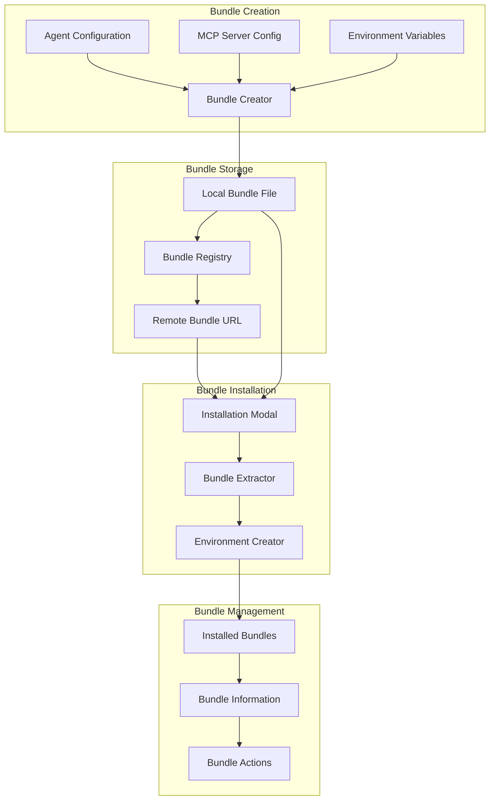

# Bundle Management System

## Overview

Station's Bundle Management System provides a comprehensive solution for packaging, distributing, and installing agent configurations across environments. This system enables teams to share agent templates, MCP configurations, and environment setups as portable bundles that can be easily deployed and managed.

## Architecture

### Bundle Lifecycle



## Bundle Structure

### Bundle Format

```json
{
  "manifest.json": {
    "name": "development-toolkit",
    "version": "1.0.0",
    "description": "Essential development tools and agents",
    "author": "Station Team",
    "created_at": "2025-01-18T10:00:00Z",
    "environment": "development",
    "agents_count": 3,
    "mcp_servers_count": 4,
    "variables_required": ["PROJECT_ROOT", "API_KEY"]
  },
  "agents/": {
    "CodeReviewer.prompt": "...",
    "FileManager.prompt": "...",
    "DeployAgent.prompt": "..."
  },
  "mcp_configs/": {
    "filesystem.json": "...",
    "git.json": "...",
    "docker.json": "...",
    "aws.json": "..."
  },
  "variables/": {
    "variables.yml": "...",
    "variables.schema.json": "..."
  }
}
```

### Tar.gz Archive Structure

```
bundle.tar.gz
├── manifest.json
├── agents/
│   ├── CodeReviewer.prompt
│   ├── FileManager.prompt
│   └── DeployAgent.prompt
├── mcp_configs/
│   ├── filesystem.json
│   ├── git.json
│   ├── docker.json
│   └── aws.json
└── variables/
    ├── variables.yml
    └── variables.schema.json
```

## Implementation

### Bundle Creation API

```go
// internal/api/v1/bundles.go
type BundleCreationRequest struct {
    EnvironmentName string   `json:"environment_name" binding:"required"`
    BundleName      string   `json:"bundle_name" binding:"required"`
    Description     string   `json:"description"`
    IncludeAgents   []int64  `json:"include_agents"`
    IncludeServers  []string `json:"include_servers"`
}

type BundleCreationResponse struct {
    BundlePath      string    `json:"bundle_path"`
    DownloadURL     string    `json:"download_url"`
    ShareURL        string    `json:"share_url,omitempty"`
    AgentsIncluded  int       `json:"agents_included"`
    ServersIncluded int       `json:"servers_included"`
    BundleSize      int64     `json:"bundle_size"`
    CreatedAt       time.Time `json:"created_at"`
}

func (h *BundlesHandler) CreateBundle(c *gin.Context) {
    var req BundleCreationRequest
    if err := c.ShouldBindJSON(&req); err != nil {
        c.JSON(400, gin.H{"error": err.Error()})
        return
    }
    
    // Create bundle using bundle creator service
    bundle, err := h.bundleCreator.CreateBundle(&BundleSpec{
        EnvironmentName: req.EnvironmentName,
        Name:           req.BundleName,
        Description:    req.Description,
        AgentIDs:       req.IncludeAgents,
        ServerNames:    req.IncludeServers,
    })
    if err != nil {
        logging.Error("Failed to create bundle: %v", err)
        c.JSON(500, gin.H{"error": "Failed to create bundle"})
        return
    }
    
    response := BundleCreationResponse{
        BundlePath:      bundle.FilePath,
        DownloadURL:     fmt.Sprintf("/api/v1/bundles/download/%s", bundle.ID),
        AgentsIncluded:  len(bundle.Agents),
        ServersIncluded: len(bundle.MCPServers),
        BundleSize:      bundle.Size,
        CreatedAt:       bundle.CreatedAt,
    }
    
    // Generate share URL if configured
    if h.config.ShareEndpoint != "" {
        response.ShareURL = fmt.Sprintf("%s/%s", h.config.ShareEndpoint, bundle.ID)
    }
    
    c.JSON(200, response)
}
```

### Bundle Installation API

```go
type BundleInstallationRequest struct {
    Source          string            `json:"source" binding:"required"` // "url" or "file"
    URL             string            `json:"url,omitempty"`
    FilePath        string            `json:"file_path,omitempty"`
    EnvironmentName string            `json:"environment_name" binding:"required"`
    Variables       map[string]string `json:"variables,omitempty"`
    OverwriteExisting bool            `json:"overwrite_existing"`
}

type BundleInstallationResponse struct {
    Success         bool              `json:"success"`
    EnvironmentName string            `json:"environment_name"`
    AgentsInstalled int               `json:"agents_installed"`
    ServersInstalled int              `json:"servers_installed"`
    BundleInfo      BundleManifest    `json:"bundle_info"`
    Warnings        []string          `json:"warnings,omitempty"`
    Errors          []string          `json:"errors,omitempty"`
}

func (h *BundlesHandler) InstallBundle(c *gin.Context) {
    var req BundleInstallationRequest
    if err := c.ShouldBindJSON(&req); err != nil {
        c.JSON(400, gin.H{"error": err.Error()})
        return
    }
    
    // Download or locate bundle file
    bundlePath, err := h.prepareBundleFile(&req)
    if err != nil {
        logging.Error("Failed to prepare bundle file: %v", err)
        c.JSON(400, gin.H{"error": "Failed to access bundle file"})
        return
    }
    defer os.RemoveAll(filepath.Dir(bundlePath)) // Cleanup temp files
    
    // Extract and validate bundle
    extractedDir, manifest, err := h.bundleExtractor.Extract(bundlePath)
    if err != nil {
        logging.Error("Failed to extract bundle: %v", err)
        c.JSON(400, gin.H{"error": "Invalid bundle format"})
        return
    }
    defer os.RemoveAll(extractedDir) // Cleanup extracted files
    
    // Install bundle components
    result, err := h.bundleInstaller.Install(&BundleInstallSpec{
        ExtractedPath:     extractedDir,
        Manifest:         manifest,
        TargetEnvironment: req.EnvironmentName,
        Variables:        req.Variables,
        OverwriteExisting: req.OverwriteExisting,
    })
    
    if err != nil {
        logging.Error("Failed to install bundle: %v", err)
        c.JSON(500, gin.H{"error": "Bundle installation failed"})
        return
    }
    
    response := BundleInstallationResponse{
        Success:          result.Success,
        EnvironmentName:  req.EnvironmentName,
        AgentsInstalled:  result.AgentsInstalled,
        ServersInstalled: result.ServersInstalled,
        BundleInfo:       *manifest,
        Warnings:         result.Warnings,
        Errors:           result.Errors,
    }
    
    c.JSON(200, response)
}
```

### Bundle Creator Service

```go
// internal/services/bundle_creator.go
type BundleCreator struct {
    db              db.Interface
    fileConfigSvc   *FileConfigService
    agentSvc        AgentServiceInterface
    bundlesDir      string
}

type BundleSpec struct {
    EnvironmentName string
    Name           string
    Description    string
    AgentIDs       []int64
    ServerNames    []string
}

type CreatedBundle struct {
    ID          string
    FilePath    string
    Size        int64
    Agents      []Agent
    MCPServers  []MCPServerConfig
    CreatedAt   time.Time
}

func (bc *BundleCreator) CreateBundle(spec *BundleSpec) (*CreatedBundle, error) {
    bundleID := generateBundleID()
    bundleDir := filepath.Join(bc.bundlesDir, bundleID)
    
    // Create temporary bundle directory structure
    if err := os.MkdirAll(bundleDir, 0755); err != nil {
        return nil, fmt.Errorf("failed to create bundle directory: %w", err)
    }
    
    // Create agents directory and copy agent files
    agentsDir := filepath.Join(bundleDir, "agents")
    if err := os.MkdirAll(agentsDir, 0755); err != nil {
        return nil, fmt.Errorf("failed to create agents directory: %w", err)
    }
    
    var includedAgents []Agent
    for _, agentID := range spec.AgentIDs {
        agent, err := bc.agentSvc.GetAgentByID(agentID)
        if err != nil {
            logging.Warn("Skipping agent %d: %v", agentID, err)
            continue
        }
        
        // Copy agent .prompt file
        agentFilename := fmt.Sprintf("%s.prompt", agent.Name)
        agentPath := bc.getAgentFilePath(spec.EnvironmentName, agentFilename)
        
        if err := bc.copyFile(agentPath, filepath.Join(agentsDir, agentFilename)); err != nil {
            logging.Warn("Failed to copy agent %s: %v", agent.Name, err)
            continue
        }
        
        includedAgents = append(includedAgents, agent)
    }
    
    // Create MCP configs directory and copy server configs
    mcpDir := filepath.Join(bundleDir, "mcp_configs")
    if err := os.MkdirAll(mcpDir, 0755); err != nil {
        return nil, fmt.Errorf("failed to create mcp configs directory: %w", err)
    }
    
    var includedServers []MCPServerConfig
    for _, serverName := range spec.ServerNames {
        serverConfig, err := bc.getMCPServerConfig(spec.EnvironmentName, serverName)
        if err != nil {
            logging.Warn("Skipping MCP server %s: %v", serverName, err)
            continue
        }
        
        configFilename := fmt.Sprintf("%s.json", serverName)
        configData, _ := json.MarshalIndent(serverConfig, "", "  ")
        
        if err := os.WriteFile(filepath.Join(mcpDir, configFilename), configData, 0644); err != nil {
            logging.Warn("Failed to write MCP config %s: %v", serverName, err)
            continue
        }
        
        includedServers = append(includedServers, serverConfig)
    }
    
    // Create variables directory and copy variables.yml
    variablesDir := filepath.Join(bundleDir, "variables")
    if err := os.MkdirAll(variablesDir, 0755); err != nil {
        return nil, fmt.Errorf("failed to create variables directory: %w", err)
    }
    
    variablesPath := bc.getVariablesFilePath(spec.EnvironmentName)
    if _, err := os.Stat(variablesPath); err == nil {
        if err := bc.copyFile(variablesPath, filepath.Join(variablesDir, "variables.yml")); err != nil {
            logging.Warn("Failed to copy variables file: %v", err)
        }
    }
    
    // Create manifest.json
    manifest := BundleManifest{
        Name:              spec.Name,
        Version:           "1.0.0",
        Description:       spec.Description,
        Author:            "Station User",
        CreatedAt:         time.Now(),
        Environment:       spec.EnvironmentName,
        AgentsCount:       len(includedAgents),
        MCPServersCount:   len(includedServers),
        VariablesRequired: bc.extractRequiredVariables(includedServers),
    }
    
    manifestData, _ := json.MarshalIndent(manifest, "", "  ")
    if err := os.WriteFile(filepath.Join(bundleDir, "manifest.json"), manifestData, 0644); err != nil {
        return nil, fmt.Errorf("failed to create manifest: %w", err)
    }
    
    // Create tar.gz archive
    bundleFilePath := filepath.Join(bc.bundlesDir, fmt.Sprintf("%s.tar.gz", bundleID))
    if err := bc.createTarGzArchive(bundleDir, bundleFilePath); err != nil {
        return nil, fmt.Errorf("failed to create bundle archive: %w", err)
    }
    
    // Get bundle size
    stat, _ := os.Stat(bundleFilePath)
    bundleSize := stat.Size()
    
    // Cleanup temporary directory
    os.RemoveAll(bundleDir)
    
    return &CreatedBundle{
        ID:         bundleID,
        FilePath:   bundleFilePath,
        Size:       bundleSize,
        Agents:     includedAgents,
        MCPServers: includedServers,
        CreatedAt:  time.Now(),
    }, nil
}

func (bc *BundleCreator) createTarGzArchive(sourceDir, targetPath string) error {
    file, err := os.Create(targetPath)
    if err != nil {
        return err
    }
    defer file.Close()
    
    gzipWriter := gzip.NewWriter(file)
    defer gzipWriter.Close()
    
    tarWriter := tar.NewWriter(gzipWriter)
    defer tarWriter.Close()
    
    return filepath.Walk(sourceDir, func(filePath string, info os.FileInfo, err error) error {
        if err != nil {
            return err
        }
        
        // Skip the root directory
        if filePath == sourceDir {
            return nil
        }
        
        // Get relative path for tar header
        relPath, _ := filepath.Rel(sourceDir, filePath)
        
        // Create tar header
        header, err := tar.FileInfoHeader(info, "")
        if err != nil {
            return err
        }
        header.Name = relPath
        
        if err := tarWriter.WriteHeader(header); err != nil {
            return err
        }
        
        // Write file content if it's a regular file
        if info.Mode().IsRegular() {
            fileContent, err := os.Open(filePath)
            if err != nil {
                return err
            }
            defer fileContent.Close()
            
            if _, err := io.Copy(tarWriter, fileContent); err != nil {
                return err
            }
        }
        
        return nil
    })
}
```

### Bundle Installation Service

```go
// internal/services/bundle_installer.go
type BundleInstaller struct {
    db              db.Interface
    fileConfigSvc   *FileConfigService
    agentSvc        AgentServiceInterface
}

type BundleInstallSpec struct {
    ExtractedPath     string
    Manifest         *BundleManifest
    TargetEnvironment string
    Variables        map[string]string
    OverwriteExisting bool
}

type InstallResult struct {
    Success          bool
    AgentsInstalled  int
    ServersInstalled int
    Warnings         []string
    Errors           []string
}

func (bi *BundleInstaller) Install(spec *BundleInstallSpec) (*InstallResult, error) {
    result := &InstallResult{
        Success:  true,
        Warnings: []string{},
        Errors:   []string{},
    }
    
    // Ensure target environment exists
    if err := bi.ensureEnvironmentExists(spec.TargetEnvironment); err != nil {
        return nil, fmt.Errorf("failed to create environment: %w", err)
    }
    
    // Install MCP server configurations
    mcpConfigsDir := filepath.Join(spec.ExtractedPath, "mcp_configs")
    if _, err := os.Stat(mcpConfigsDir); err == nil {
        if err := bi.installMCPConfigs(mcpConfigsDir, spec.TargetEnvironment, spec.OverwriteExisting); err != nil {
            result.Errors = append(result.Errors, fmt.Sprintf("MCP config installation failed: %v", err))
        } else {
            result.ServersInstalled = bi.countFiles(mcpConfigsDir, "*.json")
        }
    }
    
    // Install variables file
    variablesDir := filepath.Join(spec.ExtractedPath, "variables")
    if _, err := os.Stat(variablesDir); err == nil {
        if err := bi.installVariables(variablesDir, spec.TargetEnvironment, spec.Variables, spec.OverwriteExisting); err != nil {
            result.Warnings = append(result.Warnings, fmt.Sprintf("Variables installation warning: %v", err))
        }
    }
    
    // Install agent configurations
    agentsDir := filepath.Join(spec.ExtractedPath, "agents")
    if _, err := os.Stat(agentsDir); err == nil {
        installedAgents, err := bi.installAgents(agentsDir, spec.TargetEnvironment, spec.OverwriteExisting)
        if err != nil {
            result.Errors = append(result.Errors, fmt.Sprintf("Agent installation failed: %v", err))
        } else {
            result.AgentsInstalled = installedAgents
        }
    }
    
    // Set success to false if there were critical errors
    if len(result.Errors) > 0 {
        result.Success = false
    }
    
    return result, nil
}

func (bi *BundleInstaller) installAgents(agentsDir, environment string, overwrite bool) (int, error) {
    installedCount := 0
    
    err := filepath.Walk(agentsDir, func(path string, info os.FileInfo, err error) error {
        if err != nil {
            return err
        }
        
        if !info.Mode().IsRegular() || !strings.HasSuffix(path, ".prompt") {
            return nil
        }
        
        // Calculate target path
        filename := info.Name()
        targetDir := bi.getEnvironmentAgentsDir(environment)
        targetPath := filepath.Join(targetDir, filename)
        
        // Check if file already exists
        if _, err := os.Stat(targetPath); err == nil && !overwrite {
            logging.Warn("Agent file %s already exists, skipping", filename)
            return nil
        }
        
        // Ensure target directory exists
        if err := os.MkdirAll(targetDir, 0755); err != nil {
            return fmt.Errorf("failed to create agents directory: %w", err)
        }
        
        // Copy agent file
        if err := bi.copyFile(path, targetPath); err != nil {
            return fmt.Errorf("failed to copy agent %s: %w", filename, err)
        }
        
        installedCount++
        logging.Info("Installed agent: %s", filename)
        return nil
    })
    
    return installedCount, err
}
```

## UI Integration

### Bundle Installation Modal

```typescript
// ui/src/components/BundleInstallModal.tsx
interface BundleInstallModalProps {
    isOpen: boolean;
    onClose: () => void;
    onInstallComplete: () => void;
}

export function BundleInstallModal({ isOpen, onClose, onInstallComplete }: BundleInstallModalProps) {
    const [source, setSource] = useState<'url' | 'file'>('url');
    const [url, setUrl] = useState('');
    const [filePath, setFilePath] = useState('');
    const [environmentName, setEnvironmentName] = useState('');
    const [variables, setVariables] = useState<Record<string, string>>({});
    const [isInstalling, setIsInstalling] = useState(false);
    const [installResult, setInstallResult] = useState<BundleInstallationResponse | null>(null);
    
    const handleInstall = async () => {
        if (!environmentName) {
            alert('Please specify an environment name');
            return;
        }
        
        if (source === 'url' && !url) {
            alert('Please provide a bundle URL');
            return;
        }
        
        if (source === 'file' && !filePath) {
            alert('Please provide a file path');
            return;
        }
        
        setIsInstalling(true);
        
        try {
            const response = await fetch('/api/v1/bundles/install', {
                method: 'POST',
                headers: { 'Content-Type': 'application/json' },
                body: JSON.stringify({
                    source,
                    url: source === 'url' ? url : undefined,
                    file_path: source === 'file' ? filePath : undefined,
                    environment_name: environmentName,
                    variables,
                    overwrite_existing: true
                })
            });
            
            const result = await response.json();
            setInstallResult(result);
            
            if (result.success) {
                onInstallComplete();
                setTimeout(() => {
                    onClose();
                    setInstallResult(null);
                }, 3000);
            }
        } catch (error) {
            console.error('Bundle installation failed:', error);
            alert('Bundle installation failed');
        } finally {
            setIsInstalling(false);
        }
    };
    
    if (!isOpen) return null;
    
    return (
        <div className="fixed inset-0 bg-black bg-opacity-50 flex items-center justify-center z-50">
            <div className="bg-tokyo-bg border border-tokyo-comment rounded-lg max-w-2xl w-full mx-4">
                <div className="p-6">
                    <h2 className="text-xl font-bold text-tokyo-fg mb-6">Install Bundle</h2>
                    
                    {installResult ? (
                        <div className="space-y-4">
                            <div className={`p-4 rounded border ${
                                installResult.success 
                                    ? 'border-tokyo-green bg-tokyo-green bg-opacity-10'
                                    : 'border-tokyo-red bg-tokyo-red bg-opacity-10'
                            }`}>
                                <h3 className={`font-semibold ${
                                    installResult.success ? 'text-tokyo-green' : 'text-tokyo-red'
                                }`}>
                                    {installResult.success ? '✅ Installation Successful!' : '❌ Installation Failed'}
                                </h3>
                                
                                {installResult.success && (
                                    <div className="mt-2 space-y-1 text-tokyo-fg text-sm">
                                        <div>Environment: {installResult.environment_name}</div>
                                        <div>Agents Installed: {installResult.agents_installed}</div>
                                        <div>Servers Installed: {installResult.servers_installed}</div>
                                    </div>
                                )}
                            </div>
                            
                            {installResult.warnings && installResult.warnings.length > 0 && (
                                <div className="p-4 rounded border border-tokyo-yellow bg-tokyo-yellow bg-opacity-10">
                                    <h4 className="text-tokyo-yellow font-semibold mb-2">Warnings:</h4>
                                    <ul className="text-tokyo-fg text-sm space-y-1">
                                        {installResult.warnings.map((warning, index) => (
                                            <li key={index}>• {warning}</li>
                                        ))}
                                    </ul>
                                </div>
                            )}
                            
                            {installResult.errors && installResult.errors.length > 0 && (
                                <div className="p-4 rounded border border-tokyo-red bg-tokyo-red bg-opacity-10">
                                    <h4 className="text-tokyo-red font-semibold mb-2">Errors:</h4>
                                    <ul className="text-tokyo-fg text-sm space-y-1">
                                        {installResult.errors.map((error, index) => (
                                            <li key={index}>• {error}</li>
                                        ))}
                                    </ul>
                                </div>
                            )}
                        </div>
                    ) : (
                        <div className="space-y-6">
                            {/* Bundle Source Selection */}
                            <div>
                                <label className="block text-tokyo-fg font-medium mb-2">Bundle Source</label>
                                <div className="flex gap-4">
                                    <label className="flex items-center">
                                        <input
                                            type="radio"
                                            value="url"
                                            checked={source === 'url'}
                                            onChange={(e) => setSource('url' as const)}
                                            className="mr-2"
                                        />
                                        <span className="text-tokyo-fg">URL</span>
                                    </label>
                                    <label className="flex items-center">
                                        <input
                                            type="radio"
                                            value="file"
                                            checked={source === 'file'}
                                            onChange={(e) => setSource('file' as const)}
                                            className="mr-2"
                                        />
                                        <span className="text-tokyo-fg">File Path</span>
                                    </label>
                                </div>
                            </div>
                            
                            {/* Bundle URL/Path Input */}
                            {source === 'url' ? (
                                <div>
                                    <label className="block text-tokyo-fg font-medium mb-2">Bundle URL</label>
                                    <input
                                        type="url"
                                        value={url}
                                        onChange={(e) => setUrl(e.target.value)}
                                        placeholder="https://example.com/bundle.tar.gz"
                                        className="w-full p-3 bg-tokyo-bg-dark border border-tokyo-comment rounded text-tokyo-fg focus:border-tokyo-blue outline-none"
                                    />
                                </div>
                            ) : (
                                <div>
                                    <label className="block text-tokyo-fg font-medium mb-2">Bundle File Path</label>
                                    <input
                                        type="text"
                                        value={filePath}
                                        onChange={(e) => setFilePath(e.target.value)}
                                        placeholder="/path/to/bundle.tar.gz"
                                        className="w-full p-3 bg-tokyo-bg-dark border border-tokyo-comment rounded text-tokyo-fg focus:border-tokyo-blue outline-none"
                                    />
                                </div>
                            )}
                            
                            {/* Environment Name */}
                            <div>
                                <label className="block text-tokyo-fg font-medium mb-2">Environment Name</label>
                                <input
                                    type="text"
                                    value={environmentName}
                                    onChange={(e) => setEnvironmentName(e.target.value)}
                                    placeholder="production"
                                    className="w-full p-3 bg-tokyo-bg-dark border border-tokyo-comment rounded text-tokyo-fg focus:border-tokyo-blue outline-none"
                                />
                            </div>
                            
                            {/* Variables Configuration */}
                            <div>
                                <label className="block text-tokyo-fg font-medium mb-2">Environment Variables (Optional)</label>
                                <div className="space-y-2">
                                    {Object.entries(variables).map(([key, value], index) => (
                                        <div key={index} className="flex gap-2">
                                            <input
                                                type="text"
                                                placeholder="VARIABLE_NAME"
                                                value={key}
                                                onChange={(e) => {
                                                    const newVars = { ...variables };
                                                    delete newVars[key];
                                                    newVars[e.target.value] = value;
                                                    setVariables(newVars);
                                                }}
                                                className="flex-1 p-2 bg-tokyo-bg-dark border border-tokyo-comment rounded text-tokyo-fg focus:border-tokyo-blue outline-none"
                                            />
                                            <input
                                                type="text"
                                                placeholder="value"
                                                value={value}
                                                onChange={(e) => {
                                                    setVariables({ ...variables, [key]: e.target.value });
                                                }}
                                                className="flex-1 p-2 bg-tokyo-bg-dark border border-tokyo-comment rounded text-tokyo-fg focus:border-tokyo-blue outline-none"
                                            />
                                            <button
                                                onClick={() => {
                                                    const newVars = { ...variables };
                                                    delete newVars[key];
                                                    setVariables(newVars);
                                                }}
                                                className="px-3 py-2 bg-tokyo-red text-tokyo-bg rounded hover:bg-opacity-80"
                                            >
                                                ×
                                            </button>
                                        </div>
                                    ))}
                                    <button
                                        onClick={() => setVariables({ ...variables, '': '' })}
                                        className="px-4 py-2 bg-tokyo-comment text-tokyo-fg rounded hover:bg-opacity-80"
                                    >
                                        + Add Variable
                                    </button>
                                </div>
                            </div>
                        </div>
                    )}
                </div>
                
                {/* Modal Footer */}
                <div className="border-t border-tokyo-comment p-4 flex justify-end gap-2">
                    <button
                        onClick={onClose}
                        className="px-4 py-2 text-tokyo-fg hover:bg-tokyo-comment hover:bg-opacity-20 rounded"
                    >
                        Cancel
                    </button>
                    {!installResult && (
                        <button
                            onClick={handleInstall}
                            disabled={isInstalling}
                            className="px-6 py-2 bg-tokyo-blue text-tokyo-bg rounded hover:bg-opacity-80 disabled:opacity-50"
                        >
                            {isInstalling ? 'Installing...' : 'Install Bundle'}
                        </button>
                    )}
                </div>
            </div>
        </div>
    );
}
```

### Bundle List Display

```typescript
// ui/src/components/BundlesList.tsx
interface Bundle {
    id: string;
    name: string;
    version: string;
    description: string;
    environment: string;
    agents_count: number;
    servers_count: number;
    size: number;
    created_at: string;
    file_path: string;
}

export function BundlesList() {
    const [bundles, setBundles] = useState<Bundle[]>([]);
    const [loading, setLoading] = useState(true);
    
    useEffect(() => {
        fetchBundles();
    }, []);
    
    const fetchBundles = async () => {
        try {
            const response = await fetch('/api/v1/bundles');
            const data = await response.json();
            setBundles(data);
        } catch (error) {
            console.error('Failed to fetch bundles:', error);
        } finally {
            setLoading(false);
        }
    };
    
    const formatSize = (bytes: number) => {
        if (bytes === 0) return '0 Bytes';
        const k = 1024;
        const sizes = ['Bytes', 'KB', 'MB', 'GB'];
        const i = Math.floor(Math.log(bytes) / Math.log(k));
        return parseFloat((bytes / Math.pow(k, i)).toFixed(2)) + ' ' + sizes[i];
    };
    
    if (loading) {
        return <div className="text-tokyo-comment">Loading bundles...</div>;
    }
    
    return (
        <div className="space-y-4">
            <h2 className="text-xl font-bold text-tokyo-fg">Installed Bundles</h2>
            
            {bundles.length === 0 ? (
                <div className="text-tokyo-comment text-center py-8">
                    No bundles installed yet. Install your first bundle to get started.
                </div>
            ) : (
                <div className="grid gap-4">
                    {bundles.map((bundle) => (
                        <div key={bundle.id} 
                             className="bg-tokyo-bg-dark border border-tokyo-comment rounded-lg p-6">
                            <div className="flex justify-between items-start mb-4">
                                <div>
                                    <h3 className="text-lg font-semibold text-tokyo-fg">
                                        {bundle.name}
                                    </h3>
                                    <p className="text-tokyo-comment text-sm">
                                        v{bundle.version} • {bundle.environment} environment
                                    </p>
                                </div>
                                <div className="text-right">
                                    <div className="text-tokyo-comment text-sm">
                                        {formatSize(bundle.size)}
                                    </div>
                                    <div className="text-tokyo-comment text-xs">
                                        {new Date(bundle.created_at).toLocaleDateString()}
                                    </div>
                                </div>
                            </div>
                            
                            <p className="text-tokyo-fg mb-4">{bundle.description}</p>
                            
                            <div className="flex justify-between items-center">
                                <div className="flex gap-4 text-sm">
                                    <span className="text-tokyo-blue">
                                        📋 {bundle.agents_count} agents
                                    </span>
                                    <span className="text-tokyo-purple">
                                        🔧 {bundle.servers_count} servers
                                    </span>
                                </div>
                                
                                <div className="flex gap-2">
                                    <button className="px-3 py-1 bg-tokyo-blue text-tokyo-bg rounded text-sm hover:bg-opacity-80">
                                        Download
                                    </button>
                                    <button className="px-3 py-1 bg-tokyo-comment text-tokyo-fg rounded text-sm hover:bg-opacity-80">
                                        Info
                                    </button>
                                </div>
                            </div>
                        </div>
                    ))}
                </div>
            )}
        </div>
    );
}
```

## Future Enhancements

### Planned Features

1. **Bundle Registry Integration**:
   - Public bundle repository
   - Version management
   - Dependency resolution
   - Automated updates

2. **Advanced Bundle Features**:
   - Bundle templates
   - Conditional installations
   - Bundle dependencies
   - Environment-specific overrides

3. **Collaboration Features**:
   - Bundle sharing workflows
   - Team bundle repositories
   - Access controls
   - Usage analytics

4. **Enhanced UI**:
   - Bundle preview before installation
   - Visual dependency graphs
   - Installation progress tracking
   - Bundle comparison tools

## Conclusion

The Bundle Management System provides a comprehensive solution for packaging and distributing Station configurations. It enables teams to share complex agent setups, standardize environments, and streamline deployment processes across different environments and teams.