import { Card, CardGrid, Tabs, TabItem } from '@astrojs/starlight/components';

# Quick Start Guide

Get Station up and running in minutes and deploy your first intelligent sub-agent.

## Installation

<Tabs>
  <TabItem label="Automatic Install">
    <div class="bg-slate-900 text-slate-100 p-4 rounded-lg font-mono text-sm relative">
      curl -sSL https://getstation.cloudshipai.com | bash
      <button class="absolute top-2 right-2 bg-station-primary hover:bg-blue-600 text-white px-2 py-1 rounded text-xs copy-btn">Copy</button>
    </div>
    <p class="text-sm text-slate-600 mt-2">Automatically detects your platform and installs the latest version.</p>
  </TabItem>
  
  <TabItem label="Manual Download">
    <div class="bg-slate-900 text-slate-100 p-4 rounded-lg font-mono text-sm">
      # Download for your platform from GitHub Releases<br/>
      # https://github.com/cloudshipai/station/releases/latest<br/>
      <br/>
      # Example for Linux x64:<br/>
      wget https://github.com/cloudshipai/station/releases/latest/download/station_linux_amd64.tar.gz<br/>
      tar -xzf station_linux_amd64.tar.gz<br/>
      sudo mv stn /usr/local/bin/
    </div>
  </TabItem>
  
  <TabItem label="Build from Source">
    <div class="bg-slate-900 text-slate-100 p-4 rounded-lg font-mono text-sm">
      git clone https://github.com/cloudshipai/station<br/>
      cd station<br/>
      make install
    </div>
  </TabItem>
</Tabs>

## 1. Initialize Station

<div class="bg-slate-900 text-slate-100 p-4 rounded-lg font-mono text-sm mb-4">
stn init
</div>

This creates the Station configuration directory and initializes the database.

## 2. Load MCP Tools

Station works with Model Context Protocol (MCP) servers. Let's load some essential tools:

<div class="bg-slate-900 text-slate-100 p-4 rounded-lg font-mono text-sm mb-4">
# Load filesystem tools<br/>
stn load examples/mcps/filesystem.json<br/>
<br/>
# Load database tools<br/>
stn load examples/mcps/postgres.json<br/>
<br/>
# Sync configurations to make tools available<br/>
stn sync production
</div>

## 3. Create Your First Agent

<div class="bg-slate-900 text-slate-100 p-4 rounded-lg font-mono text-sm mb-4">
stn agent create \<br/>
&nbsp;&nbsp;--name "System Monitor" \<br/>
&nbsp;&nbsp;--description "Monitor system resources and alert on issues"
</div>

## 4. Test Your Agent

<div class="bg-slate-900 text-slate-100 p-4 rounded-lg font-mono text-sm mb-4">
stn agent run 1 "Check current disk usage and memory status"
</div>

## 5. Install from Bundle Registry

Browse and install pre-built bundles:

<div class="bg-gradient-to-r from-station-primary to-station-secondary p-6 rounded-lg text-white mb-6">
  <h3 class="text-xl font-bold mb-2">🌐 Bundle Registry</h3>
  <p class="mb-4">Discover ready-to-use MCP bundles for Station</p>
  <a href="https://cloudshipai.github.io/registry" class="bg-white bg-opacity-20 hover:bg-opacity-30 px-4 py-2 rounded-lg transition-colors">
    Browse Bundles →
  </a>
</div>

<div class="bg-slate-900 text-slate-100 p-4 rounded-lg font-mono text-sm mb-4">
# Install a filesystem bundle<br/>
stn template install https://cloudshipai.github.io/registry/bundles/filesystem-bundle.tar.gz<br/>
<br/>
# Sync to load the agents and tools<br/>
stn sync production
</div>

## Access Methods

Station provides multiple ways to interact with your agents:

<CardGrid>
  <Card title="🖥️ Command Line" icon="terminal">
    ```bash
    # Direct agent execution
    stn agent run 1 "task description"
    
    # List agents
    stn agent list
    
    # Check system status
    stn status
    ```
  </Card>
  
  <Card title="🔐 SSH/TUI Access" icon="laptop">
    ```bash
    # Access admin interface via SSH
    ssh admin@localhost -p 2222
    ```
    Interactive terminal interface for managing agents and viewing logs.
  </Card>
  
  <Card title="🌐 REST API" icon="setting">
    ```bash
    # Queue agent execution
    curl -X POST http://localhost:8080/api/v1/agents/1/queue \
      -H "Content-Type: application/json" \
      -d '{"task": "Check system status"}'
    ```
  </Card>
  
  <Card title="⚡ WebSocket" icon="rocket">
    Real-time updates and streaming responses for agent execution and system events.
  </Card>
</CardGrid>

## Architecture Flow

```mermaid
graph LR
    subgraph "Development"
        Create[Create Agent<br/>stn agent create]
        Test[Test Locally<br/>stn agent run]
        Export[Export Template<br/>stn agent export]
    end
    
    subgraph "Deployment"
        Version[Version Control<br/>git add & commit]
        Install[Install Template<br/>stn template install]
        Sync[Sync Environment<br/>stn sync prod]
    end
    
    subgraph "Production"
        Monitor[Monitor Execution<br/>SSH/API access]
        Webhooks[Webhook Notifications<br/>Alerts & Updates]
        Scale[Scale Agents<br/>Multiple environments]
    end
    
    Create --> Test
    Test --> Export
    Export --> Version
    Version --> Install
    Install --> Sync
    Sync --> Monitor
    Monitor --> Webhooks
    Webhooks --> Scale
    
    classDef development fill:#667eea,stroke:#333,stroke-width:2px,color:#fff
    classDef deployment fill:#764ba2,stroke:#333,stroke-width:2px,color:#fff
    classDef production fill:#f093fb,stroke:#333,stroke-width:2px,color:#fff
    
    class Create,Test,Export development
    class Version,Install,Sync deployment
    class Monitor,Webhooks,Scale production
```



## Next Steps

<CardGrid>
  <Card title="📚 Learn the Architecture" icon="information">
    Understand how Station manages agents, tools, and environments.
    
    [Architecture Guide →](/architecture/)
  </Card>
  
  <Card title="🔧 Explore Use Cases" icon="puzzle">
    See real-world examples of infrastructure monitoring, deployment automation, and security operations.
    
    [Use Cases →](/use-cases/monitoring/)
  </Card>
  
  <Card title="📦 Create Bundles" icon="seti:config">
    Learn to package and share your agents as reusable templates.
    
    [Bundle Creation →](/creating-bundles/)
  </Card>
  
  <Card title="🚀 Production Deployment" icon="rocket">
    Deploy Station in production with proper security and monitoring.
    
    [Production Setup →](/deployment/production/)
  </Card>
</CardGrid>

## System Requirements

<div class="bg-slate-50 border border-slate-200 rounded-lg p-4 mb-6">
  <h3 class="font-bold text-slate-800 mb-2">Minimum Requirements</h3>
  <ul class="text-slate-600 space-y-1">
    <li><strong>OS:</strong> Linux, macOS, Windows</li>
    <li><strong>Memory:</strong> 512MB RAM minimum, 1GB recommended</li>
    <li><strong>Storage:</strong> 200MB for runtime, 1GB+ for production agent data</li>
    <li><strong>Database:</strong> SQLite (development) or PostgreSQL (production)</li>
    <li><strong>Network:</strong> Outbound HTTPS for AI providers and tool integrations</li>
  </ul>
</div>

## Troubleshooting

<details class="bg-slate-50 border border-slate-200 rounded-lg p-4">
  <summary class="font-bold cursor-pointer">Common Issues</summary>
  <div class="mt-2 space-y-2">
    <p><strong>Q: Station fails to start after installation</strong></p>
    <p>A: Check that the binary has execute permissions and your system meets the requirements.</p>
    
    <p><strong>Q: Agent execution times out</strong></p>
    <p>A: Verify MCP server connections with `stn mcp status` and check network connectivity.</p>
    
    <p><strong>Q: Cannot access SSH interface</strong></p>
    <p>A: Ensure Station is running and port 2222 is not blocked by firewall.</p>
  </div>
</details>

