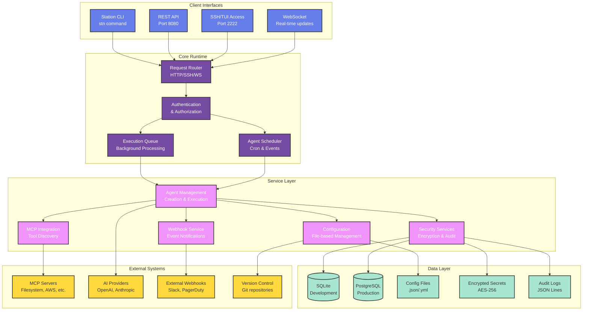
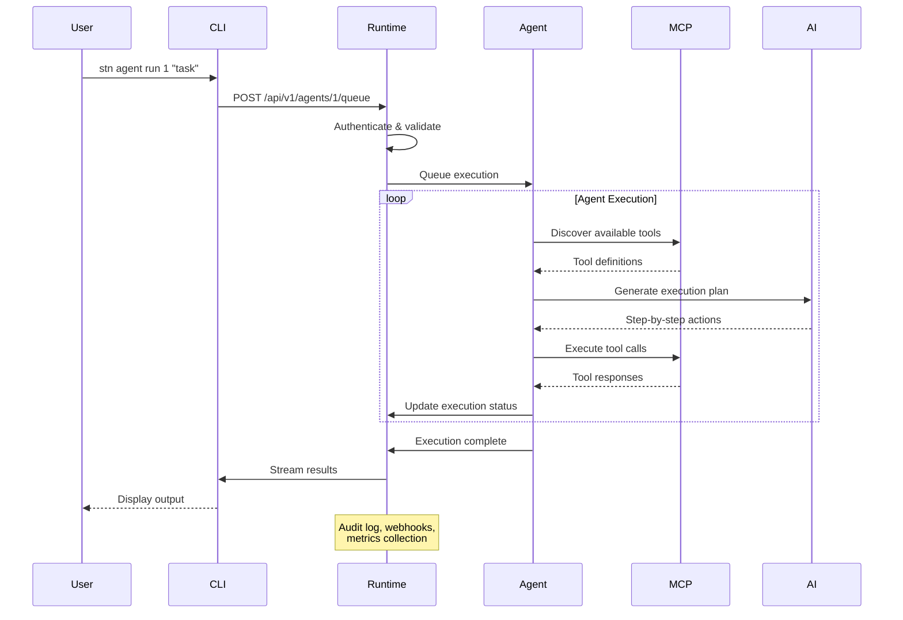
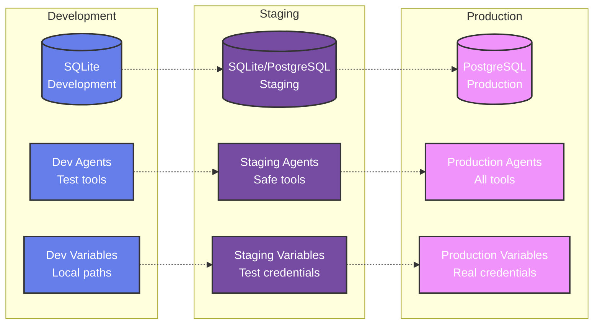
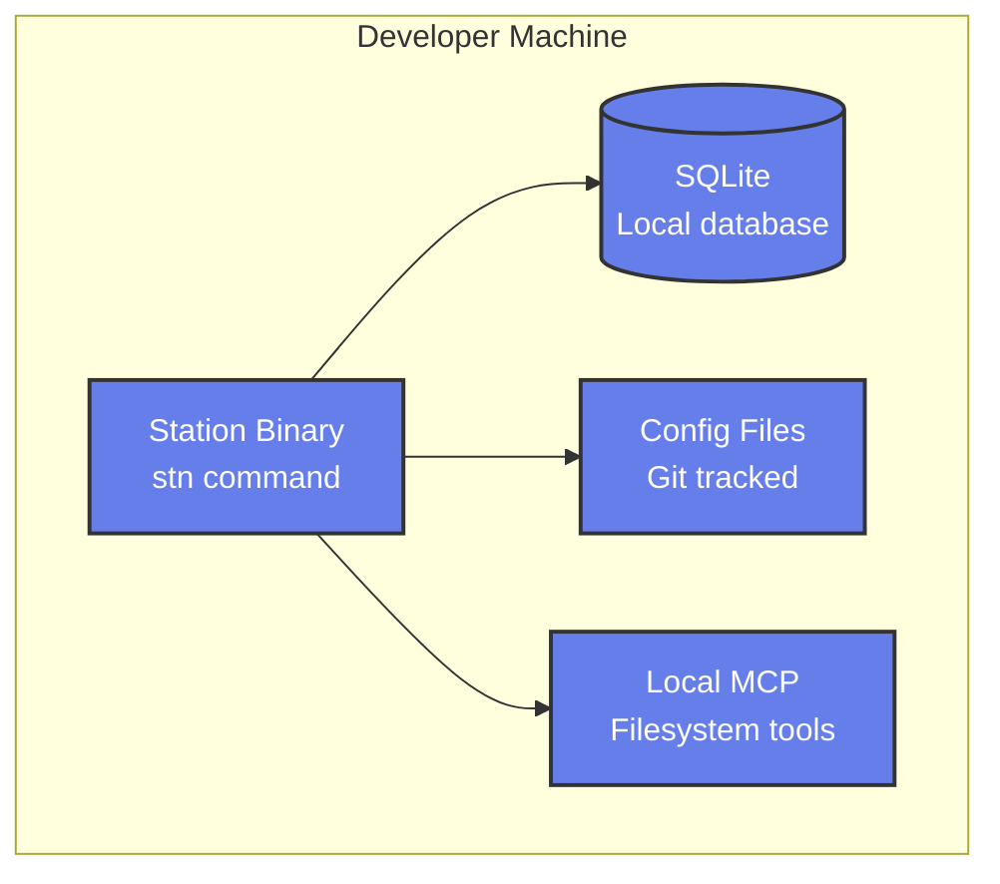
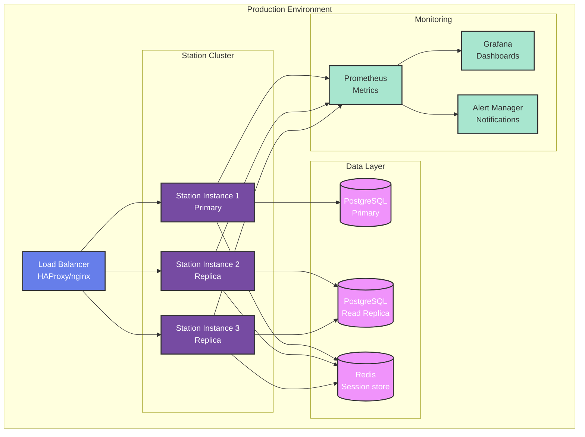

import { Card, CardGrid } from '@astrojs/starlight/components';

# Architecture Overview

Station is designed as a lightweight, secure runtime for deployable sub-agents with a focus on simplicity, security, and production readiness.

## System Architecture

## Core Components

<CardGrid>
  <Card title="🏗️ Lightweight Runtime" icon="rocket">
    **45MB Binary** with embedded SQLite for development
    
    - **Low Memory Footprint** - 512MB minimum
    - **Container Optimized** - Perfect for Docker/K8s
    - **Multi-Interface** - CLI, REST, SSH, WebSocket
    - **Production Ready** - Queue-based execution
  </Card>
  
  <Card title="🤖 Agent Management" icon="setting">
    **Intelligent Sub-Agent Orchestration**
    
    - **Agent Lifecycle** - Create, deploy, monitor, scale
    - **Environment Isolation** - Dev/staging/prod separation
    - **Template System** - Reusable agent bundles
    - **Scheduling** - Cron-based and event-driven
  </Card>
  
  <Card title="🔧 MCP Integration" icon="puzzle">
    **Model Context Protocol Support**
    
    - **Tool Discovery** - Automatic MCP server detection
    - **Configuration Management** - GitOps-ready configs
    - **20+ Built-in Tools** - Filesystem, AWS, databases
    - **Custom Tools** - Easy integration of your tools
  </Card>
  
  <Card title="🔒 Security Layer" icon="lock">
    **Enterprise-Grade Security**
    
    - **Self-Hosted** - Complete data sovereignty
    - **AES Encryption** - Secrets and sensitive data
    - **Audit Logging** - Complete execution trail
    - **Access Controls** - Role-based permissions
  </Card>
</CardGrid>

## Data Flow

## File System Layout

Station follows a standard configuration layout for predictable deployment:

# Development (default) 
~/.config/station/ 
├── station.db              # SQLite database 
├── environments/ 
│   ├── development/ 
│   │   ├── agents/          # Agent definitions (.prompt files) 
│   │   ├── *.json           # MCP configurations 
│   │   └── variables.yml    # Environment variables 
│   ├── staging/ 
│   └── production/ 
├── secrets/                 # Encrypted secrets (AES-256) 
├── audit/                   # Audit logs (JSONL) 
└── cache/                   # Temporary execution cache 
 
# Production (configurable) 
/opt/station/ 
├── config/                  # Configuration files 
├── data/                    # PostgreSQL data 
├── logs/                    # Application logs 
└── backup/                  # Database backups

## Environment Isolation

Station provides complete isolation between environments:

## Security Architecture

<CardGrid>
  <Card title="🔐 Encryption at Rest" icon="lock">
    - **AES-256 encryption** for all secrets and sensitive variables
    - **Encrypted database fields** for credentials and tokens
    - **Secure key derivation** using PBKDF2 with salt
    - **Key rotation support** for long-term security
  </Card>
  
  <Card title="🚪 Access Control" icon="setting">
    - **Environment-based isolation** prevents cross-environment access
    - **Role-based permissions** for different user types
    - **API key authentication** for programmatic access
    - **SSH key authentication** for secure terminal access
  </Card>
  
  <Card title="📊 Audit Trail" icon="document">
    - **Complete execution logging** for all agent activities
    - **Configuration change tracking** with Git integration
    - **Access logging** for all API and SSH connections
    - **Compliance reporting** for security audits
  </Card>
  
  <Card title="🌐 Network Security" icon="information">
    - **TLS encryption** for all external communications
    - **Configurable firewall rules** for port restrictions
    - **Webhook signature validation** for trusted notifications
    - **Zero-trust architecture** - verify all requests
  </Card>
</CardGrid>

## Deployment Patterns

### Single-Node Development

### Production Deployment

## Performance Characteristics

<CardGrid>
  <Card title="📈 Scalability" icon="rocket">
    - **Agent Concurrency**: 100+ concurrent agent executions
    - **API Throughput**: 1000+ requests/second
    - **Database**: Scales from SQLite to PostgreSQL cluster
    - **Memory**: Linear scaling with agent count
  </Card>
  
  <Card title="⚡ Response Times" icon="information">
    - **Agent Start**: <500ms for simple agents
    - **API Latency**: <100ms for status queries
    - **SSH Connection**: <200ms for terminal access
    - **Tool Execution**: Depends on MCP server performance
  </Card>
  
  <Card title="💾 Resource Usage" icon="setting">
    - **Binary Size**: 45MB (includes embedded SQLite)
    - **Memory Usage**: 128MB base + 50MB per active agent
    - **Disk Space**: 100MB + logs and database
    - **CPU Usage**: <5% idle, scales with agent activity
  </Card>
  
  <Card title="🔄 Reliability" icon="lock">
    - **Uptime**: 99.9%+ with proper deployment
    - **Error Recovery**: Automatic agent restart on failure
    - **Data Integrity**: ACID compliance with PostgreSQL
    - **Backup**: Automated database backup and restore
  </Card>
</CardGrid>

## Technology Stack

  

    <strong class="text-slate-800">Runtime:</strong>
    Go 1.21+, SQLite/PostgreSQL, HTTP/WebSocket servers
  

  

    <strong class="text-slate-800">Security:</strong>
    AES-256, PBKDF2, TLS 1.3, JWT tokens
  

  

    <strong class="text-slate-800">Protocols:</strong>
    HTTP/2, WebSocket, SSH, MCP (Model Context Protocol)
  

  

    <strong class="text-slate-800">Storage:</strong>
    SQLite (dev), PostgreSQL (prod), Git (configs)
  

  

    <strong class="text-slate-800">Deployment:</strong>
    Docker, Kubernetes, systemd, GitHub Actions
  

## Next Steps

<CardGrid>
  <Card title="🚀 Quick Start" icon="rocket">
    Get Station running locally and create your first agent.
    
    [Quick Start Guide →](/quickstart/)
  </Card>
  
  <Card title="🔧 MCP Integration" icon="puzzle">
    Learn how Station integrates with Model Context Protocol servers.
    
    [MCP Integration →](/mcp-integration/)
  </Card>
  
  <Card title="🏭 Production Setup" icon="setting">
    Deploy Station in production with proper security and monitoring.
    
    [Production Deployment →](/deployment/production/)
  </Card>
  
  <Card title="📊 Monitoring" icon="information">
    Set up monitoring, metrics, and alerting for your Station deployment.
    
    [Monitoring Guide →](/deployment/monitoring/)
  </Card>
</CardGrid>