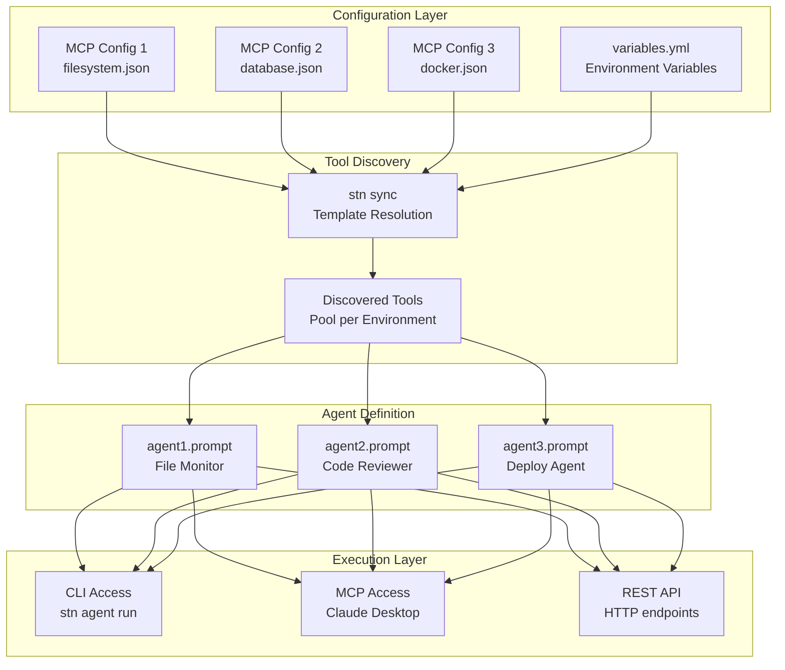
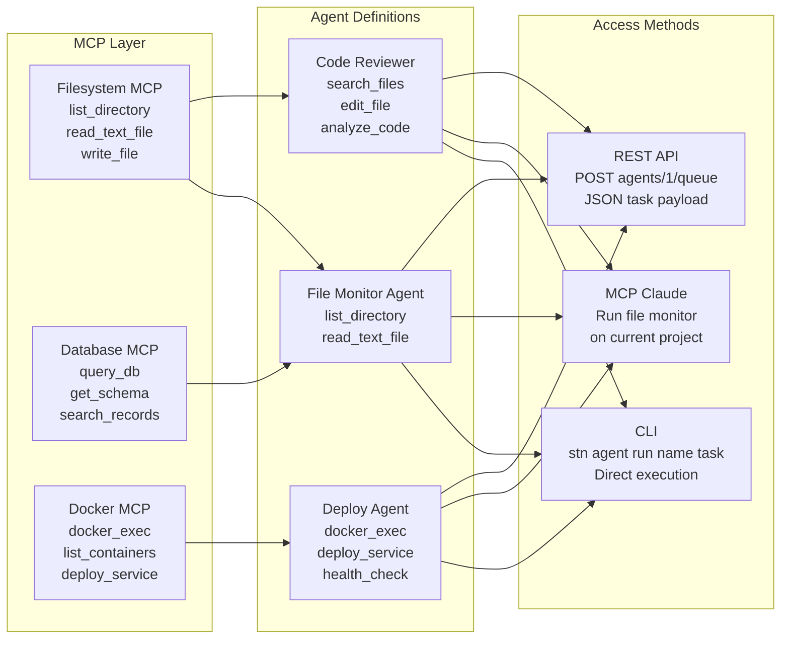
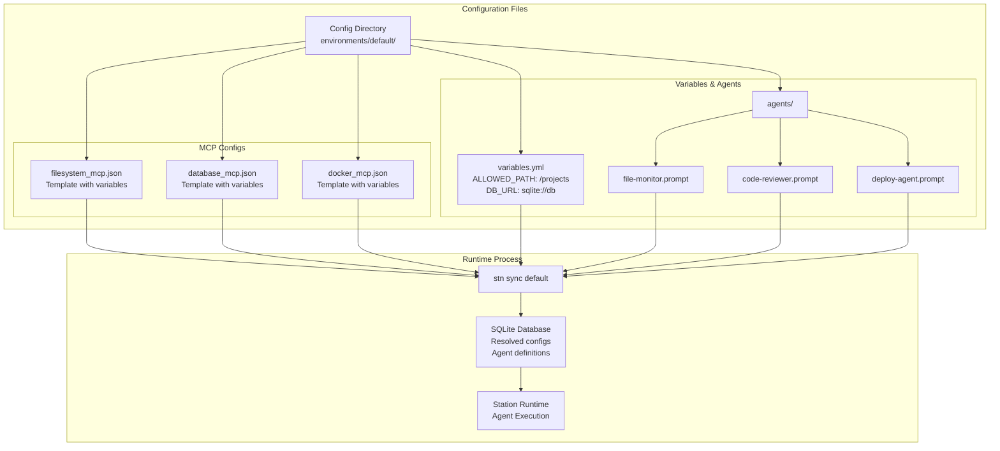
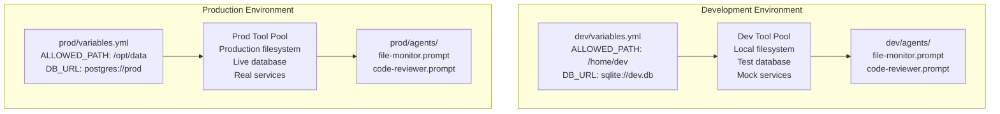

# Agent Management Overview

Station's agent management system connects MCP configurations, tools, agent definitions, and multiple access methods into a cohesive deployable sub-agent platform.

## Architecture Flow

This diagram shows how components flow from MCP configurations through tools to agents and finally to execution methods:



## Component Relationships

This diagram shows the detailed relationships between each component:



## File Structure Mapping

This shows how the file system maps to the logical components:



## Agent Access Patterns

### CLI Access
```bash
# Direct agent execution by name
stn agent run "File Monitor" "Monitor the current project directory"

# List available agents
stn agent list

# Create new agent
stn agent create "Security Scanner" "Scans for vulnerabilities in code and dependencies"
```

### MCP Access (Claude Desktop)
```
# Natural language agent interaction
"Run my file monitor agent on the current project"

"Create a new agent that can deploy Docker containers"

"List all my agents and show me what tools each one has"
```

### REST API Access
```bash
# Queue agent execution
curl -X POST http://localhost:8080/api/v1/agents/1/queue \
  -H "Content-Type: application/json" \
  -d '{"task": "Monitor /project directory for changes"}'

# Get agent details  
curl http://localhost:8080/api/v1/agents/1

# List agents
curl http://localhost:8080/api/v1/agents
```

## Environment Isolation

Each environment has its own agents and tool configurations:



## Key Concepts

### **MCP Configurations as Templates**
- MCP configs use Go template syntax: `{{ .VARIABLE_NAME }}`
- Variables resolved from `variables.yml` during `stn sync`
- Same template works across environments with different variables

### **Tool Discovery & Assignment**
- `stn sync` discovers tools from resolved MCP servers
- Agents automatically get assigned relevant tools
- Tool pools are environment-specific

### **Agent Portability**
- Agents defined in `.prompt` files are version-controllable within their environment
- Each environment has its own copy of agent `.prompt` files
- Agents can be copied between environments but exist independently in each
- GitOps-ready agent deployment per environment

### **Multiple Access Methods**
- **CLI**: Direct command-line agent execution
- **MCP**: Natural language via Claude Desktop/Code
- **REST API**: Programmatic integration and automation

## Next Steps

- **[Creating Agents](/station/en/agents/creating)** - Learn to create and configure agents
- **[Environment Isolation](/station/en/agents/environments)** - Set up multi-environment workflows
- **[Agent Configuration](/station/en/agents/config)** - Advanced agent configuration options