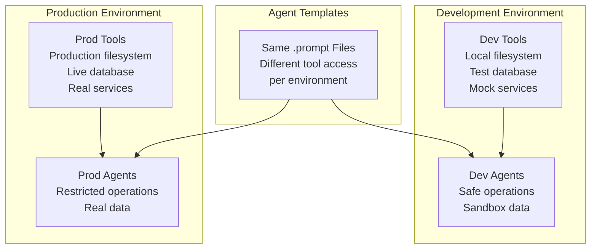

# Agent Management Overview

Station's agent management system connects MCP configurations, tools, agent definitions, and multiple access methods into a cohesive deployable sub-agent platform.

## Architecture Flow

This diagram shows how components flow from MCP configurations through tools to agents and finally to execution methods:


## Component Relationships

This diagram shows the detailed relationships between each component:

```mermaid
graph LR
    subgraph "MCP Layer"
        FS[Filesystem MCP<br/>📁 list_directory<br/>📄 read_text_file<br/>📝 write_file]
        DB[Database MCP<br/>🗄️ query_db<br/>📊 get_schema<br/>🔍 search_records]
        Docker[Docker MCP<br/>🐳 docker_exec<br/>📋 list_containers<br/>🚀 deploy_service]
    end
    
    subgraph "Agent Definitions"
        A1["File Monitor Agent<br/>📁 list_directory<br/>📄 read_text_file"]
        A2["Code Reviewer<br/>🔍 search_files<br/>📝 edit_file<br/>📋 analyze_code"]
        A3["Deploy Agent<br/>🐳 docker_exec<br/>🚀 deploy_service<br/>📊 health_check"]
    end
    
    subgraph "Access Methods"
        CLI_Access[CLI<br/>stn agent run 1<br/>"monitor /project"]
        MCP_Access[MCP/Claude<br/>"Run file monitor<br/>on current project"]
        API_Access[REST API<br/>POST /agents/1/queue<br/>{"task": "monitor"}]
    end
    
    FS --> A1
    FS --> A2
    DB --> A1
    Docker --> A3
    
    A1 --> CLI_Access
    A1 --> MCP_Access
    A1 --> API_Access
    
    A2 --> CLI_Access
    A2 --> MCP_Access
    A2 --> API_Access
    
    A3 --> CLI_Access
    A3 --> MCP_Access
    A3 --> API_Access
```

## File Structure Mapping

This shows how the file system maps to the logical components:

```mermaid
graph TD
    subgraph "Configuration Files"
        ConfigDir[~/.config/station/environments/default/]
        
        subgraph "MCP Configs"
            FSConfig[filesystem_mcp.json<br/>Template with {{ .ALLOWED_PATH }}]
            DBConfig[database_mcp.json<br/>Template with {{ .DB_URL }}]
            DockerConfig[docker_mcp.json<br/>Template with {{ .DOCKER_HOST }}]
        end
        
        subgraph "Variables & Agents"
            VarFile[variables.yml<br/>ALLOWED_PATH: /projects<br/>DB_URL: sqlite://db<br/>DOCKER_HOST: unix://]
            AgentDir[agents/]
            Agent1[agents/file-monitor.prompt]
            Agent2[agents/code-reviewer.prompt] 
            Agent3[agents/deploy-agent.prompt]
        end
    end
    
    subgraph "Runtime Process"
        SyncCmd[stn sync default]
        Database[(SQLite Database<br/>Resolved configs<br/>Agent definitions<br/>Tool assignments)]
        Runtime[Station Runtime<br/>Agent Execution<br/>Tool Resolution]
    end
    
    ConfigDir --> FSConfig
    ConfigDir --> DBConfig
    ConfigDir --> DockerConfig
    ConfigDir --> VarFile
    ConfigDir --> AgentDir
    AgentDir --> Agent1
    AgentDir --> Agent2
    AgentDir --> Agent3
    
    FSConfig --> SyncCmd
    DBConfig --> SyncCmd
    DockerConfig --> SyncCmd
    VarFile --> SyncCmd
    Agent1 --> SyncCmd
    Agent2 --> SyncCmd
    Agent3 --> SyncCmd
    
    SyncCmd --> Database
    Database --> Runtime
```

## Agent Access Patterns

### CLI Access
```bash
# Direct agent execution
stn agent run 1 "Monitor the current project directory"

# List available agents
stn agent list

# Create new agent
stn agent create --name "Security Scanner" --description "Scans for vulnerabilities"
```

### MCP Access (Claude Desktop)
```
# Natural language agent interaction
"Run my file monitor agent on the current project"

"Create a new agent that can deploy Docker containers"

"List all my agents and show me what tools each one has"
```

### REST API Access
```bash
# Queue agent execution
curl -X POST http://localhost:8080/api/v1/agents/1/queue \
  -H "Content-Type: application/json" \
  -d '{"task": "Monitor /project directory for changes"}'

# Get agent details  
curl http://localhost:8080/api/v1/agents/1

# List agents
curl http://localhost:8080/api/v1/agents
```

## Environment Isolation

Agents and tools are isolated by environment:



## Key Concepts

### **MCP Configurations as Templates**
- MCP configs use Go template syntax: `{{ .VARIABLE_NAME }}`
- Variables resolved from `variables.yml` during `stn sync`
- Same template works across environments with different variables

### **Tool Discovery & Assignment**
- `stn sync` discovers tools from resolved MCP servers
- Agents automatically get assigned relevant tools
- Tool pools are environment-specific

### **Agent Portability**
- Agents defined in `.prompt` files are version-controllable
- Export agents from one environment, import to another
- GitOps-ready agent deployment

### **Multiple Access Methods**
- **CLI**: Direct command-line agent execution
- **MCP**: Natural language via Claude Desktop/Code
- **REST API**: Programmatic integration and automation

## Next Steps

- **[Creating Agents](/station/en/agents/creating)** - Learn to create and configure agents
- **[Environment Isolation](/station/en/agents/environments)** - Set up multi-environment workflows
- **[Agent Configuration](/station/en/agents/config)** - Advanced agent configuration options