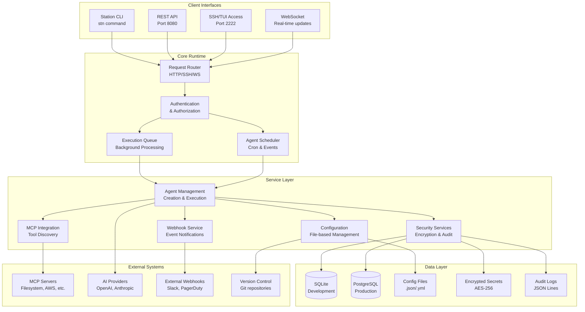
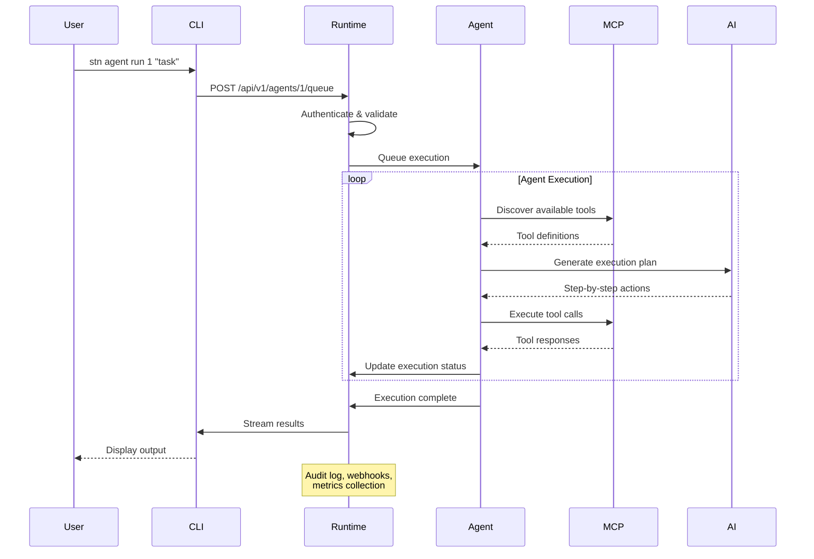
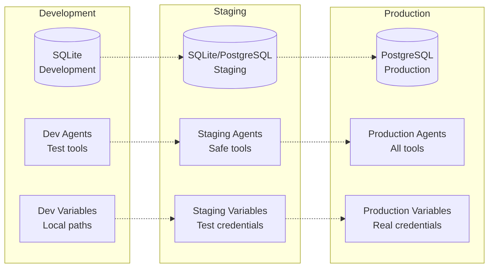
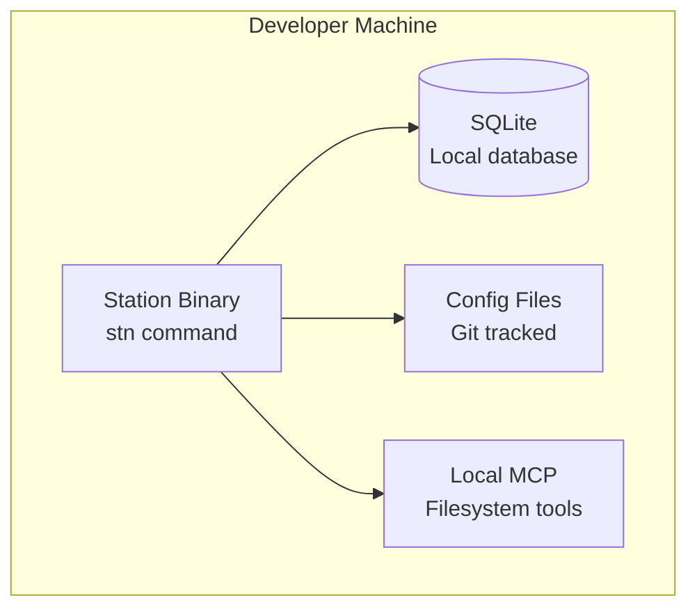
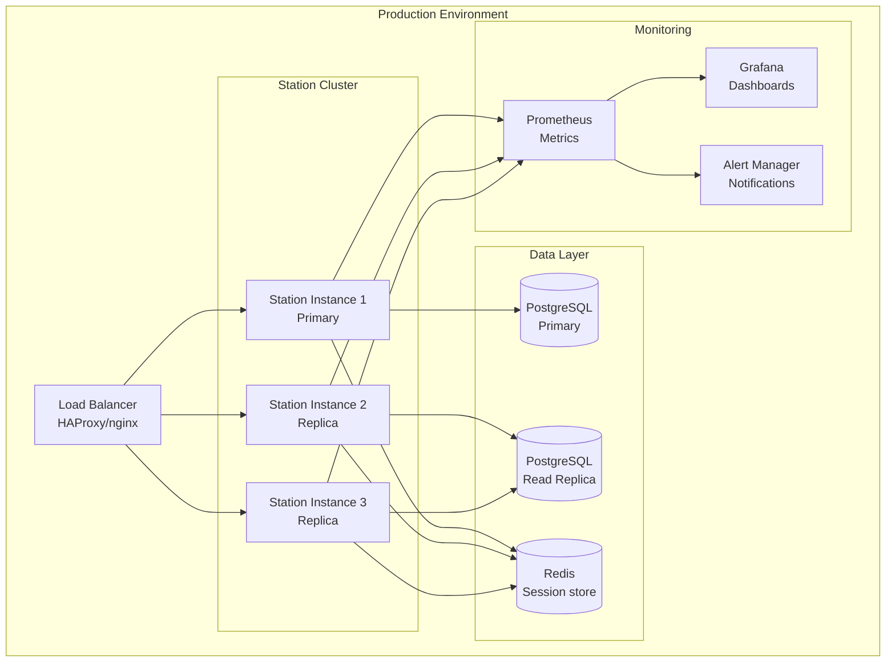

# Architecture Overview

Station is designed as a lightweight, secure runtime for deployable sub-agents with a focus on simplicity, security, and production readiness.

## System Architecture



## Core Components

### 🏗️ Lightweight Runtime
**45MB Binary** with embedded SQLite for development

- **Low Memory Footprint** - 512MB minimum
- **Container Optimized** - Perfect for Docker/K8s
- **Multi-Interface** - CLI, REST, SSH, WebSocket
- **Production Ready** - Queue-based execution

### 🤖 Agent Management
**Intelligent Sub-Agent Orchestration**

- **Agent Lifecycle** - Create, deploy, monitor, scale
- **Environment Isolation** - Dev/staging/prod separation
- **Template System** - Reusable agent bundles
- **Scheduling** - Cron-based and event-driven

### 🔧 MCP Integration
**Model Context Protocol Support**

- **Tool Discovery** - Automatic MCP server detection
- **Configuration Management** - GitOps-ready configs
- **20+ Built-in Tools** - Filesystem, AWS, databases
- **Custom Tools** - Easy integration of your tools

### 🔒 Security Layer
**Enterprise-Grade Security**

- **Self-Hosted** - Complete data sovereignty
- **AES Encryption** - Secrets and sensitive data
- **Audit Logging** - Complete execution trail
- **Access Controls** - Role-based permissions

## Data Flow



## File System Layout

Station follows a standard configuration layout for predictable deployment:

```
# Development (default)
~/.config/station/
├── station.db              # SQLite database
├── environments/
│   ├── development/
│   │   ├── agents/          # Agent definitions (.prompt files)
│   │   ├── *.json           # MCP configurations
│   │   └── variables.yml    # Environment variables
│   ├── staging/
│   └── production/
├── secrets/                 # Encrypted secrets (AES-256)
├── audit/                   # Audit logs (JSONL)
└── cache/                   # Temporary execution cache

# Production (configurable)
/opt/station/
├── config/                  # Configuration files
├── data/                    # PostgreSQL data
├── logs/                    # Application logs
└── backup/                  # Database backups
```

## Environment Isolation

Station provides complete isolation between environments:



## Security Architecture

### 🔐 Encryption at Rest
- **AES-256 encryption** for all secrets and sensitive variables
- **Encrypted database fields** for credentials and tokens
- **Secure key derivation** using PBKDF2 with salt
- **Key rotation support** for long-term security

### 🚪 Access Control
- **Environment-based isolation** prevents cross-environment access
- **Role-based permissions** for different user types
- **API key authentication** for programmatic access
- **SSH key authentication** for secure terminal access

### 📊 Audit Trail
- **Complete execution logging** for all agent activities
- **Configuration change tracking** with Git integration
- **Access logging** for all API and SSH connections
- **Compliance reporting** for security audits

### 🌐 Network Security
- **TLS encryption** for all external communications
- **Configurable firewall rules** for port restrictions
- **Webhook signature validation** for trusted notifications
- **Zero-trust architecture** - verify all requests

## Deployment Patterns

### Single-Node Development



### Production Deployment



## Performance Characteristics

### 📈 Scalability
- **Agent Concurrency**: 100+ concurrent agent executions
- **API Throughput**: 1000+ requests/second
- **Database**: Scales from SQLite to PostgreSQL cluster
- **Memory**: Linear scaling with agent count

### ⚡ Response Times
- **Agent Start**: Less than 500ms for simple agents
- **API Latency**: Less than 100ms for status queries  
- **SSH Connection**: Less than 200ms for terminal access
- **Tool Execution**: Depends on MCP server performance

### 💾 Resource Usage
- **Binary Size**: 45MB (includes embedded SQLite)
- **Memory Usage**: 128MB base + 50MB per active agent
- **Disk Space**: 100MB + logs and database
- **CPU Usage**: Less than 5% idle, scales with agent activity

### 🔄 Reliability
- **Uptime**: 99.9%+ with proper deployment
- **Error Recovery**: Automatic agent restart on failure
- **Data Integrity**: ACID compliance with PostgreSQL
- **Backup**: Automated database backup and restore

## Technology Stack

**Runtime:** Go 1.21+, SQLite/PostgreSQL, HTTP/WebSocket servers

**Security:** AES-256, PBKDF2, TLS 1.3, JWT tokens

**Protocols:** HTTP/2, WebSocket, SSH, MCP (Model Context Protocol)

**Storage:** SQLite (dev), PostgreSQL (prod), Git (configs)

**Deployment:** Docker, Kubernetes, systemd, GitHub Actions

## Next Steps

- **[Quick Start](/en/quickstart)** - Get Station running locally and create your first agent
- **[MCP Integration](/en/mcp-integration)** - Learn how Station integrates with Model Context Protocol servers
- **[Production Setup](/en/deployment/production)** - Deploy Station in production with proper security and monitoring