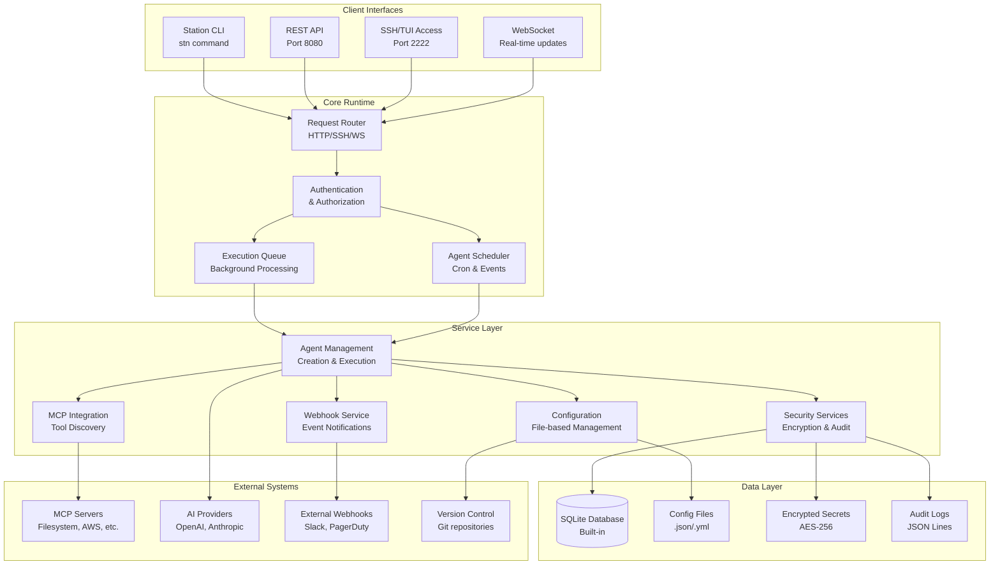
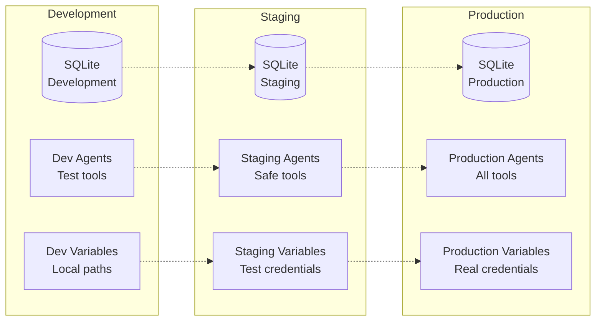
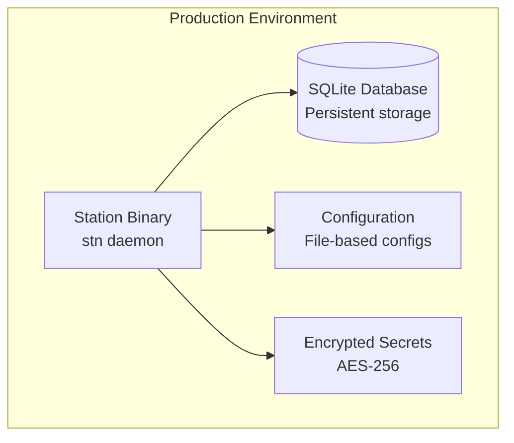

# Architecture Overview

Station is designed as a lightweight, secure runtime for deployable sub-agents with a focus on simplicity, security, and production readiness.

## System Architecture



## Core Components

### 🏗️ Lightweight Runtime
**Single Binary** with embedded SQLite

- **Low Memory Footprint** - Minimal resource usage
- **Container Optimized** - Perfect for Docker/K8s
- **Multi-Interface** - CLI, REST, SSH, WebSocket, MCP
- **Production Ready** - Queue-based execution

### 🤖 Agent Management
**Intelligent Sub-Agent Orchestration**

- **Agent Lifecycle** - Create, deploy, monitor, scale
- **Environment Isolation** - Dev/staging/prod separation
- **Template System** - Reusable agent bundles
- **Scheduling** - Cron-based and event-driven

### 🔧 MCP Integration
**Model Context Protocol Support**

- **Tool Discovery** - Automatic MCP server detection
- **Configuration Management** - GitOps-ready configs
- **20+ Built-in Tools** - Filesystem, AWS, databases
- **Custom Tools** - Easy integration of your tools

### 🔒 Security Layer
**Enterprise-Grade Security**

- **Self-Hosted** - Complete data sovereignty
- **AES Encryption** - Secrets and sensitive data
- **Audit Logging** - Complete execution trail
- **Access Controls** - Role-based permissions

## Data Flow


## File System Layout

Station follows a standard configuration layout for predictable deployment:

```
# Development (default)
~/.config/station/
├── station.db              # SQLite database
├── environments/
│   ├── development/
│   │   ├── agents/          # Agent definitions (.prompt files)
│   │   ├── *.json           # MCP configurations
│   │   └── variables.yml    # Environment variables
│   ├── staging/
│   └── production/
├── secrets/                 # Encrypted secrets (AES-256)
├── audit/                   # Audit logs (JSONL)
└── cache/                   # Temporary execution cache

# Production (configurable)
/opt/station/
├── config/                  # Configuration files
├── data/                    # SQLite database
├── logs/                    # Application logs
└── backup/                  # Database backups
```

## Environment Isolation

Station provides complete isolation between environments:



## Security Architecture

### 🔐 Encryption at Rest
- **AES-256 encryption** for all secrets and sensitive variables
- **Encrypted database fields** for credentials and tokens
- **Secure key derivation** using PBKDF2 with salt
- **Key rotation support** for long-term security

### 🚪 Access Control
- **Environment-based isolation** prevents cross-environment access
- **Role-based permissions** for different user types
- **API key authentication** for programmatic access
- **SSH key authentication** for secure terminal access

### 📊 Audit Trail
- **Complete execution logging** for all agent activities
- **Configuration change tracking** with Git integration
- **Access logging** for all API and SSH connections
- **Compliance reporting** for security audits

### 🌐 Network Security
- **TLS encryption** for all external communications
- **Configurable firewall rules** for port restrictions
- **Webhook signature validation** for trusted notifications
- **Zero-trust architecture** - verify all requests

## Deployment Patterns

### Single-Node Development


### Production Deployment

Station is designed for simple, secure deployments:



## Key Features

### 🚀 Lightweight & Fast
- **Single Binary** - No complex dependencies
- **SQLite Database** - Built-in, no setup required
- **Fast Startup** - Ready in seconds
- **Low Resource Usage** - Minimal memory footprint

### 🔄 Reliable Operation
- **Queue-based Execution** - Background processing
- **Error Recovery** - Automatic agent restart on failure
- **Data Integrity** - ACID compliance with SQLite
- **Comprehensive Logging** - Full execution audit trail

## Technology Stack

**Runtime:** Go 1.21+, SQLite, HTTP/WebSocket servers

**Security:** AES-256, PBKDF2, TLS 1.3, JWT tokens

**Protocols:** HTTP/2, WebSocket, SSH, MCP (Model Context Protocol)

**Storage:** SQLite database, Git-tracked configs

**Deployment:** Docker, Kubernetes, systemd, GitHub Actions

## Next Steps

- **[Quick Start](/station/en/quickstart)** - Get Station running locally and create your first agent
- **[MCP Quick Start](/station/en/mcp-quickstart)** - Get running with Claude Desktop in 5 minutes
- **[Why Station?](/station/en/why-station)** - Understand the use cases and benefits