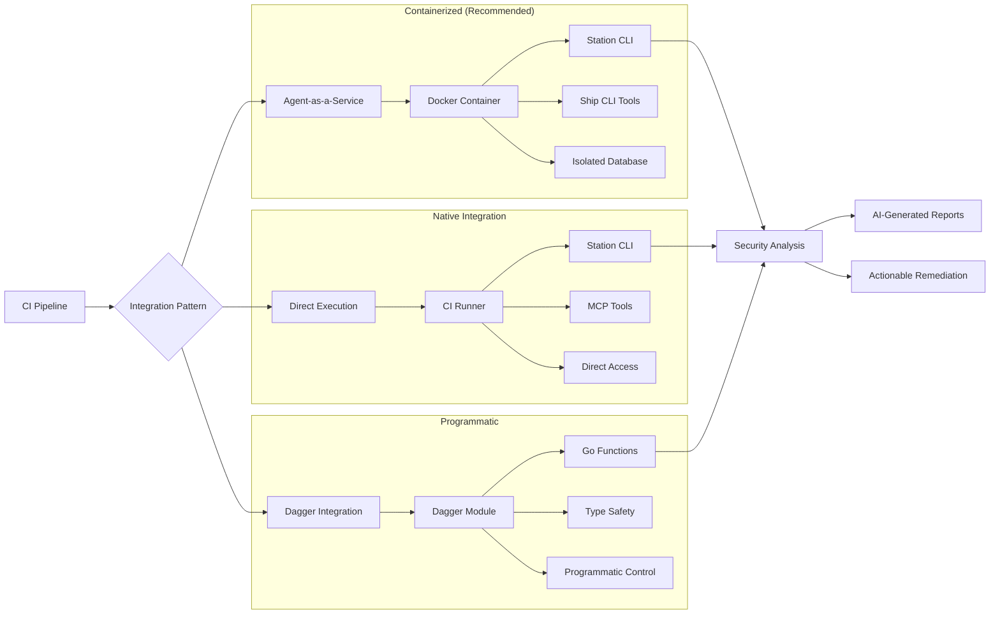

# CI/CD Integration

Station provides **production-ready patterns** for integrating AI agents into your CI/CD pipelines. Whether you're performing security analysis, generating SBOMs, or running compliance checks, Station can seamlessly integrate into your existing workflows.

## Overview

Station supports three primary integration patterns:

1. **[Agent-as-a-Service](#agent-as-a-service-docker)** - Docker containers for isolation
2. **[Direct Execution](#direct-station-execution)** - Native CI runner integration
3. **[Dagger Integration](#dagger-integration)** - Programmatic orchestration

Each pattern provides **database isolation**, ensuring that every CI run gets its own execution context with no shared state between pipelines or teams.



## Agent-as-a-Service (Docker)

Deploy Station agents in containerized environments for maximum isolation and scalability.

### Building Agent Environment Images

Station provides two ways to build containerized agent environments:

#### Option 1: Build Environment-Specific Images (Recommended)

```bash
# Build environment with specific agents and tools
stn build env production --provider openai --model gpt-5 --ship

# This creates station-production:latest with:
# ✅ Station CLI pre-installed (local binary or downloaded)  
# ✅ Ship CLI v0.7.3+ with 80+ security tools
# ✅ Pre-configured agents with tool assignments
# ✅ MCP server configurations
# ✅ Docker CLI for containerized tools
# ✅ Complete security scanning environment

# Verify the built environment
docker images | grep station-production
docker run --rm station-production:latest stn agent list
```

#### Option 2: Build Base Image (Legacy)

```bash
# Build base Station image (basic installation only)
stn build base

# Verify the image  
docker images | grep station-base
```

This creates a `station-base:latest` image (286MB) with:
- ✅ Station CLI pre-installed
- ✅ Ubuntu 22.04 with essential tools
- ✅ Database initialization ready
- ✅ Environment directories configured

> **💡 Tip**: Use `stn build env` for production deployments as it includes pre-configured agents and security tools. Use `stn build base` only when you need a minimal Station installation.

### Basic Agent Execution

```bash
# Run a security analysis agent
docker run \
  -v $(pwd)/agents:/app/environment/agents:ro \
  -v $(pwd)/config.yml:/root/.config/station/config.yaml:ro \
  -v /var/run/docker.sock:/var/run/docker.sock \
  -e OPENAI_API_KEY=$OPENAI_API_KEY \
  -e ENCRYPTION_KEY=your-encryption-key-32-chars \
  station-base:latest \
  bash -c "
    stn init --yes --provider openai --model gpt-4o
    stn sync
    stn agent run 'Security Scanner' 'Analyze infrastructure for vulnerabilities'
  "
```

> **⚠️ Important**: Mount the Docker socket (`-v /var/run/docker.sock:/var/run/docker.sock`) when using Ship CLI security tools like Checkov, TFLint, or Trivy. These tools run in containers and require Docker access for proper execution.

### GitHub Actions Example

```yaml
name: Security Analysis
on:
  push:
    branches: [main, develop]
  pull_request:
    branches: [main]

jobs:
  security-scan:
    runs-on: ubuntu-latest
    steps:
      - name: Checkout code
        uses: actions/checkout@v4

      - name: Pull Station Docker Image
        run: |
          docker pull epuerta18/station-default:latest

      - name: Run Security Analysis
        run: |
          docker run \
            -v $(pwd):/workspace:ro \
            -v $(pwd)/ci/agents:/app/environment/agents:ro \
            -v $(pwd)/ci/config.yml:/root/.config/station/config.yaml:ro \
            -v /var/run/docker.sock:/var/run/docker.sock \
            -e OPENAI_API_KEY=${{ secrets.OPENAI_API_KEY }} \
            -e ENCRYPTION_KEY=${{ secrets.STATION_ENCRYPTION_KEY }} \
            epuerta18/station-default:latest \
            bash -c "
              stn agent run 'Security Scanner' 'Comprehensive security analysis of /workspace'
              stn agent run 'Terraform Auditor' 'Analyze Terraform files for security and best practices'
            "

      - name: Collect Reports
        if: always()
        run: |
          # Extract reports from the container if generated
          docker cp \$(docker ps -lq):/workspace/reports ./security-reports 2>/dev/null || true
        
      - name: Upload Security Reports
        uses: actions/upload-artifact@v4
        if: always()
        with:
          name: security-analysis-reports
          path: security-reports/
```

### Docker Compose for Development

```yaml
# docker-compose.yml
services:
  station-security:
    image: station-security:latest
    volumes:
      - ./agents:/app/environment/agents:ro
      - ./config.yml:/root/.config/station/config.yaml:ro
      - ./workspace:/workspace
      - security-reports:/workspace/reports
      - /var/run/docker.sock:/var/run/docker.sock
    environment:
      - OPENAI_API_KEY=${OPENAI_API_KEY}
      - ENCRYPTION_KEY=${STATION_ENCRYPTION_KEY}
    command: >
      bash -c "
        stn init --yes --provider openai --model gpt-4o &&
        stn sync &&
        stn agent run terraform-security-agent 'Analyze /workspace for security issues'
      "

volumes:
  security-reports:
```

## Direct Station Execution

Execute agents directly in CI runners with full MCP tool access. This pattern provides access to the complete Station tool ecosystem.

### Installation in CI

```bash
# Install Station
curl -fsSL https://raw.githubusercontent.com/cloudshipai/station/main/install.sh | bash

# Verify installation
stn --version
```

### Configuration

```bash
# Initialize with AI provider
stn init --provider openai --model gpt-4o

# Import agents from configuration files
stn sync

# Verify agents are loaded
stn agent list
```

### Execution

```bash
# Run specific agents
stn agent run sbom-security-agent "Generate SBOM and vulnerability analysis for this repository"
stn agent run terraform-analyzer "Analyze Terraform files for security and cost issues"
stn agent run compliance-checker "Run CIS compliance checks on infrastructure"

# Check execution status
stn runs list
stn runs inspect <run-id> --verbose
```

### Jenkins Pipeline Example

```groovy
pipeline {
    agent any
    
    environment {
        OPENAI_API_KEY = credentials('openai-api-key')
        STATION_ENCRYPTION_KEY = credentials('station-encryption-key')
    }
    
    stages {
        stage('Setup Station') {
            steps {
                script {
                    sh '''
                        curl -fsSL https://raw.githubusercontent.com/cloudshipai/station/main/install.sh | bash
                        stn init --provider openai --model gpt-4o
                    '''
                }
            }
        }
        
        stage('Import Agents') {
            steps {
                script {
                    sh '''
                        cp -r ci/agents ~/.config/station/environments/default/agents/
                        stn sync
                        stn agent list
                    '''
                }
            }
        }
        
        stage('Security Analysis') {
            parallel {
                stage('SBOM Generation') {
                    steps {
                        script {
                            sh 'stn agent run sbom-generator "Generate comprehensive SBOM for this project"'
                        }
                    }
                }
                
                stage('Vulnerability Scan') {
                    steps {
                        script {
                            sh 'stn agent run security-scanner "Perform vulnerability analysis"'
                        }
                    }
                }
                
                stage('Terraform Analysis') {
                    when {
                        anyOf {
                            changeset "**/*.tf"
                            changeset "**/terraform/**"
                        }
                    }
                    steps {
                        script {
                            sh 'stn agent run terraform-analyzer "Analyze Terraform for security and cost"'
                        }
                    }
                }
            }
        }
        
        stage('Collect Results') {
            steps {
                script {
                    sh '''
                        mkdir -p reports
                        stn runs list --format json > reports/execution-summary.json
                        stn runs inspect $(stn runs list --format json | jq -r '.[0].id') --verbose > reports/detailed-analysis.json
                    '''
                }
                
                archiveArtifacts artifacts: 'reports/**/*', fingerprint: true
                
                publishHTML([
                    allowMissing: false,
                    alwaysLinkToLastBuild: false,
                    keepAll: true,
                    reportDir: 'reports',
                    reportFiles: 'detailed-analysis.json',
                    reportName: 'Station Analysis Report'
                ])
            }
        }
    }
    
    post {
        always {
            sh 'stn runs list'
        }
        failure {
            script {
                sh 'stn runs list --status failed'
            }
        }
    }
}
```

## Dagger Integration

Programmatic orchestration with type-safe Go modules for complex CI workflows.

### Dagger Module Structure

```
dagger-integration/
├── .dagger/
│   ├── main.go          # Station CI module
│   ├── dagger.gen.go    # Generated Dagger types
│   └── go.mod           # Go module definition
└── README.md
```

### Station CI Dagger Module

```go
// .dagger/main.go
package main

import (
    "context"
    "dagger/station-ci/internal/dagger"
)

type StationCI struct{}

// BuildStationBase builds the Station base image from scratch
func (m *StationCI) BuildStationBase(
    ctx context.Context,
    stationSource *dagger.Directory,
) *dagger.Container {
    // Build Station binary
    stationBinary := dag.Container().
        From("golang:1.24-alpine").
        WithDirectory("/src", stationSource).
        WithWorkdir("/src").
        WithExec([]string{"go", "mod", "tidy"}).
        WithExec([]string{"go", "build", "-o", "stn", "./cmd/main"}).
        File("/src/stn")

    // Create base container with Station
    return dag.Container().
        From("ubuntu:22.04").
        WithExec([]string{"apt-get", "update"}).
        WithExec([]string{"apt-get", "install", "-y", "ca-certificates", "curl", "sqlite3", "git"}).
        WithFile("/usr/local/bin/stn", stationBinary).
        WithExec([]string{"chmod", "+x", "/usr/local/bin/stn"}).
        WithExec([]string{"mkdir", "-p", "/app/data", "/app/environment", "/root/.config/station"}).
        WithEnvVariable("STATION_CONFIG_ROOT", "/app/environment").
        WithEnvVariable("STATION_DB_PATH", "/app/data/station.db").
        WithWorkdir("/app")
}

// SecurityScan performs comprehensive security analysis
func (m *StationCI) SecurityScan(
    ctx context.Context,
    stationSource *dagger.Directory,
    source *dagger.Directory,
    openaiKey *dagger.Secret,
) *dagger.Container {
    stationBase := m.BuildStationBase(ctx, stationSource)
    
    return stationBase.
        WithDirectory("/workspace", source).
        WithSecretVariable("OPENAI_API_KEY", openaiKey).
        WithEnvVariable("ENCRYPTION_KEY", "station-ci-key-12345678901234567890").
        WithExec([]string{"bash", "-c", "stn init --yes --provider openai --model gpt-4o"}).
        WithExec([]string{"stn", "agent", "list"}).
        WithExec([]string{"echo", "Security scan complete!"})
}

// TerraformAnalysis performs Terraform-specific analysis
func (m *StationCI) TerraformAnalysis(
    ctx context.Context,
    stationSource *dagger.Directory,
    source *dagger.Directory,
    openaiKey *dagger.Secret,
) *dagger.Container {
    stationBase := m.BuildStationBase(ctx, stationSource)
    
    return stationBase.
        WithDirectory("/workspace", source).
        WithSecretVariable("OPENAI_API_KEY", openaiKey).
        WithEnvVariable("ENCRYPTION_KEY", "station-ci-key-12345678901234567890").
        WithExec([]string{"bash", "-c", "stn init --yes --provider openai --model gpt-4o"}).
        WithExec([]string{"stn", "agent", "run", "terraform-analyzer", "Analyze Terraform configuration"})
}
```

### Using the Dagger Module

```bash
# Initialize Dagger module
dagger init --name=station-ci --sdk=go

# Test basic Station functionality
dagger call test-station-basic --station-source /path/to/station

# Run security scan
dagger call security-scan \
  --station-source /path/to/station \
  --source . \
  --openai-key env:OPENAI_API_KEY

# Run Terraform analysis
dagger call terraform-analysis \
  --station-source /path/to/station \
  --source ./infrastructure \
  --openai-key env:OPENAI_API_KEY
```

### GitHub Actions with Dagger

```yaml
name: Dagger CI Pipeline
on:
  push:
    branches: [main, develop]

jobs:
  dagger-analysis:
    runs-on: ubuntu-latest
    steps:
      - name: Checkout
        uses: actions/checkout@v4

      - name: Setup Dagger
        uses: dagger/dagger-for-github@v5
        with:
          install-only: true

      - name: Run Security Analysis
        run: |
          dagger call security-scan \
            --station-source /path/to/station \
            --source . \
            --openai-key env:OPENAI_API_KEY
        env:
          OPENAI_API_KEY: ${{ secrets.OPENAI_API_KEY }}

      - name: Run Terraform Analysis
        if: contains(github.event.head_commit.modified, '.tf')
        run: |
          dagger call terraform-analysis \
            --station-source /path/to/station \
            --source ./terraform \
            --openai-key env:OPENAI_API_KEY
        env:
          OPENAI_API_KEY: ${{ secrets.OPENAI_API_KEY }}
```

## Agent Configuration

### Security Agent Example

```json
{
  "name": "terraform-security-agent",
  "description": "Comprehensive Terraform security analysis for CI/CD pipelines",
  "prompt": "You are a Terraform security analysis agent specialized in CI/CD environments.\n\nYour mission:\n1. Analyze Terraform files in {{ .WORKSPACE_PATH }} for security vulnerabilities\n2. Use checkov_scan_directory for comprehensive security scanning\n3. Use trivy_scan_filesystem for additional vulnerability detection\n4. Use tflint_lint for code quality and best practices\n5. Generate actionable security reports with severity ratings\n6. Save findings to {{ .OUTPUT_PATH }}/terraform-security-report.json\n\nFocus on:\n- Critical security misconfigurations\n- Compliance violations (CIS, NIST, SOC2)\n- Infrastructure cost optimization opportunities\n- Best practice violations\n\nProvide clear, actionable recommendations that can be implemented in the current PR.",
  "max_steps": 10,
  "tools": [
    "__checkov_scan_directory",
    "__trivy_scan_filesystem", 
    "__tflint_lint",
    "__directory_tree",
    "__read_text_file",
    "__write_file"
  ]
}
```

### SBOM Agent Example

```json
{
  "name": "sbom-security-agent", 
  "description": "SBOM generation and vulnerability analysis for CI/CD pipelines",
  "prompt": "You are an SBOM and vulnerability analysis agent specialized in CI/CD security scanning.\n\nYour mission:\n1. Generate comprehensive SBOMs for {{ .WORKSPACE_PATH }} using multiple tools\n2. Use syft_generate_sbom_directory for broad dependency discovery\n3. Use trivy_generate_sbom for security-focused analysis\n4. Use grype_scan to identify vulnerabilities in dependencies\n5. Use osv_scanner_scan_source for additional vulnerability detection\n6. Cross-reference findings and eliminate duplicates\n7. Generate security report with vulnerability counts by severity\n8. Save SBOM and vulnerability report to {{ .OUTPUT_PATH }}/\n\nFocus on:\n- Complete dependency inventory (direct + transitive)\n- Critical and High severity vulnerabilities\n- License compliance issues\n- Outdated dependencies with available fixes\n- Supply chain risk assessment\n\nRepository: {{ .REPO_NAME }}\nBranch: {{ .BRANCH_NAME }}\nCommit: {{ .COMMIT_SHA }}",
  "max_steps": 12,
  "tools": [
    "__syft_generate_sbom_directory",
    "__trivy_generate_sbom", 
    "__grype_scan",
    "__osv_scanner_scan_source",
    "__directory_tree",
    "__read_text_file",
    "__write_file",
    "__get_file_info"
  ]
}
```

## Environment Configuration

### Variables Template

```yaml
# variables.yml
WORKSPACE_PATH: "/workspace"
OUTPUT_PATH: "/workspace/reports"
REPO_NAME: "{{ .GITHUB_REPOSITORY }}"
BRANCH_NAME: "{{ .GITHUB_REF_NAME }}"
COMMIT_SHA: "{{ .GITHUB_SHA }}"
```

### Station Config

```yaml
# config.yml
admin_username: ci-runner
ai_model: gpt-4o
ai_provider: openai
api_port: 8585
database_url: /app/data/station.db
debug: false
encryption_key: "{{ .ENCRYPTION_KEY }}"
local_mode: true
config_root: /app/environment

mcp:
  sync:
    confirm: false
    dry_run: false
    environment: "default"
    interactive: false
    validate: true
    verbose: false

mcp_port: 3000
telemetry_enabled: false
```

## Best Practices

### Security

- ✅ **Never commit API keys** - Always use environment variables or secrets
- ✅ **Use encryption keys** - Generate unique 32+ character encryption keys
- ✅ **Isolate environments** - Each CI run should have its own database
- ✅ **Validate inputs** - Sanitize all user inputs and file paths
- ✅ **Audit logging** - Enable telemetry and audit trails for compliance

### Performance

- ✅ **Cache base images** - Build and cache Station base images
- ✅ **Parallel execution** - Run multiple agents concurrently when possible
- ✅ **Resource limits** - Set appropriate CPU and memory limits
- ✅ **Cleanup** - Remove temporary files and containers after execution

### Monitoring

- ✅ **Execution tracking** - Monitor agent run status and duration
- ✅ **Error handling** - Implement proper error handling and retries
- ✅ **Artifact collection** - Save reports and logs for analysis
- ✅ **Notifications** - Set up alerts for failed or long-running agents

## Troubleshooting

### Common Issues

**Agent not found error:**
```bash
# Ensure agents are properly imported
stn sync
stn agent list
```

**MCP tools not available:**
```bash
# Verify MCP server configuration and sync
stn sync
stn mcp server list
```

**Database permission errors:**
```bash
# Ensure proper permissions for database directory
chmod -R 755 /app/data
```

**Container startup issues:**
```bash
# Check container logs
docker logs <container-id>

# Verify environment variables
docker exec <container-id> env | grep -E "(OPENAI|ENCRYPTION|STATION)"
```

### Debug Mode

Enable debug logging for detailed troubleshooting:

```bash
# Set debug mode in config
debug: true

# Or via environment variable
export STATION_DEBUG=true
```

## Examples Repository

Complete working examples are available in the Station repository:

```
dev-workspace/ci-cd-examples/
├── agent-as-service/          # Docker container examples
│   ├── agents/                # Agent JSON definitions
│   ├── config.yml             # Station configuration
│   ├── variables.yml          # Template variables
│   └── docker-compose.yml     # Development setup
├── dagger-integration/        # Dagger module examples
│   └── .dagger/               # Dagger module source
└── station-ci-server/         # Centralized CI server
    ├── agents/                # Production agent configs
    ├── docker-compose.yml     # Production deployment
    └── .github/workflows/     # GitHub Actions examples
```

These examples provide production-ready configurations that you can adapt for your specific CI/CD requirements.