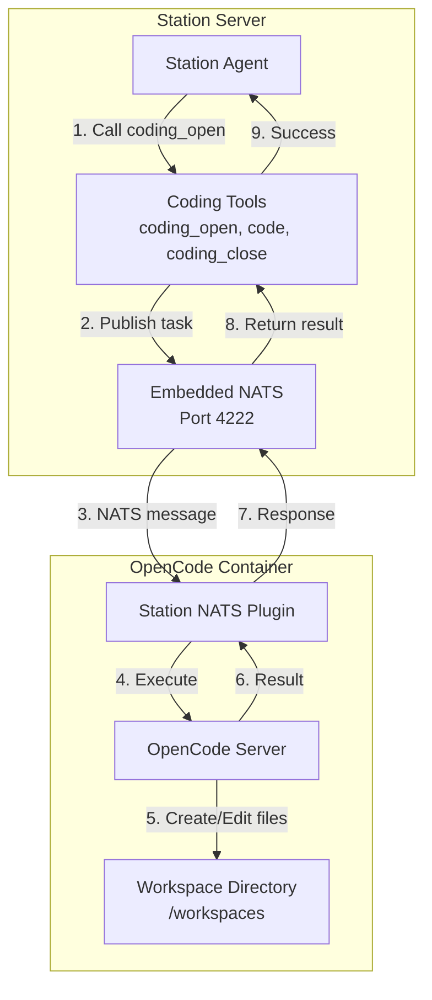
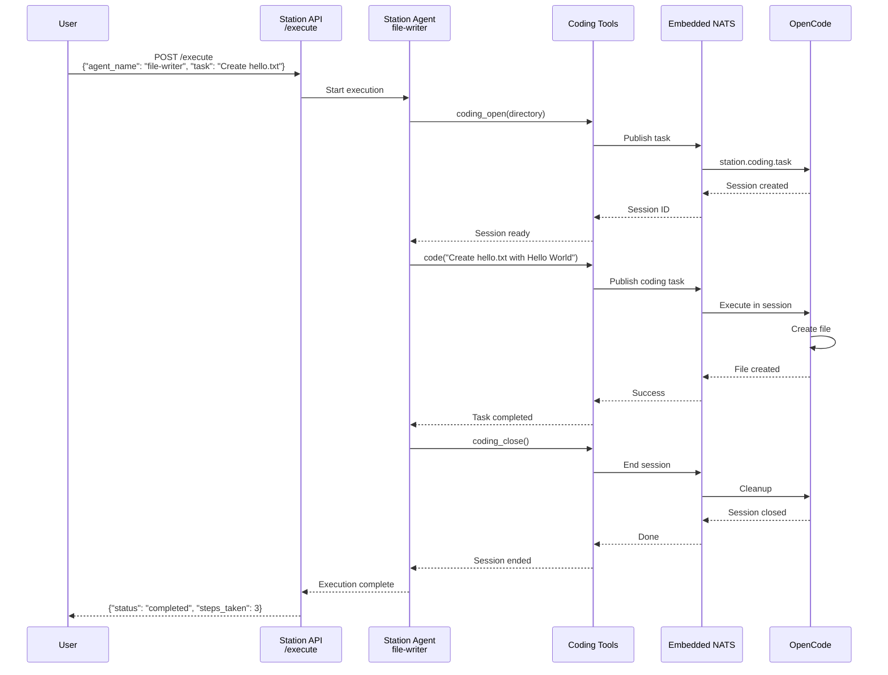

# OpenCode Coding Backend

Station can integrate with [OpenCode](https://github.com/opencode-ai/opencode) as a backend for AI-powered coding tasks. This enables your agents to create files, edit code, and manage projects using a dedicated coding AI instance.

## Architecture Overview



## Execution Flow



## Quick Start

### 1. Start Station with Docker

```bash
# Start Station server (includes embedded NATS on port 4222)
stn up default
```

### 2. Start OpenCode with Station Plugin

```bash
# Run OpenCode container with Station NATS plugin
docker run -d \
  --name opencode \
  -p 4096:4096 \
  -e OPENCODE_PLUGINS=station \
  -e STATION_NATS_URL=nats://host.docker.internal:4222 \
  -v /tmp/station-coding:/workspaces \
  ghcr.io/opencode-ai/opencode:latest
```

### 3. Configure Station

Add to your `~/.config/station/config.yaml`:

```yaml
coding:
  backend: opencode-nats
  nats:
    url: nats://127.0.0.1:4222
    subjects:
      task: station.coding.task
      result: station.coding.result
      stream: station.coding.stream
  workspace_base_path: /tmp/station-coding
  task_timeout_min: 10
  max_attempts: 3
```

### 4. Create a Coding Agent

Create an agent `.prompt` file with coding enabled:

```yaml
---
metadata:
  name: "file-writer"
  description: "Creates and edits files using OpenCode"
model: gpt-5-mini
max_steps: 10
coding:
  backend: opencode-nats
  enabled: true
---

{{role "system"}}
You create and edit files using OpenCode coding tools.

Workflow:
1. coding_open - start session in the target directory
2. code - execute coding tasks (create files, edit files, run bash)
3. coding_close - end session when done

{{role "user"}}
{{userInput}}
```

### 5. Execute via API

```bash
# Test the coding agent
curl -X POST http://localhost:8587/execute \
  -H "Content-Type: application/json" \
  -d '{
    "agent_name": "file-writer",
    "task": "Create a file called hello.txt with the content Hello World"
  }'
```

## Available Coding Tools

When `coding.enabled: true` is set in an agent's `.prompt` file, these tools become available:

| Tool | Description |
|------|-------------|
| `coding_open` | Start a coding session in a directory |
| `code` | Execute coding tasks (create, edit, run commands) |
| `coding_close` | End the coding session |
| `coding_commit` | Commit changes to git (if in a git repo) |
| `coding_push` | Push commits to remote |

## Configuration Reference

### Station `config.yaml`

```yaml
coding:
  # Backend type: "opencode-nats" or "opencode"
  backend: opencode-nats
  
  # NATS configuration (for opencode-nats backend)
  nats:
    url: nats://127.0.0.1:4222
    subjects:
      task: station.coding.task
      result: station.coding.result
      stream: station.coding.stream
  
  # Direct HTTP configuration (for opencode backend)
  opencode:
    url: http://localhost:4096
  
  # Workspace settings
  workspace_base_path: /tmp/station-coding
  
  # Execution settings
  task_timeout_min: 10
  max_attempts: 3
  
  # Git credentials (optional)
  git:
    token_env_var: GITHUB_TOKEN  # Environment variable containing token
    # or
    token: ghp_xxxx  # Direct token (not recommended)
```

### Agent `.prompt` File

```yaml
---
# ... other config ...
coding:
  enabled: true
  backend: opencode-nats  # Optional, uses config.yaml default
---
```

## Docker Compose Setup

For a complete local development setup:

```yaml
version: '3.8'

services:
  station:
    image: ghcr.io/cloudship/station:latest
    ports:
      - "8585:8585"   # API
      - "8586:8586"   # MCP
      - "8587:8587"   # Execute webhook
      - "4222:4222"   # NATS
    volumes:
      - station-data:/home/station/.config/station
      - ./config.yaml:/home/station/.config/station/config.yaml
    environment:
      - ANTHROPIC_API_KEY=${ANTHROPIC_API_KEY}
  
  opencode:
    image: ghcr.io/opencode-ai/opencode:latest
    ports:
      - "4096:4096"
    volumes:
      - coding-workspaces:/workspaces
    environment:
      - OPENCODE_PLUGINS=station
      - STATION_NATS_URL=nats://station:4222
    depends_on:
      - station

volumes:
  station-data:
  coding-workspaces:
```

## Troubleshooting

### "Coding tools NOT enabled"

Check that:
1. The embedded NATS server is running (check logs for "Embedded NATS started")
2. Your agent's `.prompt` file has `coding.enabled: true`
3. The `config.yaml` has the `coding` section configured

### "Failed to create NATS backend"

This usually means NATS isn't available when the CodingToolFactory initializes. Ensure:
1. Station's workflow engine starts before agent execution
2. The NATS URL is correct (`nats://127.0.0.1:4222` for embedded)

### OpenCode not receiving tasks

Verify:
1. OpenCode container has the Station plugin enabled
2. NATS URL uses `host.docker.internal` when running in Docker
3. Check OpenCode logs for connection status

## Sample Agents

Station includes several pre-configured coding agents:

| Agent | Description | Max Steps |
|-------|-------------|-----------|
| `file-writer` | Simple file creation and editing | 10 |
| `project-builder` | Creates complete project structures | 25 |
| `code-reviewer` | Reviews code for issues | 20 |
| `bug-fixer` | Diagnoses and fixes bugs | 25 |
| `feature-dev` | Implements features in existing codebases | 35 |
| `fullstack-engineer` | Builds complete applications | 50 |

## Next Steps

- **[Execute API Reference](/station/en/cli/advanced)** - Learn about the `/execute` webhook endpoint
- **[Agent Configuration](/station/en/agents/config)** - Detailed agent configuration options
- **[Webhooks & Notifications](/station/en/webhooks)** - Set up notifications for agent completions
