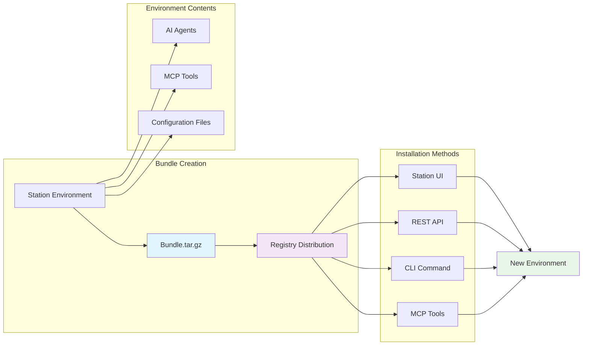
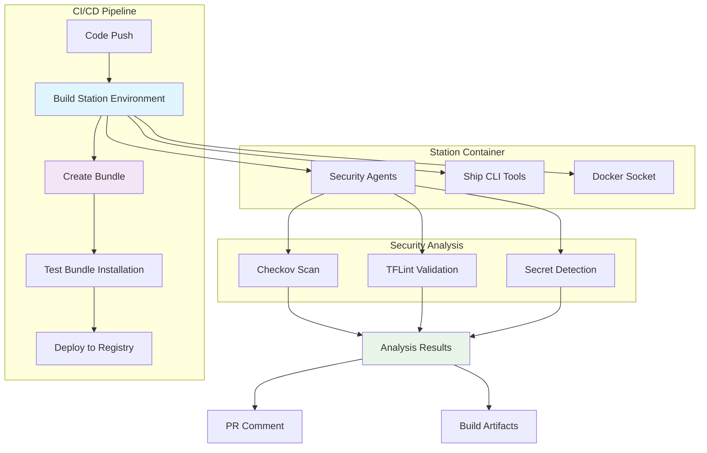

# Creating Bundles

Learn how to create, package, and distribute Station environment bundles that work seamlessly across different deployments and teams.

## What are Station Bundles?

Station bundles are portable environment packages that contain:
- **Agent definitions** - Pre-configured AI agents with specialized prompts
- **MCP tool configurations** - Connections to security, DevOps, and development tools  
- **Environment settings** - Ready-to-deploy configurations

Bundles enable you to share complete AI-powered workflows and quickly replicate environments across teams.



## Bundle Creation Methods

### Method 1: CLI Command (Recommended)
Create a bundle from any existing environment:

```bash
# List your environments
stn environments list

# Create bundle from environment
stn bundle my-environment --output my-custom-bundle.tar.gz
```

### Method 2: MCP Tools (For Claude Code/AI)
Use Station's MCP integration to create bundles programmatically:

```bash
# Available via Claude Code when Station MCP is connected
create_bundle_from_environment(environmentName="my-environment", outputPath="./bundle.tar.gz")
```

### Method 3: API Integration
Create bundles via the Station API for CI/CD integration:

```bash
curl -X POST http://localhost:8585/api/v1/bundles \
  -H "Content-Type: application/json" \
  -d '{"environment_name": "my-environment", "output_path": "./bundle.tar.gz"}'
```

## Setting Up Your Environment for Bundling

### 1. Configure MCP Tools
Create MCP server configurations in your environment directory:

```json
// ~/.config/station/environments/my-env/security-tools.json
{
  "mcpServers": {
    "ship-checkov": {
      "command": "ship",
      "args": ["mcp", "checkov"]
    },
    "ship-tflint": {
      "command": "ship", 
      "args": ["mcp", "tflint"]
    }
  }
}
```

### 2. Create Agent Definitions  
Add specialized agents to your environment:

```bash
# Create agents through the UI or CLI
stn agent create --name "Security Scanner" \
  --description "Scans repositories for security vulnerabilities" \
  --environment my-env \
  --tools "__checkov_scan_directory,__checkov_scan_file,__checkov_scan_secrets"
```

### 3. Test Your Environment
Verify everything works before bundling:

```bash
# Check MCP tools are loaded
stn tools list --environment my-env

# Test agent execution  
stn agent run "Security Scanner" "Scan the current directory for vulnerabilities"
```

### 4. Create the Bundle
```bash
# Bundle your tested environment
stn bundle my-env --output production-security-bundle.tar.gz

# Verify bundle contents
tar -tzf production-security-bundle.tar.gz
```

## Bundle Structure

A Station bundle contains these files:
```
agents/
├── Security Scanner.prompt      # Agent definition files
├── Terraform Auditor.prompt    
security-tools.json             # MCP server configurations
other-tools.json                 # Additional MCP configs
```

## Installing Bundles

### Via Station UI
1. Navigate to Bundles section
2. Upload bundle file or provide URL
3. Select target environment name
4. Click "Install Bundle"

### Via CLI
```bash
# Install from local file
curl -X POST http://localhost:8585/bundles/install \
  -H "Content-Type: application/json" \
  -d '{
    "bundle_location": "./my-bundle.tar.gz",
    "environment_name": "new-environment", 
    "source": "file"
  }'

# Install from URL (e.g., GitHub release)
curl -X POST http://localhost:8585/bundles/install \
  -H "Content-Type: application/json" \
  -d '{
    "bundle_location": "https://github.com/user/repo/releases/download/v1.0/bundle.tar.gz",
    "environment_name": "production",
    "source": "remote" 
  }'
```

## Real-World Example: DevOps Security Bundle

Here's how to create a production-ready security bundle:

### 1. Set up the environment
```bash
# Initialize environment with security tools
stn load https://github.com/shiptools/ship-checkov
stn load https://github.com/shiptools/ship-tflint

# Create security agents
stn agent create --name "Security Scanner" \
  --prompt "Scan repositories for security vulnerabilities using checkov tools" \
  --tools "__checkov_scan_directory,__checkov_scan_file,__checkov_scan_secrets"

stn agent create --name "Terraform Auditor" \
  --prompt "Analyze Terraform files for best practices using tflint" \
  --tools "__tflint_check,__tflint_init"
```

### 2. Test in CI/CD
```yaml
# .github/workflows/security-scan.yml  
- name: Run Security Analysis
  run: |
    docker run -v $(pwd):/workspace epuerta18/station-default:latest \
      stn agent run "Security Scanner" "Scan /workspace for security issues"
```

### 3. Create and publish bundle
```bash
# Create bundle
stn bundle security-environment --output devops-security-bundle.tar.gz

# Test installation in fresh environment  
curl -X POST http://localhost:8585/bundles/install \
  -H "Content-Type: application/json" \
  -d '{
    "bundle_location": "./devops-security-bundle.tar.gz",
    "environment_name": "test-install",
    "source": "file"
  }'
```

## Bundle Best Practices

- **Environment Isolation** - Test bundles in clean environments before publishing
- **Tool Dependencies** - Ensure all required tools are available in target environments  
- **Agent Validation** - Verify agents work with their assigned tools
- **Documentation** - Include usage examples and tool requirements
- **Version Control** - Tag releases and maintain changelog
- **Security Review** - Audit tools and permissions before sharing

## CI/CD Integration

Automate bundle creation and testing in your workflows:



```yaml
name: Build and Test Bundle
on:
  push:
    paths: ['environments/production/**']

jobs:
  bundle:
    runs-on: ubuntu-latest
    steps:
      - uses: actions/checkout@v4
      
      - name: Create Bundle  
        run: |
          # Use Station MCP tools to create bundle from environment
          curl -X POST http://localhost:8585/api/v1/bundles \
            -H "Content-Type: application/json" \
            -d '{"environment_name": "production", "output_path": "./production-bundle.tar.gz"}'
            
      - name: Test Bundle Installation
        run: |
          docker run -v $(pwd):/workspace epuerta18/station-default:latest \
            curl -X POST http://localhost:8585/bundles/install \
            -H "Content-Type: application/json" \
            -d '{"bundle_location": "/workspace/production-bundle.tar.gz", "environment_name": "ci-test", "source": "file"}'
            
      - name: Upload Bundle Artifact
        uses: actions/upload-artifact@v4
        with:
          name: production-bundle
          path: production-bundle.tar.gz
```

## Next Steps

- **[Publishing Bundles](/station/en/publishing-bundles)** - Share bundles via registry
- **[Bundle Registry](/station/en/registry)** - Browse community bundles
- **[CI/CD Integration](/station/en/ci-cd-integration)** - Automate with GitHub Actions