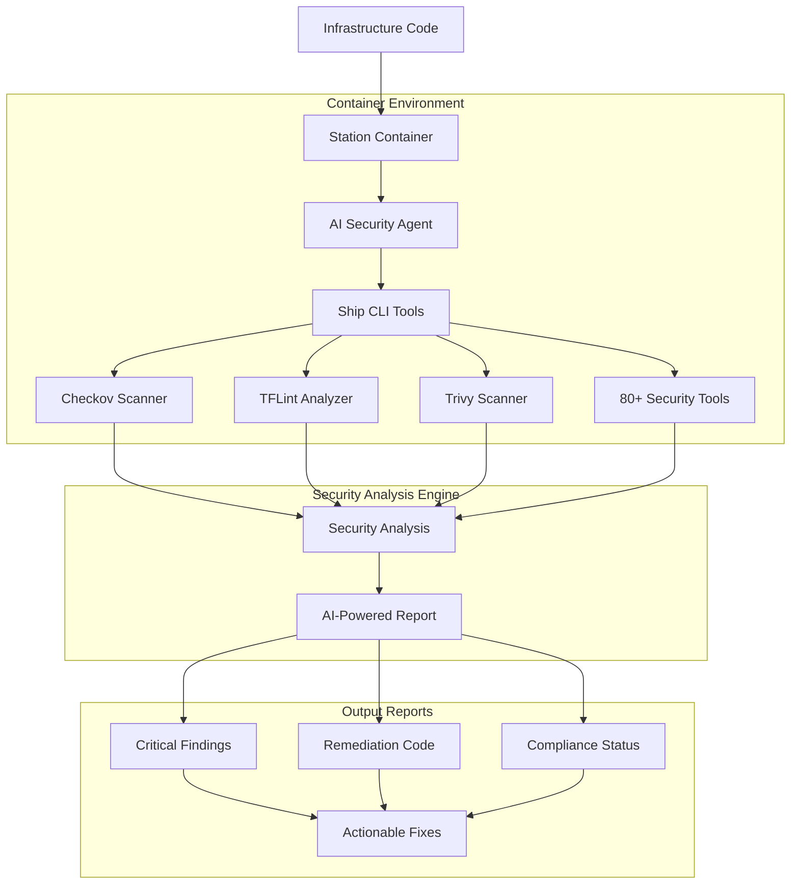

# DevOps Security Automation

Station provides **production-ready DevOps security automation** with AI agents that perform real security scanning using Ship CLI's 80+ containerized security tools. This guide shows you how to build, deploy, and run automated security workflows that analyze infrastructure code, detect vulnerabilities, and provide actionable remediation guidance.

## Quick Start

Build and test a complete DevOps security environment in 3 commands:

```bash
# 1. Build containerized security environment
stn build env default --provider openai --model gpt-5 --ship

# 2. Test against your infrastructure code
cd /path/to/your/terraform-project
docker run --rm -v "$(pwd):/workspace" -v /var/run/docker.sock:/var/run/docker.sock \
  station-default:latest bash -c "
  cd /workspace && 
  stn sync default -i=false && 
  stn agent run 'Security Scanner' 'Scan for security vulnerabilities'
"

# 3. View detailed security analysis with remediation steps
# ✅ Results include specific findings, severity levels, and Terraform fix snippets
```

## Architecture Overview

Station's DevOps security platform combines:

- **🤖 AI Security Agents**: Intelligent analysis with contextual recommendations
- **🚢 Ship CLI Integration**: 80+ containerized security tools (Checkov, TFLint, Trivy, etc.)
- **🐳 Container Deployment**: Isolated, reproducible security scanning environments  
- **📊 Real-Time Scanning**: Actual tool execution with detailed security findings
- **🔧 Actionable Remediation**: Specific code fixes and configuration improvements



## Building Security Environments

### Environment Builder Command

The `stn build env` command creates **complete containerized security environments** with:

```bash
stn build env <environment-name> [flags]

Flags:
  --provider string      AI provider (openai, anthropic, gemini)
  --model string         AI model (gpt-5, claude-3-5-sonnet-20241022)
  --ship                 Install Ship CLI with security tools
  --cloudshipai-key      CloudShip AI telemetry registration key
```

### Example: Complete Security Environment

```bash
# Build production security environment
stn build env production \
  --provider openai \
  --model gpt-5 \
  --ship

# This creates:
# ✅ Ubuntu 22.04 container with Station CLI
# ✅ Ship CLI v0.7.3+ with 80+ security tools
# ✅ Pre-configured Security Scanner and Terraform Auditor agents
# ✅ MCP tool discovery and assignment
# ✅ Self-bootstrapping stdio MCP execution
```

### Container Architecture

The built container includes:

```dockerfile
# Automatically generated via Dagger
FROM ubuntu:22.04

# System dependencies
RUN apt-get update && apt-get install -y \
    ca-certificates curl sqlite3 git nodejs

# Station CLI (uses local binary or downloads latest)
COPY stn /usr/local/bin/stn
RUN chmod +x /usr/local/bin/stn

# Ship CLI (latest from install script)  
RUN curl -fsSL https://raw.githubusercontent.com/cloudshipai/ship/main/install.sh | bash

# Docker CLI (for Ship CLI containerized tools)
RUN curl -fsSL https://download.docker.com/linux/static/stable/x86_64/docker-27.1.1.tgz | tar -xz && \
    mv docker/docker /usr/local/bin/docker

# Configuration and workspace setup
RUN mkdir -p /root/.config/station/environments/default /workspace
COPY environments/ /root/.config/station/environments/
COPY station.db /root/.config/station/station.db

WORKDIR /workspace
```

## Security Agent Configuration

### Pre-Built Security Agents

Station environments include two production-ready security agents:

#### Security Scanner Agent
```yaml
# ~/.config/station/environments/default/agents/Security Scanner.prompt
---
model: "gpt-5"
config:
  temperature: 0.3
  max_tokens: 2000
tools:
  - "__checkov_get_version"
  - "__checkov_scan_directory" 
  - "__checkov_scan_file"
  - "__checkov_scan_secrets"
metadata:
  name: "Security Scanner"
  description: "Comprehensive security vulnerability scanning using Checkov"
  max_steps: 6
---

You are a Security Scanner agent specialized in identifying security vulnerabilities.

Your responsibilities:
- Scan directories and files for security vulnerabilities
- Check for secrets and sensitive data exposure
- Analyze configurations for security misconfigurations  
- Generate detailed security reports with actionable recommendations

Guidelines:
- Use __checkov_scan_directory for comprehensive directory analysis
- Use __checkov_scan_file for targeted file analysis
- Use __checkov_scan_secrets for credential detection
- Prioritize critical security findings over minor issues
- Provide clear, actionable remediation steps

When scanning:
1. Start with __checkov_scan_directory for comprehensive analysis
2. Use __checkov_scan_secrets for credential detection
3. Analyze specific files if needed with __checkov_scan_file
4. Summarize findings with severity levels and remediation steps
```

#### Terraform Auditor Agent
```yaml
# ~/.config/station/environments/default/agents/Terraform Auditor.prompt  
---
model: "gpt-5"
config:
  temperature: 0.2
  max_tokens: 1500
tools:
  - "__tflint_init"
  - "__tflint_check"
metadata:
  name: "Terraform Auditor"
  description: "Terraform code quality and security analysis using TFLint"
  max_steps: 4
---

You are a Terraform Auditor agent specialized in infrastructure code analysis.

Your responsibilities:
- Analyze Terraform files for security issues and best practices
- Check for configuration errors and potential problems
- Provide actionable recommendations for infrastructure improvements

Guidelines:
- Use __tflint_init to initialize analysis
- Use __tflint_check to perform comprehensive Terraform analysis
- Focus on security misconfigurations and best practice violations
- Provide specific, actionable remediation guidance
```

### MCP Tool Configuration

Security tools are automatically discovered via Ship CLI MCP servers:

```json
{
  "mcpServers": {
    "ship-tflint": {
      "command": "ship", 
      "args": ["mcp", "tflint"]
    },
    "ship-checkov": {
      "command": "ship",
      "args": ["mcp", "checkov"]  
    }
  }
}
```

## Complete Security Workflow

The Station DevOps security workflow follows this pattern:

```mermaid
sequenceDiagram
    participant Dev as Developer
    participant CI as CI Pipeline  
    participant SC as Station Container
    participant SA as Security Agent
    participant Ship as Ship CLI Tools
    participant AI as AI Analysis
    
    Dev->>CI: Push Code / Create PR
    CI->>SC: Build Security Environment
    
    Note over SC: stn build env --ship
    SC->>SC: Install Station + Ship CLI
    SC->>SC: Configure Security Agents
    
    CI->>SC: Mount Source Code + Docker Socket
    SC->>SA: stn sync (discover tools)
    SA->>Ship: Connect to MCP servers
    Ship->>SA: Return 80+ security tools
    
    SA->>Ship: Execute __checkov_scan_directory
    Ship->>Ship: Run Checkov in container
    Ship->>SA: Return security findings
    
    SA->>AI: Analyze findings with context
    AI->>SA: Generate remediation recommendations
    
    SA->>CI: Return comprehensive security report
    CI->>Dev: Show results with actionable fixes
    
    Note over Dev,AI: 🎯 Complete security analysis<br/>with AI-powered remediation
```



## Running Security Scans

### Basic Security Scan

```bash
# Mount Docker socket for Ship CLI tools
docker run --rm \
  -v "$(pwd):/workspace" \
  -v /var/run/docker.sock:/var/run/docker.sock \
  station-default:latest bash -c "
  cd /workspace &&
  stn sync default -i=false &&
  stn agent run 'Security Scanner' 'Scan /workspace for security vulnerabilities'
"
```

### Targeted Terraform Analysis

```bash
# Scan specific Terraform directory
docker run --rm \
  -v "$(pwd):/workspace" \
  -v /var/run/docker.sock:/var/run/docker.sock \
  station-default:latest bash -c "
  cd /workspace &&
  stn sync default -i=false &&
  stn agent run 'Terraform Auditor' 'Analyze Terraform files in /workspace/terraform'
"
```

### CI/CD Integration

```yaml
# .github/workflows/security-scan.yml
name: DevOps Security Scan
on:
  push:
    branches: [main, develop]
  pull_request:
    branches: [main]

jobs:
  security-analysis:
    runs-on: ubuntu-latest
    steps:
      - name: Checkout code
        uses: actions/checkout@v4

      - name: Install Station
        run: |
          curl -fsSL https://raw.githubusercontent.com/cloudshipai/station/main/install.sh | bash

      - name: Build Security Environment  
        run: |
          stn build env security \
            --provider openai \
            --model gpt-5 \
            --ship

      - name: Run Security Analysis
        run: |
          docker run --rm \
            -v "$(pwd):/workspace" \
            -v /var/run/docker.sock:/var/run/docker.sock \
            -e OPENAI_API_KEY="${{ secrets.OPENAI_API_KEY }}" \
            station-security:latest bash -c "
            cd /workspace &&
            stn sync default -i=false &&
            stn agent run 'Security Scanner' 'Comprehensive security scan of repository'
          "

      - name: Run Terraform Analysis
        if: contains(github.event.head_commit.modified, '.tf')
        run: |
          docker run --rm \
            -v "$(pwd):/workspace" \
            -v /var/run/docker.sock:/var/run/docker.sock \
            -e OPENAI_API_KEY="${{ secrets.OPENAI_API_KEY }}" \
            station-security:latest bash -c "
            cd /workspace &&
            stn sync default -i=false &&  
            stn agent run 'Terraform Auditor' 'Analyze Terraform infrastructure for security issues'
          "
```

## Real-World Security Analysis

### Example: Terraform Security Scan Results

When scanning infrastructure code, Station agents provide comprehensive analysis:

```bash
Security scan completed for: /workspace/terraform
Engine: Checkov 3.2.467

Overall summary:
- Resources scanned: 10
- Failed checks: 41
- Passed checks: 22  
- Secrets found: 1

Top critical findings:
1) 🚨 Hardcoded secret detected in user data
   - Check: CKV_SECRET_6 Base64 High Entropy String
   - File: /workspace/main.tf:111
   - Context: export API_KEY=sk-123...
   - Risk: Credential exposure in plain text
   - Remediation: Remove secret, use AWS Secrets Manager

2) 🚨 RDS instance publicly accessible and unencrypted  
   - Checks: CKV_AWS_17, CKV_AWS_16, CKV_AWS_293
   - File: main.tf:123-150
   - Risk: Data breach, data loss
   - Remediation: 
     publicly_accessible = false
     storage_encrypted = true
     backup_retention_period = 7

3) 🚨 Security group allows unrestricted access
   - Checks: CKV_AWS_24, CKV_AWS_260
   - Risk: External compromise  
   - Remediation: Restrict SSH to trusted CIDRs
```

### Actionable Remediation

Station provides **specific code fixes**:

```hcl
# S3 bucket security hardening
resource "aws_s3_bucket_public_access_block" "demo_bucket" {
  bucket                   = aws_s3_bucket.demo_bucket.id
  block_public_acls        = true
  block_public_policy      = true
  ignore_public_acls       = true
  restrict_public_buckets  = true
}

resource "aws_s3_bucket_server_side_encryption_configuration" "default" {
  bucket = aws_s3_bucket.demo_bucket.id
  rule {
    apply_server_side_encryption_by_default {
      sse_algorithm     = "aws:kms"
      kms_master_key_id = aws_kms_key.s3.id
    }
  }
}

# EC2 security hardening
resource "aws_instance" "web" {
  # ... other config ...
  
  root_block_device {
    volume_type = "gp3"
    volume_size = 20
    encrypted   = true
    kms_key_id  = aws_kms_key.ebs.arn
  }
  
  metadata_options {
    http_tokens = "required"  # Require IMDSv2
  }
  
  monitoring = true
  iam_instance_profile = aws_iam_instance_profile.web.name
}
```

## Advanced Configuration

### Custom Security Agents

Create specialized agents for your security requirements:

```json
{
  "name": "compliance-auditor",
  "description": "SOC2 and CIS compliance auditing agent",
  "prompt": "You are a compliance auditing agent specialized in SOC2 and CIS benchmarks.\n\nAnalyze infrastructure for:\n1. SOC2 Type II controls\n2. CIS benchmarks compliance\n3. Data protection requirements\n4. Access control violations\n\nUse checkov with compliance-specific frameworks and generate detailed compliance reports.",
  "max_steps": 8,
  "tools": [
    "__checkov_scan_directory",
    "__checkov_scan_with_checks",
    "__trivy_scan_filesystem",
    "__write_file"
  ],
  "config": {
    "temperature": 0.1,
    "max_tokens": 3000
  }
}
```

### Environment Variables

Pass runtime variables to MCP templates:

```bash
# Build with variable support
stn build env production \
  --provider openai \
  --model gpt-5 \
  --ship

# Run with environment-specific variables  
docker run --rm \
  -v "$(pwd):/workspace" \
  -v /var/run/docker.sock:/var/run/docker.sock \
  -e OPENAI_API_KEY="$OPENAI_API_KEY" \
  -e ENVIRONMENT="production" \
  -e COMPLIANCE_LEVEL="strict" \
  station-production:latest bash -c "
  cd /workspace &&
  stn sync default -i=false &&
  stn agent run 'compliance-auditor' 'Run ${COMPLIANCE_LEVEL} compliance audit for ${ENVIRONMENT}'
"
```

### Template Variables

Configure agents with dynamic variables:

```yaml
# variables.yml
WORKSPACE_PATH: "/workspace"
ENVIRONMENT: "{{ .ENVIRONMENT }}"
COMPLIANCE_LEVEL: "{{ .COMPLIANCE_LEVEL }}"  
OUTPUT_PATH: "/workspace/reports"
SCAN_DEPTH: "comprehensive"
```

## Performance and Scaling

### Parallel Agent Execution

```bash
# Run multiple agents concurrently
docker run --rm \
  -v "$(pwd):/workspace" \
  -v /var/run/docker.sock:/var/run/docker.sock \
  station-default:latest bash -c "
  cd /workspace &&
  stn sync default -i=false &&
  (stn agent run 'Security Scanner' 'Scan for vulnerabilities' &) &&
  (stn agent run 'Terraform Auditor' 'Analyze Terraform' &) &&
  wait
"
```

### Resource Management

```bash
# Set container resource limits
docker run --rm \
  --memory="2g" \
  --cpus="1.5" \
  -v "$(pwd):/workspace" \
  -v /var/run/docker.sock:/var/run/docker.sock \
  station-default:latest [commands]
```

### Caching and Optimization

```bash
# Cache base images for faster CI
docker build -t station-security-base:latest \
  --build-arg SHIP_VERSION=0.7.3 \
  --build-arg STATION_VERSION=latest \
  .

# Use cached base in CI
docker run --rm \
  -v "$(pwd):/workspace" \
  -v /var/run/docker.sock:/var/run/docker.sock \
  station-security-base:latest [commands]
```

## Security Best Practices

### Container Security

- ✅ **Mount Docker socket carefully**: Only when Ship CLI tools need container access
- ✅ **Use read-only mounts**: Mount source code as read-only (`ro`)
- ✅ **Isolate environments**: Each scan gets fresh container with clean database
- ✅ **Secret management**: Pass API keys via environment variables, never in code
- ✅ **Resource limits**: Set appropriate CPU/memory limits for containers

### CI/CD Security

- ✅ **Encrypted secrets**: Store API keys in CI secret management
- ✅ **Branch protection**: Require security scans to pass before merge
- ✅ **Artifact collection**: Save security reports for audit trails
- ✅ **Fail fast**: Stop pipelines on critical security findings
- ✅ **Regular updates**: Keep Station and Ship CLI versions current

### Audit and Compliance

- ✅ **Execution tracking**: Monitor all agent runs with detailed metadata
- ✅ **Report retention**: Archive security scan results for compliance
- ✅ **Change tracking**: Link security scans to specific commits/PRs
- ✅ **Access logging**: Track who runs security scans and when

## Troubleshooting

### Common Issues

**Docker socket permission denied:**
```bash
# Ensure Docker socket is accessible
ls -la /var/run/docker.sock
sudo chmod 666 /var/run/docker.sock  # For development only
```

**Ship CLI tools not working:**
```bash
# Verify Ship CLI version and tools
docker run --rm station-default:latest ship version
docker run --rm station-default:latest ship mcp checkov --help
```

**Agent tool assignment failures:**
```bash
# Check MCP tool discovery
docker run --rm station-default:latest bash -c "
  stn sync default -i=false && 
  sqlite3 /root/.config/station/station.db 'SELECT a.name, t.name FROM agents a JOIN agent_tools at ON a.id = at.agent_id JOIN tools t ON at.tool_id = t.id'
"
```

**Memory/performance issues:**
```bash
# Check container resource usage
docker stats

# Increase container limits
docker run --memory="4g" --cpus="2" [other args]
```

### Debug Mode

Enable detailed logging for troubleshooting:

```bash
# Run with debug logging
docker run --rm \
  -e STATION_DEBUG=true \
  -v "$(pwd):/workspace" \
  -v /var/run/docker.sock:/var/run/docker.sock \
  station-default:latest bash -c "
  cd /workspace &&
  stn sync default -i=false --verbose &&
  stn agent run 'Security Scanner' 'Debug scan' --verbose
"
```

## Production Deployment Examples

Complete production-ready examples are available in the Station repository:

```
dev-workspace/devops-security-examples/
├── basic-terraform-scan/           # Simple Terraform security scanning
├── multi-cloud-compliance/        # AWS, GCP, Azure compliance auditing
├── container-security/            # Container and Kubernetes security
├── supply-chain-analysis/         # SBOM generation and vulnerability analysis
└── enterprise-deployment/         # Scalable enterprise security automation
```

These examples provide production-tested configurations for real-world DevOps security automation workflows.