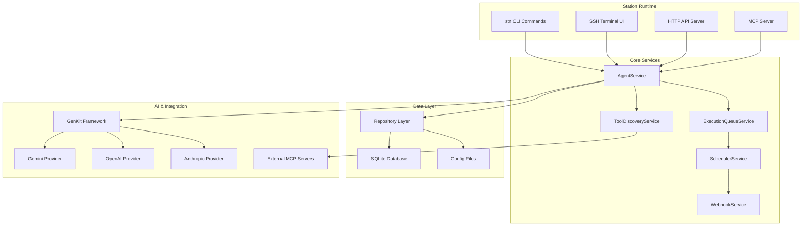

# Station

**A secure, self-hosted platform for building and deploying intelligent sub-agents.**

🌐 **[Browse Bundle Registry](https://cloudshipai.github.io/registry)** - Discover ready-to-use MCP bundles for Station

📚 **[Documentation](https://cloudshipai.github.io/station)** - Complete Station documentation and guides

> Lightweight runtime for deployable sub-agents that need to access internal systems, run deep in your infrastructure, and integrate seamlessly with your existing deployment processes.

Station is purpose-built for **deployable sub-agents** - the intelligent automation you need for infrastructure monitoring, deployment pipelines, security scanning, and day-to-day tasks that require secure access to internal systems.

## Why Station Exists

When you need agents for internal work, you need more than application-focused agent platforms. You need:

- **Secure Internal Access** - Agents that can safely handle database credentials, API keys, and system-level access
- **Versionable Deployment** - Deployable agents that integrate with your existing deployment pipelines  
- **Team-Approved Tools** - Easy way to use and share the tools your team builds and approves
- **Low Footprint Runtime** - Lightweight system that blends into your infrastructure without overhead

**Station provides exactly this** - a lightweight, secure runtime specifically designed for deployable sub-agents.

## Key Features

### 🔒 Security by Design
- **Self-Hosted** - Complete data sovereignty, no external dependencies beyond AI providers
- **Encrypted Secrets** - AES encryption for credentials and sensitive configuration
- **Environment Isolation** - Separate execution contexts for dev/staging/prod
- **Audit Trail** - Complete tracking of agent deployments and executions

### ⚡ Lightweight & Integrated
- **Single 45MB Binary** - No complex infrastructure or dependencies
- **SQLite + Litestream** - Zero-setup database with automatic replication for production
- **GitOps Ready** - Version-controlled agent configurations like infrastructure code
- **Existing Toolchain** - Uses your team's approved MCP tools and integrations

### 🔧 MCP Integration
- **Connects to Any MCP Client** - Claude Desktop, Cursor, VS Code, and more
- **Variable Templates** - Easy sharing with parameterized configurations
- **Git-Backed Registries** - Install bundles directly from GitHub repositories
- **Add Any MCP Tools** - Assign filesystem, AWS, database, or custom tools to agents

## Quick Start

Get Station running in 2 minutes:

```bash
# 1. Install Station
curl -fsSL https://raw.githubusercontent.com/cloudshipai/station/main/install.sh | bash

# 2. Initialize with your AI provider
stn init --provider anthropic --ship  # or: openai, gemini
stn auth anthropic login              # for Claude Max/Pro subscription

# 3. Start Jaeger tracing
stn jaeger up

# 4. Connect to Claude Code
claude mcp add station -e OTEL_EXPORTER_OTLP_ENDPOINT=http://localhost:4318 --scope user -- stn stdio
```

**✅ Ready!** You now have 41 MCP tools available. Open [Station UI](http://localhost:8585) to configure agents.


## Architecture Overview

Station provides multiple interfaces for agent management:

- **CLI** - Command-line interface for development and scripting
- **REST API** - HTTP API for integration with existing systems  
- **SSH/TUI** - Terminal-based admin interface
- **MCP Server** - Model Context Protocol for AI client integration



All interfaces connect to the core agent management system with MCP tool integration, configuration management, and security services.

## Next Steps

- [Quick Start Guide →](/station/en/quickstart) - Get running in 5 minutes
- [Installation Options →](/station/en/installation) - Manual install, Docker, build from source
- [Learn MCP Tools →](/station/en/mcp/tools) - What you can do via MCP
- [Browse Bundles →](https://cloudshipai.github.io/registry) - Ready-to-use agent bundles