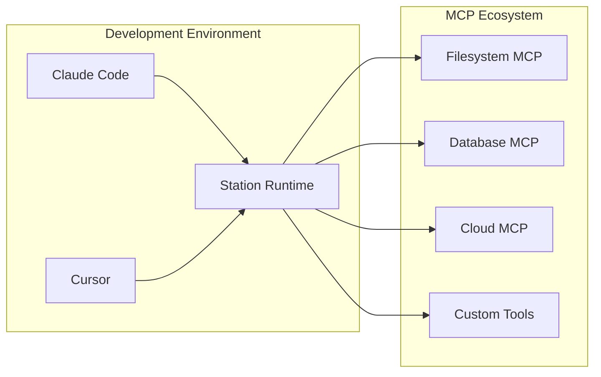

# MCP Integration

Station is primarily an **MCP runtime** that augments your Claude Code and Cursor development experience by providing an agnostic runtime for your sub-agents.

## Station as MCP Runtime

Rather than managing agents in various platforms, Station gives you:

- **Centralized Agent Management** - One place to create, manage, and monitor all your sub-agents
- **Environment Isolation** - Separate agents and MCP tools by dev/staging/production environments  
- **Server Deployment** - Deploy Station as a persistent server for background agent operations
- **Universal MCP Client** - Works with any MCP-compatible tools and servers



**Key Benefits:**
- **Tool Reuse** - Share MCP servers across all your development tools
- **Agent Portability** - Export agents as `.prompt` files for version control
- **Background Execution** - Long-running agents that work while you code
- **Multi-Environment** - Same agent, different tools per environment

## MCP Templates & Variable Resolution

Station treats **MCP configurations as templates** with environment-specific variable resolution. This allows you to define MCP servers once and deploy them across multiple environments with different settings.

### Template System

MCP configurations support **Go template syntax** for dynamic values:

```json
{
  "name": "Filesystem MCP",
  "description": "Basic filesystem operations",
  "mcpServers": {
    "filesystem": {
      "command": "npx",
      "args": [
        "-y",
        "@modelcontextprotocol/server-filesystem@latest",
        "{{ .ALLOWED_PATH }}"
      ]
    }
  }
}
```

### Variable Resolution with `stn sync`

When you run `stn sync`, Station automatically resolves template variables:

```bash
stn sync default
```

**Station will:**
1. **Look for `variables.yml`** in your environment directory
2. **Prompt for missing variables** if not found in the file
3. **Resolve all templates** using the variables
4. **Discover tools** from resolved MCP servers

**Example workflow:**
```bash
# Copy template to production environment
cp filesystem-mcp.json ~/.config/station/environments/production/template.json

# Create variables file (or Station will prompt)
echo "ALLOWED_PATH: /opt/production/data" > ~/.config/station/environments/production/variables.yml

# Sync resolves variables and discovers tools
stn sync production
```

### Environment-Specific Configuration

The same MCP template works across environments with different variables:

```yaml
# ~/.config/station/environments/development/variables.yml
ALLOWED_PATH: "/home/user/dev-projects"
API_ENDPOINT: "http://localhost:3000"
DEBUG_MODE: "true"
```

```yaml
# ~/.config/station/environments/production/variables.yml  
ALLOWED_PATH: "/opt/production/data"
API_ENDPOINT: "https://api.company.com"
DEBUG_MODE: "false"
```

Same template, completely different tool behavior per environment!

## Loading MCP Configurations

### Create MCP Template

Create a new MCP configuration file:

```bash
# Create filesystem MCP template
cat > filesystem-mcp.json << 'EOF'
{
  "name": "Filesystem MCP",
  "description": "Basic filesystem operations",
  "mcpServers": {
    "filesystem": {
      "command": "npx",
      "args": [
        "-y",
        "@modelcontextprotocol/server-filesystem@latest",
        "{{ .ALLOWED_PATH }}"
      ]
    }
  }
}
EOF
```

### Load Into Environment

```bash
# Copy configuration to specific environment
cp filesystem-mcp.json ~/.config/station/environments/default/template.json
```

**Output:**
```
╭────────────────────────────────╮
│                                │
│  📂 Loading MCP Configuration  │
│                                │
╰────────────────────────────────╯

📄 Found config file: filesystem-mcp.json
🔧 Found 1 MCP server(s)
📝 Config name: Filesystem MCP-20250814-095146
🌍 Environment: default
📁 Creating file-based configuration...
✅ Saved template file: ~/.config/station/environments/default/filesystem_mcp.json
```

### Sync & Discover Tools

```bash
# Sync resolves templates and discovers tools
stn sync default
```

**Output:**
```
✅ MCP SUCCESS: Discovered 14 tools from server 'filesystem'
   🔧 Tool 1: __read_text_file
   🔧 Tool 2: __list_directory  
   🔧 Tool 3: __directory_tree
   🔧 Tool 4: __write_file
   🔧 Tool 5: __edit_file
   [... 9 more tools discovered]
```

## Agent Integration

Once MCP tools are loaded and synced, your agents can automatically access them:

### Through Claude Desktop/Code

**You:** *"Create an agent that monitors project files and reports changes"*

**Station Response:**
```json
{
  "agent": {
    "id": 42,
    "name": "File Change Monitor",
    "description": "Monitors project files and reports changes"
  },
  "tool_assignment": {
    "assigned_count": 5,
    "assigned_tools": [
      "__list_directory",
      "__read_text_file", 
      "__directory_tree",
      "__get_file_info",
      "__search_files"
    ],
    "status": "success"
  }
}
```

Station automatically assigned the right filesystem tools based on what's available in your environment!

### Environment Isolation in Action

The same agent works differently per environment:

- **Development**: Agent accesses `/home/user/projects` (from dev variables.yml)
- **Production**: Same agent accesses `/opt/production/data` (from prod variables.yml)

**Same agent logic, completely different data sources.**

## Next Steps

- **[MCP Quick Start](/station/en/mcp-quickstart)** - Get running with Claude Desktop in 5 minutes  
- **[Agent Management](/station/en/agents/creating)** - Create and manage your agents
- **[Environment Setup](/station/en/environments)** - Configure multiple environments
- **[Architecture Overview](/station/en/architecture)** - Understand Station's MCP runtime architecture