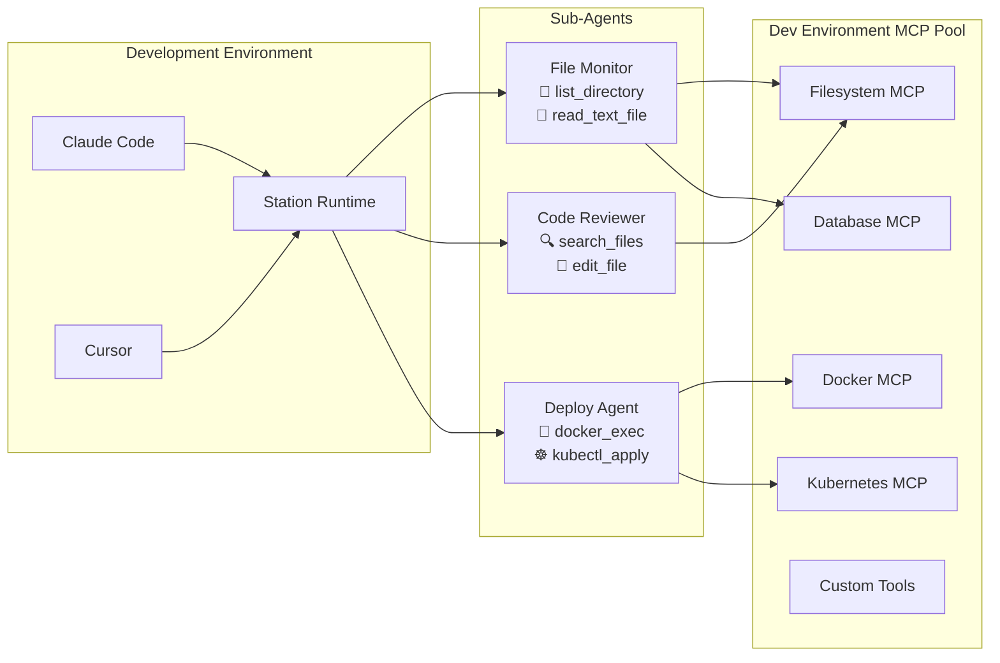

# MCP Integration Overview

Station is primarily an **MCP runtime** that augments your Claude Code and Cursor development experience by providing an agnostic runtime for your sub-agents.

## Station as MCP Runtime

Rather than managing agents in various platforms, Station gives you:

- **Centralized Agent Management** - One place to create, manage, and monitor all your sub-agents
- **Environment Isolation** - Separate agents and MCP tools by dev/staging/production environments  
- **Server Deployment** - Deploy Station as a persistent server for background agent operations
- **Universal MCP Client** - Works with any MCP-compatible tools and servers



**Key Benefits:**
- **Tool Reuse** - Share MCP servers across all your development tools
- **Agent Portability** - Export agents as `.prompt` files for version control
- **Background Execution** - Long-running agents that work while you code
- **Multi-Environment** - Same agent, different tools per environment

## MCP Templates & Variable Resolution

Station treats **MCP configurations as templates** with environment-specific variable resolution. This allows you to define MCP servers once and deploy them across multiple environments with different settings.

### Template System

MCP configurations support **Go template syntax** for dynamic values:

```json
{
  "name": "Filesystem MCP",
  "description": "Basic filesystem operations",
  "mcpServers": {
    "filesystem": {
      "command": "npx",
      "args": [
        "-y",
        "@modelcontextprotocol/server-filesystem@latest",
        "{{ .ALLOWED_PATH }}"
      ]
    }
  }
}
```

### Variable Resolution with `stn sync`

When you run `stn sync`, Station automatically resolves template variables:

```bash
stn sync default
```

**Station will:**
1. **Look for `variables.yml`** in your environment directory
2. **Prompt for missing variables** if not found in the file
3. **Resolve all templates** using the variables
4. **Discover tools** from resolved MCP servers

## Quick Start

Get Station running as an MCP server in Claude Desktop in 5 minutes:

### 1. Install & Initialize
```bash
curl -fsSL https://raw.githubusercontent.com/cloudshipai/station/main/install.sh | bash
stn init
```

### 2. Load MCP Tools
```bash
# Create filesystem MCP template
cat > filesystem-mcp.json << 'EOF'
{
  "name": "Filesystem MCP",
  "description": "Basic filesystem operations", 
  "mcpServers": {
    "filesystem": {
      "command": "npx",
      "args": ["-y", "@modelcontextprotocol/server-filesystem@latest", "{{ .ALLOWED_PATH }}"]
    }
  }
}
EOF

cp filesystem-mcp.json ~/.config/station/environments/default/template.json
echo "ALLOWED_PATH: /home/user/projects" > ~/.config/station/environments/default/variables.yml
stn sync
```

### 3. Connect to Claude Desktop
Add to your Claude Desktop config:
```json
{
  "mcpServers": {
    "station": {
      "command": "stn",
      "args": ["stdio"]
    }
  }
}
```

### 4. Create Agents
**You:** *"Create an agent that monitors project files"*

Station automatically assigns the right filesystem tools and creates your deployable sub-agent!

## Next Steps

- **[Claude Desktop Setup](/station/en/mcp/claude-desktop)** - Detailed Claude Desktop integration
- **[MCP Tools & Commands](/station/en/mcp/tools)** - Available MCP tools and usage
- **[Agent Interaction](/station/en/mcp/agents)** - Managing agents through MCP