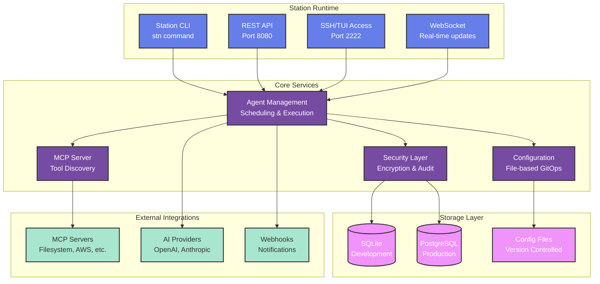

import { Card, CardGrid } from '@astrojs/starlight/components';

# Station - Lightweight Runtime for Deployable Sub-Agents

**A secure, self-hosted platform for building and deploying intelligent sub-agents.**

🌐 **[Browse Bundle Registry](https://cloudshipai.github.io/registry)** - Discover ready-to-use MCP bundles for Station

Station is purpose-built for **deployable sub-agents** - the intelligent automation you need for infrastructure monitoring, deployment pipelines, security scanning, and day-to-day tasks that require secure access to internal systems.

## Quick Installation

curl -sSL https://getstation.cloudshipai.com | bash
<button class="copy-button" onclick="copyToClipboard('curl -sSL https://getstation.cloudshipai.com | bash')">Copy</button>

## Why Station Exists

When you need agents for internal work, you need more than application-focused agent platforms. You need:

<CardGrid>
  <Card title="🔒 Secure Internal Access" icon="lock">
    Agents that can safely handle database credentials, API keys, and system-level access with AES encryption and environment isolation.
  </Card>
  
  <Card title="📋 Versionable Deployment" icon="document">
    Deployable agents that integrate with your existing deployment pipelines using GitOps-ready configuration management.
  </Card>
  
  <Card title="🔧 Team-Approved Tools" icon="setting">
    Easy way to use and share the tools your team builds and approves with 20+ production-ready MCP integrations.
  </Card>
  
  <Card title="⚡ Low Footprint Runtime" icon="rocket">
    Single 45MB binary with SQLite development mode and PostgreSQL production support - no complex infrastructure.
  </Card>
</CardGrid>

**Station provides exactly this** - a lightweight, secure runtime specifically designed for deployable sub-agents.

## Core Value: Secure Deployable Sub-Agent Runtime

### 🔧 Purpose-Built for Internal Tasks

Unlike application-focused agent platforms, Station is designed for deployable sub-agents that need to:

- Access internal databases with production credentials
- Monitor infrastructure and alert on issues  
- Automate deployment pipelines with CI/CD system access
- Perform security scans with elevated permissions
- Handle incident response with system-level tools

### 🔐 Security by Design

- **Self-Hosted** - Complete data sovereignty, no external dependencies beyond AI providers
- **Encrypted Secrets** - AES encryption for credentials and sensitive configuration
- **Environment Isolation** - Separate execution contexts for dev/staging/prod
- **Audit Trail** - Complete tracking of agent deployments and executions

### ⚡ Lightweight & Integrated

- **Single 45MB Binary** - No complex infrastructure or dependencies
- **SQLite Database** - Zero-setup local development, PostgreSQL for production
- **GitOps Ready** - Version-controlled agent configurations like infrastructure code
- **Existing Toolchain** - Uses your team's approved MCP tools and integrations

## Architecture Overview

## Next Steps

1. [📚 Learn why Station is different](/why-station/)
2. [🚀 Follow the Quick Start guide](/quickstart/)
3. [🏗️ Understand the architecture](/architecture/)
4. [📦 Browse the Bundle Registry](https://cloudshipai.github.io/registry)

